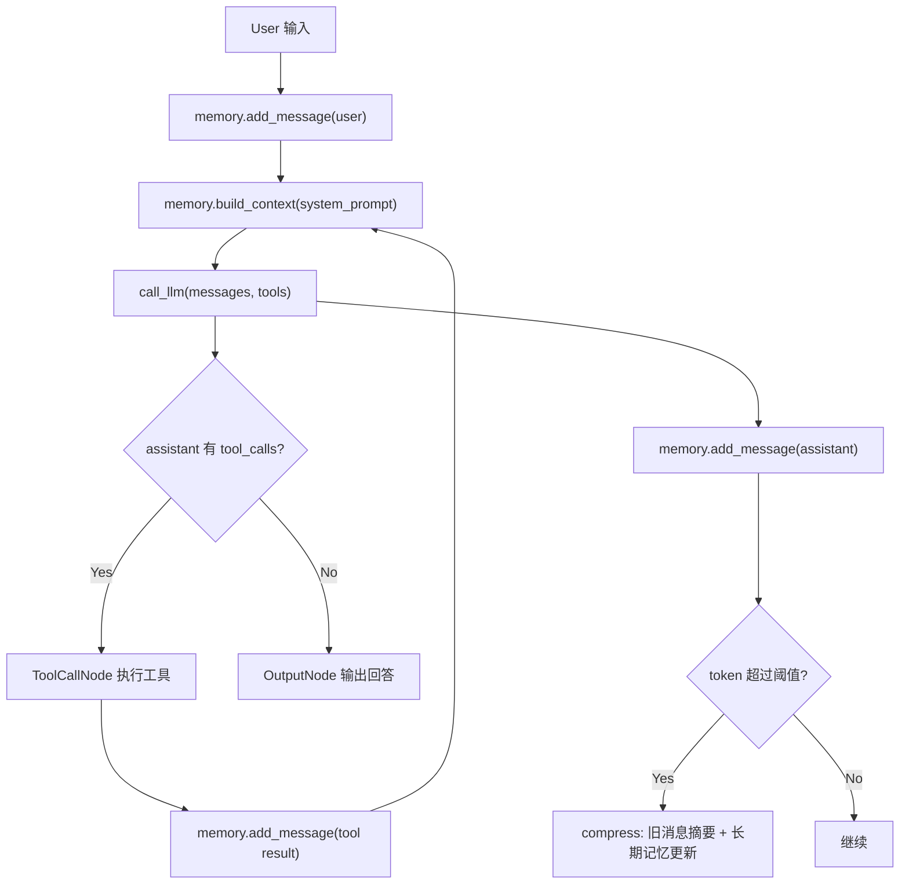

<!--more-->


## 零、写在前面

主要做一个简化的 context/memory 的实现，然后顺便做一点 agent memory 的调研。


## 一、Context、Memory 管理

### 2.1 什么是 Context

LLM 每次回答问题时，不是真的“脑子里保留了刚刚所有对话”。它收到的是一次 API 请求：

```python
messages = [
    {"role": "system", "content": "..."},
    {"role": "user", "content": "你好"},
    {"role": "assistant", "content": "你好，有什么可以帮你？"},
    {"role": "user", "content": "我刚才说了什么？"},
]
```

这些消息被送进模型。模型只能看见这次请求里的内容。

所以 **Context** 就是：**本次调用 LLM 时，放进 prompt/messages 里的全部信息。**

它包括：

-   system prompt
-   用户消息
-   assistant 历史回复
-   tool_calls
-   tool results
-   RAG evidence
-   长期记忆摘要
-   任务目标
-   代码片段

LLM 的回答不是凭空来的，而是在当前 context 上做预测。


### 2.2 为什么要做 Context 管理

先想一个很简单的聊天：

```text
第 1 轮：我叫小明。
第 2 轮：我喜欢蓝色。
第 3 轮：我正在学 Agent Memory。
第 50 轮：我叫什么？我喜欢什么颜色？
```

如果程序每次只把最后一条用户消息发给模型：

```python
messages = [
    {"role": "user", "content": "我叫什么？我喜欢什么颜色？"}
]
```

模型当然不知道。

这时候它就像只有几秒记忆的金鱼。不是因为模型真的生物学上忘了，而是因为：**程序没有把历史消息放进本次 context。**

但如果把所有历史都放进去，又会遇到另一个问题：**上下文窗口有限。**

**模型一次最多只能读一定长度的 token。超过上限就塞不进去，或者非常贵、非常慢。**

所以 Context 管理的核心矛盾是：

-   不放历史：模型像金鱼。
-   全放历史：迟早超过上下文窗口。

于是我们需要 Memory 管理：

-   哪些内容原样保留？
-   哪些内容压缩成摘要？
-   哪些内容写进长期记忆？
-   哪些内容需要检索回来？
-   哪些内容应该忘掉？


### 2.3 Token 和 Context Window

模型不按“字数”计算输入长度，而按 token。Context window 就是模型一次最多能看的 token 数。

例如：

```text
8K context  : 约 8,000 tokens
32K context : 约 32,000 tokens
128K context: 约 128,000 tokens
```

如果聊天一直追加：

```text
messages += user
messages += assistant
messages += tool results
```

总 token 会越来越长。

所以我们在使用 Agent 的时候，往往可以看见上下文用量，然后使用量达到限制后会触发压缩。


### 2.4 Context 和 Memory 的区别

很多人容易把它们混在一起。

**Context 是“这次调用模型时塞进去的内容”。**它是**即时的、临时的**。

-   调用前构造
-   调用时使用
-   调用后不一定保存

**Memory 是“系统保存和管理信息的机制”。**它是**跨时间的**。

-   写入
-   保存
-   压缩
-   检索
-   更新
-   遗忘
-   注入 context

关系是：

-   Memory 不是 Context。
-   Memory 负责决定哪些信息应该进入 Context。


### 2.5 短期记忆 vs 长期记忆

可以用人类学习来类比。**短期记忆是“刚刚发生的事情”。**

例如：

-   用户刚问了什么
-   模型刚回答了什么
-   刚调用了哪个工具
-   工具返回了什么

在后面的实践中，短期/对话记忆主要存在：

```text
chat_memory/session.jsonl
```

它保存每一条 message：

```json
{"role": "user", "content": "我叫小明"}
{"role": "assistant", "content": "好的，我记住了。"}
{"role": "tool", "tool_call_id": "call_x", "content": "..."}
```

**长期记忆是“以后也可能有用的信息”。**

例如：

-   用户名字
-   用户偏好
-   长期研究方向
-   常用工作目录
-   已经确定的重要事实
-   稳定的任务背景

在后面的实践中，长期记忆存在：

```text
chat_memory/MEMORY.md
```

它更像一份长期笔记。

现代 Agent Memory 里还常说 **working memory**。

**它不是长期保存所有东西，而是当前任务正在用的临时草稿。**

例如：

-   当前目标
-   当前计划
-   正在比较的几个方案
-   刚检索出来的证据

可以理解为：

-   短期记忆：刚刚聊了什么
-   长期记忆：以后也要记住什么
-   工作记忆：当前任务正在想什么


### 2.6 为什么不是把所有聊天记录都存下来就完了

**保存聊天记录只是 Memory 的最低级形态。**

真正的 memory system 还要解决：

-   Formation：什么信息应该进入记忆？
-   Evolution：旧记忆如何被更新、合并、纠错？
-   Retrieval：当前任务需要哪些记忆？
-   Forgetting：什么内容可以忘掉或压缩？
-   Grounding：回答能不能追溯到证据？


### 2.7 现代 Memory System 速览

#### 2.7.1 Generative Agents：记忆驱动行为

Generative Agents 是很经典的早期 agent memory 论文。

>   甚至能在论文作者里面看到 CS336 的老师hh

它做了一个类似 The Sims 的小镇。里面的 agent 会：

-   观察环境
-   保存记忆
-   反思总结
-   计划行为
-   和其他 agent 互动

**它的核心启发是：Memory 不只是为了回答问题，而是为了影响 agent 的行为。**

例如一个 agent 记住：

-   明天有情人节派对。
-   某人想邀请朋友参加。

之后它会基于这些记忆做计划和社交行为。

关键词：

-   observation
-   reflection
-   planning
-   retrieval

参考：

- Generative Agents: https://arxiv.org/abs/2304.03442


#### 2.7.2 MemGPT：像操作系统一样管理上下文

MemGPT 的核心类比非常重要：

-   **LLM 的 context window 像内存 RAM，很快但容量有限。**
-   **外部存储像硬盘，容量大但不能全部同时塞进模型。**
-   **Memory manager 负责把需要的内容搬进搬出 context。**

它称为 **virtual context management**。

也就是说：

-   看起来模型有很大的记忆
-   实际上是系统在不同记忆层之间搬运内容

这个思想和 Learn-OpenClaw 的压缩很像，只是 MemGPT 更系统：

-   核心上下文
-   归档记忆
-   分页/检索
-   控制流

参考：

- MemGPT: https://arxiv.org/abs/2310.08560


#### 2.7.3 Mem0：生产级长期记忆

Mem0 更偏工程和产品化。

它关注长期多轮对话中：

-   如何动态抽取重要信息
-   如何合并/更新记忆
-   如何在回答时检索相关记忆
-   如何让长期记忆可扩展

一句话：Mem0 不是把所有历史塞给 LLM，而是动态抽取、整合、检索重要记忆。

参考：

- Mem0: https://arxiv.org/abs/2504.19413


#### 2.7.4 A-MEM：记忆之间要建立链接

**A-MEM 的核心思想是：记忆不是一堆孤立卡片，而应该像知识网络一样互相连接。**

它借鉴 Zettelkasten 笔记法。

每条新记忆加入时，不只是保存文本，还会生成：

-   上下文描述
-   关键词
-   标签
-   和旧记忆的连接

**而且新记忆还能触发旧记忆更新。这就是 memory evolution。**

参考：

- A-MEM: https://arxiv.org/abs/2502.12110


#### 2.7.5 2026 前沿：从“写规则”到“学会管理记忆”

2026 年的趋势正在变成：

```text
不只是设计一个 memory module，
而是让 agent 学会什么时候存、什么时候取、什么时候更新、什么时候忘。
```

两个很值得后续调研的例子：

**AgeMem：把记忆操作变成 agent action**

AgeMem 的核心想法是：

-   store / retrieve / update / summarize / discard
-   这些记忆操作不再只是工程规则，而是 agent 可以选择的工具动作。

也就是说，Agent 不只是回答问题，它还要学会管理自己的脑子。

这和 我们后面实现 的差别很明显：

```text
MyClaw:
达到 token 阈值 -> 自动压缩

AgeMem:
agent 根据任务状态 -> 自己决定是否存、取、更新、总结、丢弃
```

**这对研究很重要，因为真实任务里，“什么时候应该记住”本身就是智能的一部分。**

参考：

- AgeMem / Agentic Memory: https://arxiv.org/abs/2601.01885


**APEX-MEM：用时间图谱处理长期对话冲突**

长期记忆还有一个很麻烦的问题：信息会变化。

比如：

-   第 1 天：用户说自己住在北京。
-   第 30 天：用户说自己搬到了上海。
-   第 60 天：用户问“我现在住在哪里？”

如果 memory system 只是向量检索，可能把“北京”和“上海”都找出来，然后模型就糊涂了。

APEX-MEM 的思路是把对话组织成带时间的 entity/event/property graph，并且保留 append-only 历史。查询时，由 retrieval agent 根据时间和冲突关系生成一份更紧凑、更可靠的 memory summary。

总结就是，APEX-MEM 不是只问“哪条记忆最相似”，还问“哪条记忆在当前时间和实体状态下更有效”。

参考：

- APEX-MEM: https://arxiv.org/abs/2604.14362


## 二、简化实现

文件结构：

```text
core/memory.py
examples/chatbot_with_memory/main.py
```

运行后默认创建：

```text
chat_memory/session.jsonl
chat_memory/MEMORY.md
```

**session.jsonl**

一行一条 JSON message。

适合追加写入：

```text
快
简单
崩溃时不容易全坏
可以逐行恢复
```

**MEMORY.md**

Markdown 长期记忆文件。

适合人类打开查看和手动编辑。

例如：

```markdown
# 长期记忆

- 用户正在学习 Agent Memory。
- 用户偏好使用 uv 管 Python 环境。
- 当前项目目录是 D:\AgentGroup\Research\Agent Memory。
```


### 2.1 memory 类实现

**库**

```python
import json
from pathlib import Path
from typing import Any

from core.llm import call_llm
```

**全局配置**

```python
MEMORY_FILEPATH = Path(r".\chat_memory\session.jsonl")                                # 对话记忆文件存储路径（jsonl格式）
LONG_TERM_MEMORY_FILEPATH = Path(r".\chat_memory\MEMORY.md")                          # 长期记忆文件存储路径（md格式）
MAX_CONTEXT_LENGTH = 128_000                                                          # 大模型最大上下文窗口大小（按token计算）
COMPRESS_THRESHOLD = 0.9                                                              # 摘要压缩阈值（达到阈值后自动摘要压缩）
KEEP_MESSAGES_ON_COMPRESS = 4                                                         # 摘要压缩对话之后保留的最近消息条数
LONG_TERM_MEMORY_HEADER = "# 长期记忆：包括用户偏好、重要事件、运行环境等等\n\n"            # MEMORY.md文件的标题
MESSAGE_KEYS = {"role", "content", "tool_calls", "tool_call_id", "reasoning_content"} # message字典中可出现的所有key值
```


`Memory`类

**框架：**

```python
class Memory:
    """一份 jsonl 对话记录 + 一个长期记忆文件。"""

    def __init__(self):
        """初始化记忆文件，并把已有的 session.jsonl 读回内存。"""
		pass

    def add_message(self, message: dict[str, Any]):
        """添加一条 message，写入 session.jsonl，并在最终助手回复后按需压缩。"""
		pass

    def compress(self, total_tokens: int):
        """当上下文接近上限时，把较早消息压缩成摘要，并保留最近几条消息。"""
		pass

```


**初始化：**

```python
class Memory:
    """一份 jsonl 对话记录 + 一个长期记忆文件。"""

    def __init__(self):
        """初始化记忆文件，并把已有的 session.jsonl 读回内存。"""
        MEMORY_FILEPATH.parent.mkdir(parents=True, exist_ok=True)
        LONG_TERM_MEMORY_FILEPATH.parent.mkdir(parents=True, exist_ok=True)
        if not LONG_TERM_MEMORY_FILEPATH.exists():
            LONG_TERM_MEMORY_FILEPATH.write_text(LONG_TERM_MEMORY_HEADER, encoding="utf-8")

        self.messages: list[dict[str, Any]] = []

        if MEMORY_FILEPATH.exists():
            for line in MEMORY_FILEPATH.read_text(encoding="utf-8").splitlines():
                if not line.strip():
                    continue
                try:
                    self.messages.append(json.loads(line))
                except json.JSONDecodeError:
                    pass

        # 上次崩溃如果停在 tool 调用中间，就丢掉这轮未完成消息。
        need_rewrite = False
        for index in range(len(self.messages) - 1, -1, -1):
            message = self.messages[index]
            if message.get("role") != "assistant" or not message.get("tool_calls"):
                continue

            tail = self.messages[index + 1:]
            if tail and not all(item.get("role") == "tool" for item in tail):
                break

            start = index - 1 if index > 0 and self.messages[index - 1].get("role") == "user" else index
            del self.messages[start:]
            need_rewrite = True
            break

        if need_rewrite:
            with MEMORY_FILEPATH.open("w", encoding="utf-8") as f:
                for message in self.messages:
                    f.write(json.dumps(message, ensure_ascii=False) + "\n")
```

其实就是读取了一下memory，只不过我们要检查一下**上一次是不是崩在了一轮 tool call 中间**

即，对话存在一个后缀是这样的形式：

```text
user
assistant with tool_calls
```

或者：

```text
user
assistant with tool_calls
tool
tool
```

因为根据我们编排的workflow，tool 之后应该是 assistant final answer，所以要删去中断在 tool 调用的部分。


**add_message：**

1. 看这次 LLM 调用用了多少 token。
2. 把 message 清洗后保存。
3. 如果到了阈值，触发压缩。

```python
def add_message(self, message: dict[str, Any]):
    """添加一条 message，写入 session.jsonl，并在最终助手回复后按需压缩。"""
    total_tokens = message.get("usage", {}).get("total_tokens", 0)
    should_compress = total_tokens > 0 and not message.get("tool_calls")
    message = {key: value for key, value in message.items() if key in MESSAGE_KEYS}
    self.messages.append(message)
    with MEMORY_FILEPATH.open("a", encoding="utf-8") as f:
        f.write(json.dumps(message, ensure_ascii=False) + "\n")

    if should_compress:
        self.compress(total_tokens)
```

为什么 `not message.get("tool_calls")`？

**因为如果 assistant message 里还有 tool_calls，这一轮还没结束。不能在中间压缩，否则可能把 tool call 和 tool result 拆开。**

>   注意这里虽然调用了compress，但是最终是否compress 还需要在 compress 函数中处理


**build_context: 构造发给 LLM 的 messages**

```python
def build_context(self, system_prompt: str = "") -> list[dict[str, Any]]:
    """组装传给 LLM 的 messages，必要时把长期记忆放进 system prompt。"""
    if not system_prompt:
        return list(self.messages)

    long_term_memory = LONG_TERM_MEMORY_FILEPATH.read_text(encoding="utf-8").strip()
    if long_term_memory == LONG_TERM_MEMORY_HEADER.strip():
        long_term_memory = ""

    system_message = {"role": "system", "content": system_prompt}
    if long_term_memory:
        system_message["content"] += f"\n\n长期记忆：\n{long_term_memory}"

    if self.messages and self.messages[0].get("role") == "system":
        system_message["content"] += f"\n\n{self.messages[0]['content']}"
        return [system_message, *self.messages[1:]]

    return [system_message, *self.messages]
```

它负责把：

-   system prompt
-   long-term memory
-   self.messages

组装成最终发给 LLM 的 context。

如果有长期记忆：

```python
system_message["content"] += f"\n\n长期记忆：\n{long_term_memory}"
```

也就是说长期记忆被注入 system message。

为什么放 system message？

因为它是全局背景，应该影响后续所有回答。


**compress：摘要压缩**

```python
def compress(self, total_tokens: int):
    """当上下文接近上限时，把较早消息压缩成摘要，并保留最近几条消息。"""
    if total_tokens <= MAX_CONTEXT_LENGTH * COMPRESS_THRESHOLD:
        return
    if len(self.messages) <= KEEP_MESSAGES_ON_COMPRESS:
        return

    split_index = max(0, len(self.messages) - KEEP_MESSAGES_ON_COMPRESS)

    # 避免把 assistant tool_calls 和后续 tool 结果拆到摘要边界两边。
    while split_index > 0 and self.messages[split_index].get("role") == "tool":
        split_index -= 1

    if (
        split_index > 0
        and self.messages[split_index].get("role") == "assistant"
        and self.messages[split_index].get("tool_calls")
        and self.messages[split_index - 1].get("role") == "user"
    ):
        split_index -= 1

    old_messages = self.messages[:split_index]
    recent_messages = self.messages[split_index:]
    if not old_messages:
        return

    long_term_memory = LONG_TERM_MEMORY_FILEPATH.read_text(encoding="utf-8").strip()
    if long_term_memory == LONG_TERM_MEMORY_HEADER.strip():
        long_term_memory = "无"

    response = call_llm(messages=[
        *old_messages,
        {
            "role": "user",
            "content": (
                f"已有长期记忆：\n{long_term_memory}\n\n请压缩以上对话历史，并判断是否有值得长期记住的信息（用户偏好、关键事实、运行环境等等。注意排除已有的长期记忆）。\n"
                "只返回 JSON，不要使用 Markdown 代码块。"
                "JSON 包含 summary(摘要总结) 和 memory_update(值得长期记忆的信息) 两个字符串字段。"
            ),
        },
    ])

    try:
        result = json.loads(response.get("content", ""))
        summary = result.get("summary", "")
        memory_update = result.get("memory_update", "")
    except json.JSONDecodeError:
        summary = response.get("content", "")
        memory_update = ""

    self.messages = [{"role": "system", "content": f"对话历史摘要：\n{summary}"}, *recent_messages]
    with MEMORY_FILEPATH.open("w", encoding="utf-8") as f:
        for message in self.messages:
            f.write(json.dumps(message, ensure_ascii=False) + "\n")

    if memory_update:
        with LONG_TERM_MEMORY_FILEPATH.open("a", encoding="utf-8") as f:
            f.write("\n" + memory_update)
```


**Node 构造：**

和之前的章节一样，只不过加入了memory管理，改动不大。

```python
SYSTEM_PROMPT = (
    "你是一个会调用工具的助手。"
    "当问题涉及最新信息、模型版本、产品发布时间或事实核验时，优先先调用 search 工具，再基于搜索结果回答。"
    "若问题是本地文件/代码相关，优先使用 read/grep/find/ls 等本地工具。"
)


class ChatNode(Node):
    """发送消息给 LLM，获取响应（可能包含 tool_calls）"""

    def _exec(self, payload: Any) -> Tuple[str, Any]:
        memory = shared["memory"]
        tools = shared["tools"]

        messages = memory.build_context(system_prompt=SYSTEM_PROMPT)
        assistant_message = call_llm(messages=messages, tools=tools)
        memory.add_message(assistant_message)

        if assistant_message.get("tool_calls"):
            return "tool_call", assistant_message

        return "output", assistant_message


class ToolCallNode(Node):
    """执行 LLM 返回的 tool_calls"""

    def _exec(self, payload: Any) -> Tuple[str, Any]:
        response = payload
        memory = shared["memory"]
        executor = shared["tool_executor"]

        tool_calls = executor.parse_tool_calls(response)
        results = executor.execute_all(tool_calls)

        for tool_call, result in zip(tool_calls, results):
            print(f"  [Tool] 执行: {tool_call.name}({tool_call.arguments})")
            print(f"  [Tool] 结果: {result.content[:100]}...")
            memory.add_message(result.to_message())

        return "chat", None
```

**主循环：**

```python
def run_chat() -> None:
    """运行对话循环"""
    print("=" * 60)
    print("🤖 Chatbot with Memory")
    print("=" * 60)
    print("可用工具: read, write, edit, bash, grep, find, ls, search")
    print("记忆管理: 短期上下文 + 长期记忆 (自动压缩)")
    print("输入 'quit' 或 'exit' 退出\n")

    shared.clear()

    shared["memory"] = Memory()
    shared["tools"] = [t.to_llm_format() for t in get_tools()]
    shared["tool_executor"] = ToolExecutor()

    chat = ChatNode()
    tool_call = ToolCallNode()
    output = OutputNode()

    chat - "tool_call" >> tool_call
    tool_call - "chat" >> chat
    chat - "output" >> output

    while True:
        user_input = input("👤 You: ").strip()

        if user_input.lower() in ("quit", "exit", "q"):
            print("\n再见！")
            break

        if not user_input:
            continue

        shared["memory"].add_message({"role": "user", "content": user_input})
        flow = Flow(chat)
        flow.run(None)


def main() -> None:
    if not os.environ.get("OPENAI_API_KEY") or not os.environ.get("OPENAI_BASE_URL"):
        print("⚠️  提示：请先设置环境变量 OPENAI_API_KEY 和 OPENAI_BASE_URL")
        return

    run_chat()


if __name__ == "__main__":
    main()

```

运行示例：


**完整运行流程：**




### 2.2 为什么这不是普通 RAG

RAG 通常是：

```text
用户问题 -> 检索外部文档 -> 注入 evidence -> 回答
```

Memory 是：

-   **交互过程中形成记忆**
-   **记忆会被更新和压缩**
-   **记忆会影响未来行为**
-   **记忆可能包含用户偏好、经历、工具结果、任务状态**

所以：

```text
RAG 偏“查资料”
Memory 偏“积累经历和状态”
```

当然，现代 Agent Memory 经常会用 RAG 技术来检索记忆。

但二者不等价。


### 2.3 简化实现的局限

-   **没有向量检索**
-   **长期记忆只是 append，缺少去重和更新**
-   **没有重要性评分**
-   **没有记忆冲突检测**
-   **没有按任务选择相关记忆**
-   **没有 evidence id**
-   **压缩质量依赖 LLM 输出 JSON**
-   **不同用户/session 没有隔离**


后续研究 baseline，可以继续加：

```text
memory_id
timestamp
source_turn
importance
embedding
tags
evidence
last_accessed_at
confidence
```


