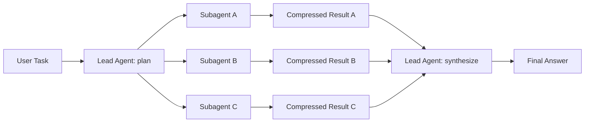
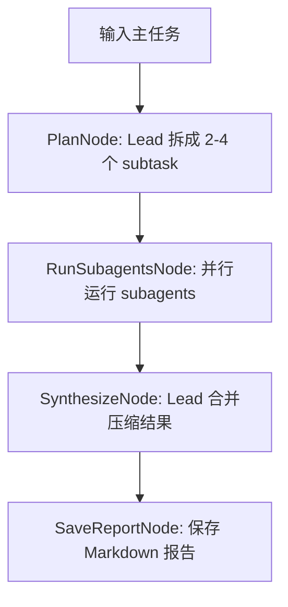

<!--more-->


## 零、写在前面

多 Agent 的设计理念以及面临的问题和 OS 中进程互斥、同步与通信其实是类似的，总体来说比较贴合传统工程。


## 一、Multi-Agent

### 1.1 多就是好吗？

如果是第一次听 Multi-Agent，会想象成：

-   一个 Agent 当老板
-   一个 Agent 当程序员
-   一个 Agent 当测试
-   一个 Agent 当产品经理
-   然后大家开会，自动把项目做完

这个想象很诱人，但现实里经常翻车。

原因有三个：

-   沟通成本高
-   责任边界不清
-   错误会互相传染

如果任务本身很简单，一个强 Single Agent 直接做，往往更稳定。多 Agent 会额外引入：

-   谁来拆任务？
-   谁来判断谁说得对？
-   多个 Agent 输出冲突怎么办？
-   是否浪费了更多 token？
-   并行结果怎么合并？

所以一个很重要的理念就是：

-   不是“能拆就拆”，而是“拆了以后上下文更干净、探索更充分、速度更快，才值得拆”。


### 1.2 Multi-Agent / Subagent / Agent Teams

#### 1.2.1 Multi-Agent

Multi-Agent 是总称：多个 Agent 参与同一个任务。

它可以是：

-   **主从式**：Lead Agent -> Subagent A / B / C -> Lead 汇总
-   **平行式**：Agent A / B / C 各自推进，最后合并
-   **辩论式**：Proposer -> Critic -> Judge
-   **流水线式**：Planner -> Coder -> Tester -> Reviewer

最早大家会想象不同公司、不同系统的 Agent 通过协议互相通信，例如 Google 的 A2A。但在日常工程里，真正常用的不是远程 Agent 大联盟，而是更朴素的本地编排：

-   主 Agent 在同一个程序里启动几个子任务
-   每个子任务有自己的 prompt / memory / tool budget
-   **最后只把摘要交回主 Agent**


#### 1.2.2 Subagent

Subagent 可以理解成主 Agent 临时雇来的“小助手”。

主 Agent 不把所有细节都塞进自己脑子，而是说：

-   你去查论文路线。
-   你去看代码结构。
-   你去设计实验。
-   你去检查风险。

每个 Subagent 只看到自己的任务。它完成后，不把全部过程倒回主 Agent，而是只交：

-   结论
-   证据
-   风险
-   建议

**这就是压缩回传**。


#### 1.2.3 Agent Teams

Agent Teams 更像真正的团队协作。

Subagent 常常还是主从结构：

```text
Lead -> Subagent -> Lead
```

Agent Teams 更强调平行推进：

-   Agent A 在工作区 A 做 parser
-   Agent B 在工作区 B 做 test
-   Agent C 在工作区 C 做 docs
-   最后集成

对 coding agent 来说，Agent Teams 的关键通常是：

-   隔离工作区
-   并行运行
-   避免互相改同一批文件
-   最终由人或 lead agent 做 merge/review

>   有一个比较朴素的方式是用tmux：tmux 可以很朴素地启动多个终端 session，每个 session 里跑一个 agent，让它们并行工作。


### 1.3 Multi-Agent 场景

#### 1.3.1 上下文隔离

主 Agent 不想被细节污染。

例如你让 Agent 调研 10 篇论文。如果主 Agent 自己读完整网页、PDF、代码、引用信息，它的 context 会很快变脏。

更好的方式：

-   Subagent A 读论文 1-3，只回传表格
-   Subagent B 读论文 4-6，只回传表格
-   Subagent C 读论文 7-10，只回传表格
-   Lead Agent 合并表格

主 Agent 看到的是压缩结果，不是所有原始噪声。


#### 1.3.2 并行探索

任务有多个互相独立的方向。

例如：

-   找 bug
-   写测试
-   读文档
-   查 API

这些可以并行做。并行带来的价值不是“更聪明”，而是“更快”和“覆盖更广”。


#### 1.3.3 专家角色不同

有些任务天然需要不同视角：

-   系统设计
-   安全审查
-   实验评估
-   用户体验

让不同 Subagent 带着不同 role prompt 分析，可以减少单一视角盲区。


#### 1.3.4 长任务拆块

长任务容易把单个 Agent 的 context 和执行状态拖得很重。

Subagent 可以作为一次性 worker：

-   拿任务
-   独立做
-   交付摘要
-   释放上下文

这和人类研究合作很像：不是所有人一直坐在同一个会议室里听每句话，而是分头做，最后同步要点。


### 1.4 Multi-Agent 的核心架构模式

#### 1.4.1 Lead-Worker



优点：

-   简单
-   好调试
-   适合调研、代码审查、方案比较

缺点：

-   **Lead Agent 容易成为瓶颈**
-   Lead 拆错任务，后面全偏
-   Subagent 之间不能直接协调


#### 1.4.2 Pipeline

```text
Planner -> Executor -> Tester -> Reviewer
```

适合流程明确的任务，比如 coding。

**缺点是前面错了后面会继承错误。**


#### 1.4.3 Debate / Critic

```text
Proposer -> Critic -> Reviser -> Judge
```

适合需要质量控制的任务，比如论文想法、实验设计、代码风险审查。

**注意：Critic 不应该只负责挑刺，还要给出可执行修改建议。**


#### 1.4.4 Team / Parallel Worktrees

```text
Agent A -> workspace A
Agent B -> workspace B
Agent C -> workspace C
Integration Agent / Human -> merge
```

**适合大型代码任务。**

**关键是隔离：**

-   不同工作
-   不同任务边界
-   不同日志
-   最后统一 review


### 1.5 和 Memory 的关系

Multi-Agent 本身也是一种 context/memory 管理策略。

单 Agent 的问题：

```text
所有工具结果、网页内容、错误尝试、推理过程都挤在一个 context 里。
```

Subagent 的做法：

```text
把噪声留在子上下文里，只把压缩后的结论写回主上下文。
```

从 Memory 角度看：

```text
Subagent context = 临时工作记忆
Subagent output  = 压缩后的 episodic memory
Lead context     = 全局工作记忆
Team artifact    = 共享外部记忆
```

所以就会有以下问题：

-   多个 agent 的记忆如何共享？
-   哪些记忆应该留在 subagent 私有上下文？
-   哪些记忆应该写入团队共享 memory？
-   不同 agent 对同一事件记忆冲突怎么办？

这些都是很自然的 Agent Memory 研究问题。


## 二、Lead-Worker demo 实现

我们实现一个最小 Lead-Worker 架构：

```text
PlanNode
-> RunSubagentsNode
-> SynthesizeNode
-> SaveReportNode
```

需要复用之前的实现来建立workflow：

```python
core.node.Node
core.node.Flow
core.llm.call_llm
```

### 2.1 流程




### 2.2 代码实现

~~~python
from __future__ import annotations

import argparse
import json
import os
import sys
from concurrent.futures import ThreadPoolExecutor, as_completed
from dataclasses import dataclass
from pathlib import Path
from typing import Any


AGENT_MEMORY_ROOT = Path(__file__).resolve().parents[2]
if str(AGENT_MEMORY_ROOT) not in sys.path:
    sys.path.insert(0, str(AGENT_MEMORY_ROOT))

from core.node import Flow, Node

DEFAULT_TASK = (
    "设计一个最小 Multimodal Agent Memory baseline：输入若干图片和文本问题，"
    "系统检索相关视觉记忆并给出带 evidence id 的回答。"
)

OUTPUT_DIR = AGENT_MEMORY_ROOT / "openclaw_study" / "runtime_multi_agent"
OUTPUT_FILE = OUTPUT_DIR / "multi_agent_report.md"


@dataclass
class Subtask:
    name: str
    role: str
    objective: str
    output_format: str


@dataclass
class SubagentResult:
    name: str
    role: str
    objective: str
    content: str


def require_api_env() -> None:
    missing = [
        key
        for key in ("OPENAI_API_KEY", "OPENAI_BASE_URL")
        if not os.environ.get(key)
    ]
    if missing:
        names = ", ".join(missing)
        raise RuntimeError(
            f"Missing environment variables: {names}. Set them before running."
        )


def llm_text(system_prompt: str, user_prompt: str) -> str:
    from core.llm import call_llm

    response = call_llm(
        messages=[{"role": "user", "content": user_prompt}],
        system_prompt=system_prompt,
    )
    return response.get("content", "").strip()


def parse_subtasks(text: str) -> list[Subtask]:
    try:
        data = json.loads(text)
    except json.JSONDecodeError as exc:
        raise ValueError(f"Planner did not return valid JSON: {text}") from exc

    subtasks: list[Subtask] = []
    for index, item in enumerate(data, start=1):
        if not isinstance(item, dict):
            raise ValueError("Each subtask must be a JSON object.")
        subtasks.append(
            Subtask(
                name=str(item.get("name") or f"subagent_{index}"),
                role=str(item.get("role") or "通用研究员"),
                objective=str(item.get("objective") or ""),
                output_format=str(item.get("output_format") or "返回简洁要点。"),
            )
        )
    if not subtasks:
        raise ValueError("Planner returned an empty subtask list.")
    return subtasks


class PlanNode(Node):
    def _exec(self, payload: dict[str, Any]) -> tuple[str, dict[str, Any]]:
        task = payload["task"]

        system_prompt = (
            "你是 multi-agent lead planner。你的任务是把用户目标拆成 2-4 个可以并行、"
            "彼此边界清楚的 subagent 任务。你只负责规划，不能声称任何任务已经执行。"
            "只返回 JSON 数组，不要 Markdown。"
        )
        user_prompt = f"""
            用户目标：
            {task}

            请拆成 subagents。每个对象包含：
            - name: 英文 snake_case 名称
            - role: 中文角色
            - objective: 清晰的局部目标
            - output_format: 期望输出格式
            """
        plan_text = llm_text(system_prompt, user_prompt)
        subtasks = parse_subtasks(plan_text)
        payload["subtasks"] = subtasks
        payload["plan_text"] = plan_text
        return "run", payload


class RunSubagentsNode(Node):
    def _exec(self, payload: dict[str, Any]) -> tuple[str, dict[str, Any]]:
        subtasks: list[Subtask] = payload["subtasks"]
        max_workers = min(payload["max_workers"], len(subtasks))

        results: list[SubagentResult] = []
        with ThreadPoolExecutor(max_workers=max_workers) as executor:
            future_to_subtask = {
                executor.submit(run_subagent, subtask, payload["task"]): subtask
                for subtask in subtasks
            }
            for future in as_completed(future_to_subtask):
                results.append(future.result())

        results.sort(key=lambda item: item.name)
        payload["results"] = results
        return "synthesize", payload


def run_subagent(subtask: Subtask, main_task: str) -> SubagentResult:
    system_prompt = (
        f"你是一个独立 subagent，角色是：{subtask.role}。"
        "你只能看到自己的任务，不要假装知道其他 subagent 的内部过程。"
        "你的输出必须短而密，只回传压缩后的关键结论。"
        "当前没有提供任何外部工具：不要声称已实现、已运行、已验证、已读取文件或已查询数据。"
        "请把未经执行的内容明确表述为建议、假设或待验证项。"
    )
    user_prompt = f"""
主任务：
{main_task}

你的局部目标：
{subtask.objective}

输出要求：
{subtask.output_format}
"""
    content = llm_text(
        system_prompt,
        user_prompt,
    )
    return SubagentResult(
        name=subtask.name,
        role=subtask.role,
        objective=subtask.objective,
        content=content,
    )


class SynthesizeNode(Node):
    def _exec(self, payload: dict[str, Any]) -> tuple[str, dict[str, Any]]:
        findings = "\n\n".join(
            f"## {item.name} ({item.role})\n目标：{item.objective}\n结果：\n{item.content}"
            for item in payload["results"]
        )
        system_prompt = (
            "你是 lead agent。你会收到多个 subagent 的压缩结果。"
            "请去重、合并冲突、形成一个可执行方案。"
            "当前系统没有执行工具；所有输出都应是分析或建议，"
            "不得声称已经实现、测试或验证任何外部系统。"
        )
        user_prompt = f"""
原始任务：
{payload["task"]}

Subagent 结果：
{findings}

请输出：
1. 综合结论
2. 推荐下一步
3. 仍然不确定的问题
"""
        payload["final_answer"] = llm_text(system_prompt, user_prompt)
        return "save", payload


class SaveReportNode(Node):
    def _exec(self, payload: dict[str, Any]) -> tuple[str, dict[str, Any]]:
        OUTPUT_DIR.mkdir(parents=True, exist_ok=True)
        report = render_report(payload)
        OUTPUT_FILE.write_text(report, encoding="utf-8")
        payload["output_file"] = str(OUTPUT_FILE)
        return "default", payload


def render_report(payload: dict[str, Any]) -> str:
    subtask_sections = "\n\n".join(
        f"### {item.name} ({item.role})\n\n"
        f"**Objective:** {item.objective}\n\n"
        f"**Compressed result:**\n\n{item.content}"
        for item in payload["results"]
    )
    return f"""# Multi-Agent Lab Report

## Main Task

{payload["task"]}

## Plan

```json
{payload["plan_text"]}
```

## Subagent Results

{subtask_sections}

## Lead Synthesis

{payload["final_answer"]}
"""


def build_flow() -> Flow:
    plan = PlanNode()
    run_agents = RunSubagentsNode()
    synthesize = SynthesizeNode()
    save = SaveReportNode()

    plan - "run" >> run_agents
    run_agents - "synthesize" >> synthesize
    synthesize - "save" >> save

    return Flow(plan)


def parse_args() -> argparse.Namespace:
    parser = argparse.ArgumentParser(
        description="Minimal multi-agent/subagent/team-style lab for Learn-OpenClaw."
    )
    parser.add_argument("--task", default=DEFAULT_TASK, help="Main task for the lead agent.")
    parser.add_argument("--max-workers", type=int, default=3, help="Parallel subagent workers.")
    return parser.parse_args()


def main() -> None:
    args = parse_args()
    require_api_env()
    payload = {
        "task": args.task,
        "max_workers": max(1, args.max_workers),
    }
    _, result = build_flow().run(payload)

    print("=" * 72)
    print("Multi-Agent Lab finished")
    print("=" * 72)
    print(f"Task: {result['task']}")
    print(f"Subagents: {len(result['results'])}")
    print(f"Report: {result['output_file']}")
    print("\nLead synthesis:\n")
    print(result["final_answer"])


if __name__ == "__main__":
    main()

~~~

按照前面的流程图，写一个workflow。总体比较简单。

因为没有tool_call，所以 agent 的回答还专门强调了一下数据都是假设数据hh：


