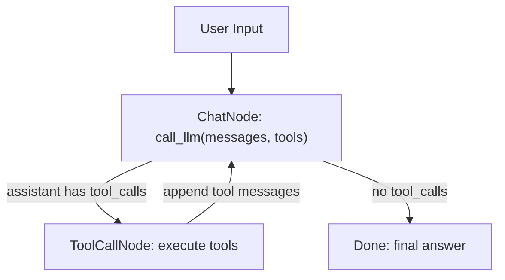
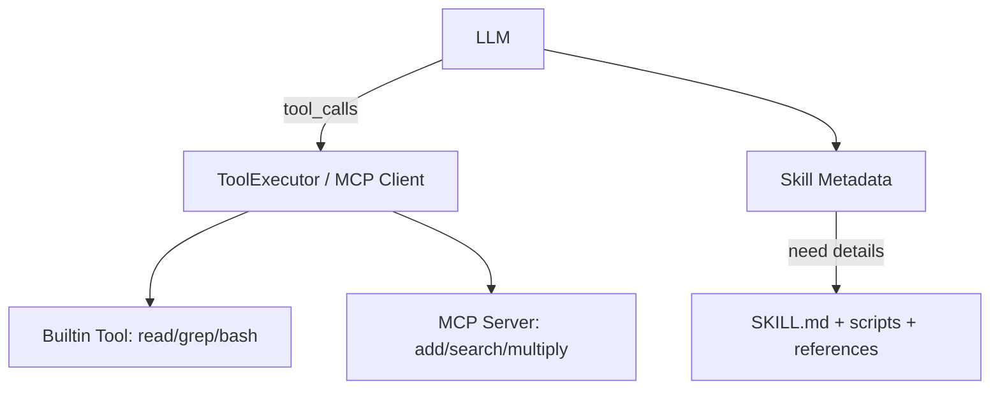

<!--more-->


## 零、写在前面

Agent 原本只是会说话的 LLM。**Tool / MCP / Skill 的共同目标，是让 LLM 从“只会回答”变成“能调用外部能力做事”**。

```text
chatbot = LLM + messages
agent = LLM + messages + tools + tool loop
```

-   Tool  = 本程序里的一个可调用函数
-   MCP   = 按标准协议暴露出来的远程/进程 Tool
-   Skill = 可渐进加载的本地能力包，通常包含说明书 + 脚本 + 参考资料

它们本质上都在回答同一个问题：**LLM 想做一件真实世界的事时，怎样把“想法”变成“函数调用”？**


## 一、Tool

### 1.1 为什么需要 Tool

普通 LLM 的输入输出都是文本：

-   用户：帮我看看当前目录有什么文件
-   LLM：我无法直接查看你的文件系统……

但是 Agent 想要的是：

-   用户：帮我看看当前目录有什么文件
-   LLM：我应该调用 ls 工具
-   程序：执行 ls
-   工具结果：README.md, tools/, examples/
-   LLM：当前目录包含 README.md、tools 和 examples

所以 Tool 的动机是：

- 获取最新信息：web search。
- 读取外部状态：read / ls / grep / find。
- 改变外部世界：write / edit / bash。
- 连接数据库、浏览器、API、文件系统。

LLM 本身不直接执行工具。它只输出一个结构化请求，例如：

```json
{
  "name": "ls",
  "arguments": {"path": "tools"}
}
```

真正执行的是宿主程序。


### 1.2 Tool 的底层协议直觉

Tool calling 是一个三方协作：

-   LLM：我想调用哪个工具，用什么参数
-   程序：检查并执行这个工具
-   外部世界：文件系统、搜索引擎、命令行、数据库等

完整消息流：

```text
user message
  -> LLM(messages + tool schemas)
  -> assistant message(content 或 tool_calls)
  -> ToolExecutor 执行 tool_calls
  -> tool messages 写回 messages
  -> LLM 再读 tool results
  -> final assistant answer
```

重点是：工具结果必须写回上下文。否则 LLM 不知道工具执行后发生了什么。


### 1.3 简单实现

#### 1.3.1 Tool 定义

```python
class Tool:
    """简单工具定义"""

    def __init__(
        self,
        name: str,
        description: str,
        parameters: dict,
        fn: Callable,
    ):
        self.name = name
        self.description = description
        self.parameters = parameters
        self.fn = fn

    def to_llm_format(self) -> dict:
        """转换为 LLM API 格式（OpenAI/Anthropic 通用）"""
        return {
            "type": "function",
            "function": {
                "name": self.name,
                "description": self.description,
                "parameters": self.parameters,
            },
        }

    def execute(self, **kwargs) -> Any:
        """执行工具"""
        return self.fn(**kwargs)
```

有四个关键字段：

```text
name        : 工具叫什么
description : 什么时候用它
parameters  : 参数长什么样
fn          : 真正要执行的 Python 函数
```


例如 `read` 工具：

```text
name: read
description: Read file contents. Use offset/limit for large files.
parameters:
  path: string
  offset: integer
  limit: integer
fn: read_file
```

这个 `parameters` 是 JSON Schema。它不是给人看的普通说明，而是给模型看的结构化接口说明。


#### 1.3.2 to_llm_format

`to_llm_format()` 会把内部 Tool 对象转成 OpenAI-compatible API 能理解的格式：

```python
{
    "type": "function",
    "function": {
        "name": self.name,
        "description": self.description,
        "parameters": self.parameters,
    },
}
```

这一步很关键。因为 LLM API 不认识 Python 函数对象，它只认识一段工具说明：

```text
这里有一个叫 read 的函数，它需要 path 参数，功能是读取文件。
```

模型读完这些工具说明后，才可能返回：

```json
{
  "tool_calls": [
    {
      "function": {
        "name": "read",
        "arguments": "{\"path\":\"README.md\"}"
      }
    }
  ]
}
```


#### 1.3.3 如何把工具交给模型

```python
def call_llm(
    messages: list[dict[str, Any]],
    tools: list[dict[str, Any]] | None = None,
    system_prompt: str | None = None,
) -> dict[str, Any]:
    """
    消息/工具模式接口：返回 assistant message 字典。
    """
    msgs = list(messages)

    if system_prompt:
        msgs = [{"role": "system", "content": system_prompt}, *msgs]

    kwargs: dict[str, Any] = {
        "model": os.environ.get("OPENAI_MODEL_ID", "kimi-k2.5"),
        "messages": msgs,
    }
    if tools:
        kwargs["tools"] = tools
        kwargs["tool_choice"] = "auto"

    client = OpenAI(
        api_key=os.environ.get("OPENAI_API_KEY"),
        base_url=os.environ.get("OPENAI_BASE_URL"),
    )
    response = client.chat.completions.create(**kwargs)
    message = response.choices[0].message

    result: dict[str, Any] = {
        "role": "assistant",
        "content": message.content or "",
        "usage": {
            "total_tokens": response.usage.total_tokens,
            "prompt_tokens": response.usage.prompt_tokens,
            "completion_tokens": response.usage.completion_tokens,
        },
    }

    reasoning_content = getattr(message, "reasoning_content", None)
    if reasoning_content:
        result["reasoning_content"] = reasoning_content

    if message.tool_calls:
        result["tool_calls"] = [tool_call.model_dump() for tool_call in message.tool_calls]

    return result
```

如果传入 `tools`：

```python
kwargs["tools"] = tools
kwargs["tool_choice"] = "auto"
```

含义是：

```text
tools       : 告诉模型有哪些函数可以用
tool_choice : 让模型自己决定是否调用工具
```

所以模型有两个选择：

```text
1. 直接回答用户：content 非空，没有 tool_calls
2. 请求调用工具：返回 tool_calls
```

如果模型返回了 `message.tool_calls`，代码会把它转成普通 dict：

```python
result["tool_calls"] = [tool_call.model_dump() for tool_call in message.tool_calls]
```

这使后面的 `ToolExecutor` 可以统一处理。


#### 1.3.4 ToolExecutor

ToolExecutor 做三件事：

```text
parse_tool_calls  : 从 assistant message 里解析工具调用
execute           : 执行一个工具
execute_all       : 执行一批工具
```


为了规范化模型输出和工具output，我们定义两个数据容器：

-   ToolCall
-   ToolResult


##### 1.3.4.1 ToolCall：把模型输出规范化

`ToolCall`定义：

```python
def _safe_json_loads(value: str) -> Any:
    """Load JSON safely and fall back to empty dict."""
    try:
        return json.loads(value)
    except json.JSONDecodeError:
        return {}

@dataclass(slots=True)
class ToolCall:
    """A normalized tool call parsed from an assistant message."""

    id: str
    name: str
    arguments: dict[str, Any]

    @classmethod
    def from_openai_item(cls, item: dict[str, Any]) -> "ToolCall":
        """Parse one OpenAI-style tool call item."""
        function = item.get("function", {})
        arguments = function.get("arguments", {})
        if isinstance(arguments, str):
            arguments = _safe_json_loads(arguments)
        if not isinstance(arguments, dict):
            arguments = {}
        return cls(
            id=item.get("id", ""),
            name=function.get("name", ""),
            arguments=arguments,
        )
```


模型返回的 tool call 是 OpenAI 风格：

```json
{
  "id": "call_abc123",
  "function": {
    "name": "ls",
    "arguments": "{\"path\":\"tools\"}"
  }
}
```

`ToolCall.from_openai_item()` 会提取：

```text
id        : call_abc123
name      : ls
arguments : {"path": "tools"}
```

注意：`arguments` 很多时候是 JSON 字符串，所以代码会做：

```python
if isinstance(arguments, str):
    arguments = json.loads(arguments)
```


##### 1.3.4.2 ToolResult：把工具结果变回 message

```python
@dataclass(slots=True)
class ToolResult:
    """Result of one tool execution."""

    tool_call_id: str
    content: str
    is_error: bool = False

    def to_message(self) -> dict[str, str]:
        """Convert to a standard tool message for conversation history."""
        return {
            "role": "tool",
            "tool_call_id": self.tool_call_id,
            "content": self.content,
        }
```


工具执行完之后，不能只是 print。它必须变成一条标准 message：

```python
{
    "role": "tool",
    "tool_call_id": self.tool_call_id,
    "content": self.content,
}
```

为什么要有 `tool_call_id`？

因为模型可能一次请求多个工具：

```text
call_1 -> read README.md
call_2 -> ls tools
```

`tool_call_id` 用来告诉模型：这个 tool result 对应哪一次 tool call。


##### 1.3.4.3 ToolExecutor

```python
class ToolExecutor:
    """Parse assistant messages and execute referenced tools."""

    def __init__(self) -> None:
        self.tools = get_builtin_tools()
        self.tool_map = {tool.name: tool for tool in self.tools}

    def parse_tool_calls(self, assistant_message: dict[str, Any]) -> list[ToolCall]:
        """
        Parse tool calls from a single assistant message.

        Supported format:
        - OpenAI: message.tool_calls
        """
        openai_calls = assistant_message.get("tool_calls")
        if isinstance(openai_calls, list):
            return [ToolCall.from_openai_item(item) for item in openai_calls]

        return []

    def execute(self, tool_call: ToolCall) -> ToolResult:
        """Execute one tool call and normalize the output."""
        tool = self.tool_map.get(tool_call.name)
        if not tool:
            return ToolResult(
                tool_call_id=tool_call.id,
                content=f"Tool '{tool_call.name}' not found",
                is_error=True,
            )

        try:
            raw_result = tool.execute(**tool_call.arguments)
        except Exception as exc:
            return ToolResult(
                tool_call_id=tool_call.id,
                content=f"Error: {exc}",
                is_error=True,
            )

        return ToolResult(
            tool_call_id=tool_call.id,
            content=_stringify_result(raw_result),
            is_error=False,
        )

    def execute_all(self, tool_calls: list[ToolCall]) -> list[ToolResult]:
        """Execute all tool calls in order."""
        return [self.execute(tool_call) for tool_call in tool_calls]
```


`execute` 核心逻辑：

```text
根据 tool_call.name 找到真实 Tool
把 tool_call.arguments 展开成函数参数
执行 tool.fn(**arguments)
把结果转成 ToolResult
```

伪代码：

```python
tool = tool_map[tool_call.name]
raw_result = tool.execute(**tool_call.arguments)
return ToolResult(content=str(raw_result))
```

这就是 Agent 从“说我要查目录”到“真的查目录”的关键一步。


#### 1.3.5 `chatbot_with_tools` 的 Agent Loop

回看之前的 `chatbot_with_tools` 的实现：

有两个 Node：

```text
ChatNode      : 调用 LLM
ToolCallNode  : 执行工具
```

状态机结构：



`ChatNode` 做：

```python
assistant_message = call_llm(messages=messages, tools=tools, system_prompt=SYSTEM_PROMPT)
messages.append(assistant_message)
tool_calls = assistant_message.get("tool_calls")
```

如果有 `tool_calls`：

```python
return "tool_call", assistant_message
```

如果没有：

```python
return "done", assistant_message
```

这就是状态机里的分支。

`ToolCallNode` 做：

```python
tool_calls = executor.parse_tool_calls(response)
results = executor.execute_all(tool_calls)
messages.append(result.to_message())
return "chat", None
```

它执行完工具后回到 `ChatNode`，让 LLM 读工具结果并继续推理。

外层循环：

```text
不断接收用户新输入
```

内层循环：

```text
一次用户输入中，LLM 可能多次调用工具
```

所以 Tool Agent 的本质是：

```text
while user keeps chatting:
    add user message
    while assistant wants tools:
        call LLM
        execute tools
        append tool results
    final answer
```


## 二、MCP

### 2.1 什么是MCP

**MCP = Model Context Protocol。**

可以把它理解成：

```text
给 Agent 工具调用设计的一套标准插头。
```

没有 MCP 时，每个工具系统都可能长这样：

```text
工具 A：自己定义 JSON
工具 B：自己定义 HTTP API
工具 C：自己定义 Python wrapper
工具 D：自己定义认证方式
```

Agent 要接很多工具时会很乱。

MCP 试图统一：

```text
怎么发现工具
怎么描述工具
怎么调用工具
怎么返回结果
怎么连接本地进程或远程服务
```

MCP 可以先理解为：

-   **普通 Tool 是本地函数调用。**
-   **MCP Tool 是通过协议调用另一个进程/服务器里的函数。**


### 2.2 简单实现

#### 2.2.1 MCP Server

我们用现有的 FastMCP 框架，帮我们快速写MCP服务。

没有 FastMCP，我们可能要自己处理：

```text
JSON-RPC 消息格式
工具注册
参数 schema
请求解析
结果序列化
stdio/http transport
连接生命周期
```

但是借助 FastMCP，只需：

```text
mcp = FastMCP("agent-tools")

@mcp.tool()
def add(a: float, b: float) -> float:
    return a + b
```

它会自动把函数变成 MCP tool。

我们写一个用于后续在本地测试的server脚本：

```python
"""MCP 服务器实现 - 使用 FastMCP"""

from __future__ import annotations

from fastmcp import FastMCP


# 创建 FastMCP 实例
mcp = FastMCP("agent-tools")


@mcp.tool()
def search(query: str, max_results: int = 5) -> list[dict]:
    """使用 DuckDuckGo 搜索网页"""
    from tools.builtins.search import search as search_impl
    return search_impl(query, max_results)


@mcp.tool()
def add(a: float, b: float) -> float:
    """Add two numbers"""
    return a + b


@mcp.tool()
def multiply(a: float, b: float) -> float:
    """Multiply two numbers"""
    return a * b


# 示例用法
if __name__ == "__main__":
    # 直接运行服务器 (stdio 传输)
    mcp.run(transport="stdio")

```


#### 2.2.2 MCP Client

MCPClient = 一个会启动 MCP server、连接 server、查看工具、调用工具、关闭连接的小客户端。

`client.py`

```python
"""Minimal MCP client implementation using stdio transport."""

from __future__ import annotations

import sys
from contextlib import AsyncExitStack
from pathlib import Path
from typing import Any

sys.path.insert(0, str(Path(__file__).parent.parent.parent))

from mcp import ClientSession, StdioServerParameters
from mcp.client.stdio import stdio_client


class MCPClient:
    """A tiny MCP client for connecting to a local stdio MCP server."""

    def __init__(self) -> None:
        self.session: ClientSession | None = None
        self.tools: list[dict] = []
        self._exit_stack: AsyncExitStack | None = None
	
    async def connect_stdio(self, command: str, args: list[str] | None = None) -> None:
        """Connect to an MCP server launched as a local subprocess."""
        if self._exit_stack is not None:
            await self.close()

        server_params = StdioServerParameters(
            command=command,
            args=args or [],
            env=None,
            cwd=Path(__file__).parent.parent.parent,
        )

        self._exit_stack = AsyncExitStack()
        read, write = await self._exit_stack.enter_async_context(stdio_client(server_params))
        self.session = await self._exit_stack.enter_async_context(ClientSession(read, write))
        await self.session.initialize()

        tools_result = await self.session.list_tools()
        self.tools = [tool.model_dump() for tool in tools_result.tools]

    async def list_tools(self) -> list[dict]:
        """List all tools exposed by the connected MCP server."""
        if not self.session:
            raise RuntimeError("Not connected to server")
        tools_result = await self.session.list_tools()
        return [tool.model_dump() for tool in tools_result.tools]

    async def call_tool(self, name: str, arguments: dict) -> Any:
        """Call one tool on the connected MCP server."""
        if not self.session:
            raise RuntimeError("Not connected to server")
        return await self.session.call_tool(name, arguments)

    async def close(self) -> None:
        """Close the MCP session and terminate the stdio server process."""
        if self._exit_stack:
            await self._exit_stack.aclose()
        self.session = None
        self.tools = []
        self._exit_stack = None


async def main() -> None:
    client = MCPClient()
    await client.connect_stdio(sys.executable, ["tools/mcp/server.py"])

    tools = await client.list_tools()
    print("Available tools:", [tool["name"] for tool in tools])

    result = await client.call_tool("add", {"a": 3, "b": 4})
    print("3 + 4 =", result)

    await client.close()


if __name__ == "__main__":
    import asyncio

    asyncio.run(main())

```


其中：

```python
client = MCPClient()
await client.connect_stdio(sys.executable, ["tools/mcp/server.py"])

tools = await client.list_tools()
result = await client.call_tool("add", {"a": 3, "b": 4})

await client.close()
```

-   启动 server.py 子进程
-   和 server.py 建立 stdio 通信
-   初始化 MCP 会话
-   请求 server.py 列出工具
-   调用 add 工具
-   关闭连接


```python
from contextlib import AsyncExitStack
```

**AsyncExitStack：管理多个 async context 的生命周期**

MCP 连接同时有两个需要保持活着的上下文：

```
stdio_client(...) 负责 server 子进程和 stdin/stdout 管道
ClientSession(...) 负责 MCP 协议会话
```

如果它们提前退出，连接就断了，所以需要 AsyncExitStack 来做管理。


```python
from mcp import ClientSession, StdioServerParameters
from mcp.client.stdio import stdio_client
```

-   **StdioServerParameters**：告诉客户端怎么启动 MCP server
-   **stdio_client**：真正启动 server 子进程，并建立 stdin/stdout 通信
-   **ClientSession**：在通信管道上建立 MCP 协议会话


运行测试：


### 2.3 MCP 和普通 Tool 的区别

| 维度     | 普通 Tool                      | MCP Tool                         |
| -------- | ------------------------------ | -------------------------------- |
| 调用位置 | 当前 Python 进程               | 另一个进程/远程服务              |
| 接入方式 | import 函数                    | 按 MCP 协议连接                  |
| 工具发现 | 本地列表 `get_builtin_tools()` | `session.list_tools()`           |
| 调用方式 | `fn(**kwargs)`                 | `session.call_tool(name, args)`  |
| 适合场景 | 简单本地能力                   | 外部服务、跨语言工具、标准化生态 |
| 代价     | 简单、低开销                   | 多一层协议和连接管理             |


## 三、Skill

### 3.1 什么是Skill

Skill 不是简单函数，而是一种“能力包”。

它通常包含：

```text
SKILL.md      : 什么时候用、怎么用、注意事项
scripts/      : 可执行脚本
reference.md  : 更详细的参考资料
assets/       : 模板或资源
```

我们以一个 pdf 的skill为例，会有如下组织结构：

```text
tools/skills/pdf/SKILL.md
tools/skills/pdf/reference.md
tools/skills/pdf/forms.md
tools/skills/pdf/scripts/*.py
```

`SKILL.md` 前面有 YAML frontmatter：

```yaml
---
name: pdf
description: Use this skill whenever the user wants to do anything with PDF files...
license: Proprietary. LICENSE.txt has complete terms
---
```

正文则是具体操作指南。


### 3.2 Skill 的核心动机：渐进式加载

如果一个 Agent 有 100 个工具，每个工具都有详细说明，全部塞给 LLM 会怎样？

-   上下文变长
-   token 变贵
-   模型注意力被稀释
-   很多无关工具干扰决策

Skill 的思想是：

-   **先只给模型看每个 skill 的 name + description**
-   **当任务真的需要某个 skill 时，再加载完整 SKILL.md**
-   **如果 SKILL.md 指向 reference/scripts，再按需加载**

**这就是 progressive disclosure，渐进式披露。**

它像你去图书馆：

-   先看目录
-   需要哪一章，再翻哪一章
-   需要附录，再看附录

而不是一上来把整本书每一页都塞进脑子。


### 3.3 Skill Loader

我们、写一个辅助函数来读取 skill.md 的内容

```python
def load(path: str) -> tuple[dict, str]:
    content = f.read()
    if not content.startswith("---"):
        return {}, content
    parts = content.split("---", 2)
    metadata = yaml.safe_load(parts[1])
    body = parts[2].strip()
    return metadata or {}, body
```

它做的是：

```text
读取 SKILL.md
解析 YAML metadata
返回 metadata 和正文 body
```


```python
if __name__ == "__main__":
    import sys
    from pathlib import Path

    # 默认测试文件（相对于脚本所在目录）
    script_dir = Path(__file__).parent
    test_file = script_dir / "skills/pdf/SKILL.md"

    if len(sys.argv) > 1:
        test_file = Path(sys.argv[1])

    print(f"Loading: {test_file}")
    print("=" * 50)

    meta, body = load(str(test_file))

    print("METADATA:")
    for k, v in meta.items():
        display = f"{v[:60]}..." if isinstance(v, str) and len(v) > 60 else v
        print(f"  {k}: {display}")

    print(f"\nCONTENT (first 300 chars):\n{body[:300]}...")

```

运行一下：


### 3.4 Tool / MCP / Skill 的统一理解

可以把它们都放进一张图：



三者的区别不是“谁高级谁低级”，而是边界不同：

-   Tool 解决：如何调用一个函数
-   MCP 解决：如何标准化调用外部工具服务
-   Skill 解决：如何把复杂能力说明按需加载


### 3.5 Tool 越多越好吗？

Tool 不是越多越好。

每个工具都会带来：

-   更多 tool schema token
-   更多选择困难
-   更多错误调用可能
-   更多安全边界
-   更多维护成本

对于 coding agent，少量通用工具往往很强：

```text
read
write
edit
bash
grep
find
ls
```

因为这些工具组合起来已经能完成大量任务：

```text
看文件 -> 搜索代码 -> 修改文件 -> 跑测试 -> 根据错误继续修改
```

**工具要少而强，能用代码执行解决的问题，不一定要为每个 API 都做一个专门 tool。**


