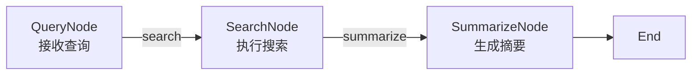
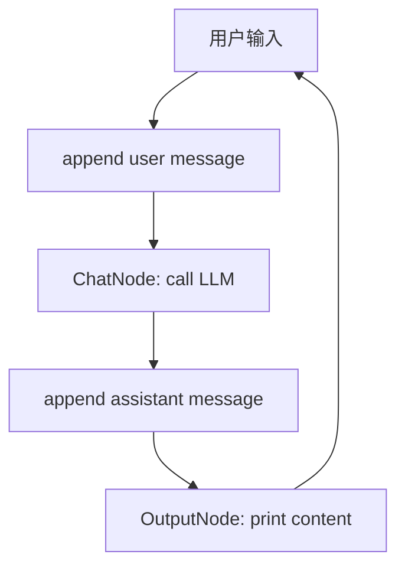
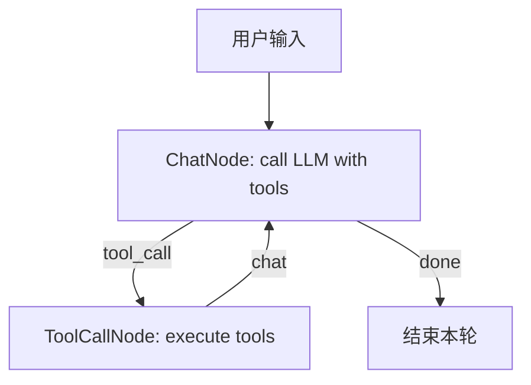

<!--more-->


## 零、写在前面

主要先跑一遍 Agent 的流程，后面进行原理学习会舒服一点。


## 一、环境配置

clone仓库到本地：

uv sync 一下

然后powershell 进入仓库目录，配一下环境变量：

```python
$env:OPENAI_API_KEY="你的 key"
$env:OPENAI_BASE_URL="你的 base url"
$env:OPENAI_MODEL_ID="你的模型"
```

然后运行一下试试：

```python
uv run python core\llm.py
```


## 二、从零实现轻量级Agent

我们最终的目标是造一个Agent，能够联网搜索、运行命令行、文件编辑。


### 2.1 Node 与 Flow

**Node** 是一个带业务逻辑的状态机节点，**Flow** 则是 状态机执行器 / 调度器。

Agent 的行为逻辑很适合用状态机来抽象，因为Agent 经常需要根据当前情况决定下一步：

```text
QueryNode 执行后如果返回 search    -> 进入 SearchNode
SearchNode 执行后如果返回 summarize -> 进入 SummarizeNode
SummarizeNode 没有后继节点          -> 结束
```


#### 2.1.1 Node 简单实现

```python
class Node:
    """
    同步节点：exec(payload) 返回 (action, next_payload)，支持重试。
    """

    def __init__(self, max_retries: int = 1, wait: float = 0) -> None:
        self.successors: Dict[str, "Node"] = {}
        self._action: str = "default"
        self.max_retries, self.wait = max_retries, wait

    def _exec(self, payload: Any) -> Tuple[str, Any]:  # pragma: no cover - 需要子类实现
        raise NotImplementedError

    def exec(self, payload: Any) -> Tuple[str, Any]:
        for cur_retry in range(self.max_retries):
            try:
                return self._exec(payload)
            except Exception as e:
                if cur_retry == self.max_retries - 1:
                    raise e
                if self.wait > 0:
                    time.sleep(self.wait)
        raise RuntimeError("Unexpected error in Node._exec")

    def __rshift__(self, other: "Node") -> "Node":
        self.successors[self._action] = other
        self._action = "default"
        return other

    def __sub__(self, action: str) -> "Node":
        if not isinstance(action, str):
            raise TypeError("Action must be a string")
        self._action = action or "default"
        return self
```

-   _action：状态转移条件 / 边标签

    >   _action是一个临时变量，当触发动作时，会加载对应动作名称到该变量

-   successors：转移表

-   payload：状态间传递的数据

注意到我们定义了两个 in-place 的运算符逻辑：- 和 >>，便于配合这种写法：

```python
node - "action" >> next_node
```

即，连接转移节点next_node，触发动作为 "action"


`_exec` 就是：

-   **进入这个状态后，要执行什么逻辑？**
-   **执行完后，输出哪个 action？**
-   **传给下一个状态的数据是什么？**

因为不同Node 逻辑不同，所以需要子类实现。


**状态转移函数**：
$$
δ(current\_node, payload) = (action, next\_payload)
$$
比如：

```python
class QueryNode(Node):
    def exec(self, payload):
        return "search", str(payload)
```


**_exec**：

```text
尝试执行当前状态
如果失败，并且还有重试次数，就等一下再试
如果最终失败，就抛异常
```


#### 2.1.2 Flow 简单实现

```python
class Flow:
    """
    同步编排器：按 action 依次执行节点。
    """

    def __init__(self, start: Optional[Node] = None) -> None:
        self.start = start

    def run(self, payload: Any = None) -> Tuple[Optional[str], Any]:
        curr, last_action = self.start, "default"
        while curr:
            last_action, payload = curr.exec(payload)
            curr = curr.successors.get(last_action)
        return last_action, payload

```

run 就是根据转移表跑状态机的过程。


### 2.2 workflow

**Workflow**： **把多个 Node 按 action 边连接起来，形成一个可执行任务流程。**

一下面这个状态机为例，构建一个简单工作流。




**库：**

```python
"""Workflow Example - 搜索工作流示例

工作流: Query -> Search -> Summarize
"""

from __future__ import annotations

import os
import sys
from pathlib import Path
from typing import Any, Tuple

sys.path.insert(0, str(Path(__file__).parent.parent.parent))

from core.llm import call_llm_simple
from core.node import Node, Flow
from tools.builtins.search import search as search_ddgs
```

-   `search_ddgs`：搜索工具，底层用 `ddgs` 做网页搜索。


**查询节点：**

```python
class QueryNode(Node):
    """查询节点"""

    def _exec(self, payload: Any) -> Tuple[str, Any]:
        return "search", str(payload)
```


**搜索节点：**

```python
class SearchNode(Node):
    """搜索节点"""

    def _exec(self, payload: Any) -> Tuple[str, Any]:
        results = search_ddgs(str(payload), max_results=3)
        titles = [r.get("title") or r.get("body") or "" for r in results]
        summary_input = " | ".join([t for t in titles if t])
        return "summarize", summary_input
```

第一行：

```python
results = search_ddgs(str(payload), max_results=3)
```

用搜索工具搜索 payload，最多取 3 条结果

返回的 `results` 大概是一个列表，每个元素是一个搜索结果字典：

```python
[
    {"title": "...", "body": "...", "href": "..."},
    {"title": "...", "body": "...", "href": "..."},
]
```

然后优先取每个结果的title，如果没有就取body，然后拼接起来返回。


**总结节点：**

```python
class SummarizeNode(Node):
    """总结节点"""

    def _exec(self, payload: Any) -> Tuple[str, Any]:
        prompt = f"基于以下要点写一句话摘要：{payload}"
        text = call_llm_simple(prompt)
        return "default", text
```


**主程序：**

```python
def main() -> None:
    """运行工作流"""
    if not os.environ.get("OPENAI_API_KEY"):
        print("提示：请先设置环境变量 OPENAI_API_KEY")
        return

    query = QueryNode()
    search = SearchNode()
    summarize = SummarizeNode()

    query - "search" >> search
    search - "summarize" >> summarize

    flow = Flow(query)
    _, result = flow.run("asyncio python best practices")
    print("Workflow 输出：", result)


if __name__ == "__main__":
    main()

```


运行结果：

```text
PS D:\AgentGroup\Research\Agent Memory\Learn-OpenClaw> uv run python .\examples\workflow\main.py
Workflow 输出： 这三份资料分别提供了Python异步编程的最佳实践讨论、动手实操教程以及官方概念性概述。
PS D:\AgentGroup\Research\Agent Memory\Learn-OpenClaw> 
```


我们成功搭建了一个简单的 联网搜索并且总结的workflow。

但是，这很死板，我们总不能每次都手写workflow吧，那么Agent究竟是如何做到自动化工作流的呢？


### 2.3 Tool Agent

现在尝试给chatbot一些tools(这里先不深究tool)，让它能够上网搜索东西、编辑文件、运行命令行，从“固定工作流”走向“真正 Agent”。

```text
workflow = node + node
chatbot = workflow + loop
agent = chatbot + tools
```


#### 2.3.1 Chatbot 是什么

Chatbot 的本质不是“会调用大模型”这么简单。更准确地说：

**Chatbot = 一个可以持续接收用户输入、维护 messages、反复调用 LLM 的循环系统**

和 Workflow 的区别是：

-   Workflow：一次输入，一次执行，一次输出
-   Chatbot：多次输入，多轮上下文，持续运行

之前 Workflow 是：

```
payload -> QueryNode -> SearchNode -> SummarizeNode -> result
```

Chatbot 是：

```
while True:
    user_input -> append messages
    ChatNode -> LLM
    append assistant message
    OutputNode
```

所以它的状态不只是一个 `payload`，还多了一个关键东西：

```
shared["messages"]
```

这就是**对话历史**。


#### 2.3.2 Chatbot 实现（无tools）

**库：**

```python
"""Simple Chatbot - 简单对话机器人（无工具）"""

from __future__ import annotations

import os
import sys
from pathlib import Path
from typing import Any, Tuple

sys.path.insert(0, str(Path(__file__).parent.parent.parent))

from core.llm import call_llm
from core.node import Node, Flow, shared

SYSTEM_PROMPT = "你是一个友好的对话助手，请回答用户的问题。"
```

-   `call_llm`：调用大模型的接口。


**ChatNode**

```python
class ChatNode(Node):
    """对话节点：发送消息给 LLM 并获取回复"""

    def _exec(self, payload: Any) -> Tuple[str, Any]:
        messages = shared["messages"]
        assistant_message = call_llm(messages=messages, system_prompt=SYSTEM_PROMPT)
        messages.append(assistant_message)
        return "output", assistant_message
```

-   在调用的时候我们加入了SYSTEM_PROMPT（"你是一个友好的对话助手，请回答用户的问题。"）
-   我们还取出了历史消息，并把助手回复追加到历史里。

**OutputNode**

```python
class OutputNode(Node):
    """输出节点：显示助手回复"""

    def _exec(self, payload: Any) -> Tuple[str, Any]:
        response = payload
        content = response.get("content", "")
        print(f"\n🤖 Assistant: {content}\n")
        return "default", None
```


**主程序**

```python
def run_chat() -> None:
    """运行对话循环"""
    print("=" * 60)
    print("🤖 Simple Chatbot")
    print("=" * 60)
    print("输入 'quit' 或 'exit' 退出\n")

    # 初始化
    shared.clear()
    shared["messages"] = []

    # 创建节点
    chat = ChatNode()
    output = OutputNode()

    # 连接节点
    chat - "output" >> output

    while True:
        # 获取用户输入
        user_input = input("👤 You: ").strip()

        if user_input.lower() in ("quit", "exit", "q"):
            print("\n再见！")
            break

        if not user_input:
            continue

        # 添加用户消息
        shared["messages"].append({"role": "user", "content": user_input})

        # 运行 Flow
        flow = Flow(chat)
        flow.run(None)


def main() -> None:
    if not os.environ.get("OPENAI_API_KEY") or not os.environ.get("OPENAI_BASE_URL"):
        print("⚠️  提示：请先设置环境变量 OPENAI_API_KEY 和 OPENAI_BASE_URL")
        return

    run_chat()


if __name__ == "__main__":
    main()

```

最终发给模型的大致结构是：

```text
[
    {"role": "system", "content": "..."},
    {"role": "user", "content": "..."},
    {"role": "assistant", "content": "..."},
    {"role": "user", "content": "..."}
]
```

注意：这里每轮都会创建一个 `Flow(chat)`，但 `messages` 保存在 `shared` 里，所以历史不会丢。

因此 Simple Chatbot 的整体流程是：



更简洁地说：

```
chatbot = while loop + messages + ChatNode
```

**运行效果：**


#### 2.3.3 Chatbot 和 Workflow 的区别

Workflow 是：**一次性任务流**

比如：

```
搜索 -> 总结 -> 结束
```

Chatbot 是：**任务流外面包了一个用户交互循环**

所以：

-   Workflow 关心“这一次怎么处理”
-   Chatbot 关心“多轮对话如何持续”

前者的状态主要是 `payload`。

后者的状态主要是：**messages**

这就是 Chatbot 的核心。


### 2.4 Tool Agent 

#### 2.4.1 原理

现在进入 Tool Agent。

Tool Agent 不是说“模型变聪明了”，而是它多了一个能力：**模型可以不直接回答，而是请求调用某个工具**

例如用户问：

```
帮我看看当前目录有哪些文件
```

普通 Chatbot 只能凭空说。

Tool Agent 可以让模型输出：

```python
tool_calls = [
    {
        "function": {
            "name": "ls",
            "arguments": {"path": "."}
        }
    }
]
```

然后程序真的调用 `ls` 工具，把结果再发回模型。

这就是：

-   LLM 负责决策
-   程序负责执行工具
-   工具结果再返回给 LLM

这已经非常接近 ReAct：

```
Reason -> Act -> Observe -> Reason
```


#### 2.4.2 代码实现

**库**

```python
"""Chatbot with Tool Support - 支持工具调用的对话机器人"""

from __future__ import annotations

import os
import sys
from pathlib import Path
from typing import Any, Tuple

sys.path.insert(0, str(Path(__file__).parent.parent.parent))

from core.llm import call_llm
from core.node import Node, Flow, shared
from tools import get_tools, ToolExecutor

SYSTEM_PROMPT = (
    "你是一个会调用工具的助手。"
    "当问题涉及最新信息、模型版本、产品发布时间或事实核验时，优先先调用 search 工具，再基于搜索结果回答。"
    "若问题是本地文件/代码相关，优先使用 read/grep/find/ls 等本地工具。"
    "如果一轮回复中既需要向用户展示文字又需要继续调用工具，可以同时返回 content 和 tool_calls。"
)
```

-   `get_tools`：拿到所有工具定义。
-   `ToolExecutor`：真正执行工具调用。
-   然后SYSTEM_PROMPT也加入了工具调用相关内容。


**ChatNode**

```python
class ChatNode(Node):
    """调用 LLM，打印 assistant content，并按 tool_calls 决定是否继续。"""

    def exec(self, payload: Any) -> Tuple[str, Any]:
        messages = shared["messages"]
        tools = shared["tools"]

        assistant_message = call_llm(messages=messages, tools=tools, system_prompt=SYSTEM_PROMPT)
        messages.append(assistant_message)

        content = assistant_message["content"]
        tool_calls = assistant_message.get("tool_calls")

        if content:
            print(f"\n🤖 Assistant: {content}\n")

        if tool_calls:
            return "tool_call", assistant_message

        return "done", assistant_message
```

-   取出对话历史和**工具列表**。
    -   这意味着请求 LLM 时，会把可用工具的 schema 一起传过去。
-   如果看到 tool_calls，我们返回 "tool_call" 这个 last_action，来执行状态转移。

即：

```text
如果 LLM 返回 tool_calls:
    ChatNode --tool_call--> ToolCallNode
否则:
    ChatNode --done--> 结束
```


**ToolCallNode**

```python
class ToolCallNode(Node):
    """执行 LLM 返回的 tool_calls"""

    def exec(self, payload: Any) -> Tuple[str, Any]:
        response = payload	# ChatNode 传来的 assistant message
        messages = shared["messages"]
        executor = shared["tool_executor"]

        tool_calls = executor.parse_tool_calls(response)	# 从 assistant message 里解析工具调用
        results = executor.execute_all(tool_calls)	# 逐个执行工具
	    
        # 每个工具结果都会变成一条 role="tool" 的消息，追加到 messages
        for tc, result in zip(tool_calls, results):
            print(f"  [Tool] 执行: {tc.name}({tc.arguments})")
            print(f"  [Tool] 结果: {result.content[:100]}...")
            messages.append(result.to_message())

        return "chat", None
```

-   代码里面写了点注释，还是很好懂的

Tool Agent 的状态图是：



这个循环就是 Agent 的关键。


**主程序**

```python
def run_chat() -> None:
    """运行对话循环"""
    print("=" * 60)
    print("🤖 Chatbot with Tools")
    print("=" * 60)
    print("可用工具: read, write, edit, bash, grep, find, ls, search")
    print("输入 'quit' 或 'exit' 退出\n")

    shared.clear()
    shared["messages"] = []
    shared["tools"] = [t.to_llm_format() for t in get_tools()]
    shared["tool_executor"] = ToolExecutor()

    chat = ChatNode()
    tool_call = ToolCallNode()

    chat - "tool_call" >> tool_call
    tool_call - "chat" >> chat

    while True:
        user_input = input("👤 You: ").strip()

        if user_input.lower() in ("quit", "exit", "q"):
            print("\n再见！")
            break

        if not user_input:
            continue

        shared["messages"].append({"role": "user", "content": user_input})
        flow = Flow(chat)
        flow.run(None)


def main() -> None:
    if not os.environ.get("OPENAI_API_KEY") or not os.environ.get("OPENAI_BASE_URL"):
        print("⚠️  提示：请先设置环境变量 OPENAI_API_KEY 和 OPENAI_BASE_URL")
        return

    run_chat()


if __name__ == "__main__":
    main()

```


**运行结果**


