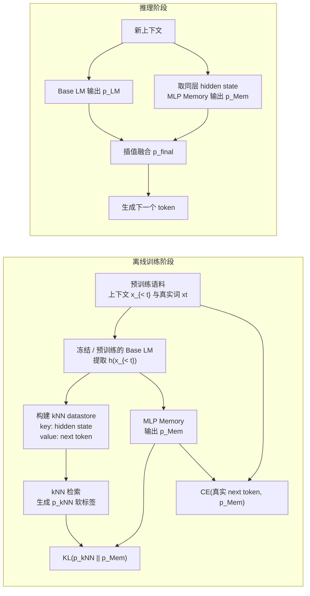

<!--more-->


## 零、写在前面

这个工作还蛮有趣，rag做检索效果不错，但是延迟高，且很难深度融合。CPT/LoRA 虽然推理快，但是容易灾难性遗忘，并且学新知识太麻烦。所以作者考虑在大规模语料上训练一个MLP来学习检索的行为，但又不是真的去做检索。

让这个MLP的概率输出和transformer内部的概率插值，从而提高了llm的记忆能力。

这个显然就不是可插拔的了，对于特定model都要重新训练，这也是这种外部adapter的通病。


## 一、标题


>   **来源：ICLR 2026**
>
>   作者团队来自 SJTU LUMIA Lab
>
>   然后 上海AI Lab 给他们提供了算力支持，泪目

然后看题目里面的 MLP 和 Pretrained 就知道这大概是一个以 MLP 形式做 parametric memory 的工作。


## 二、摘要


作者认为现有知识增强有两个极端：

1.  RAG：虽然能灵活访问外部知识，但存在高推理延迟和浅层集成的问题；
2.  LoRA / CPT：访问快但有灾难性遗忘先前所学能力的风险，**并且常常降低通用任务上的性能**，需要仔细的任务特定调优，限制了其更广泛的适用性。

作者提出在旁边放一个 **MLP Memory**：它在离线训练时，看见 LLM 的当前隐藏状态，学习输出一个类似检索器的“下一个 token 概率表”。推理时，不再查文档，也不做最近邻搜索；直接把这个 MLP 的概率表与原 LLM 的概率表插值融合。

然后摘要里面也是卖了一下实验结果：

- 在 WikiText-103 和 Web 数据上，缩放律指数分别提升 `17.5%`、`24.1%`；
- 在五个 QA 基准上，Mistral-7B 平均相对提升 `12.3%`，Llama2-7B 为 `7.8%`；
- 九个一般 NLP 任务平均绝对提升 `5.2` 分；
- HaluEval 上，最多提升约 `10` 个点；
- 相对 top-5 RAG，首 token 推理速度约快 `2.5x`。

表明：**在论文使用的语料、基础模型和评测协议下，额外训练一个 MLP 模块有正收益。**


## 三、引言


### 3.1 以往的问题

语言模型常能生成通顺的话，却未必能稳定调动参数中已有的事实知识。为此有两条常见路线：

1. **非参数记忆**：把文档保留在外部，按问题检索。典型是 RAG、kNN-LM。
2. **参数记忆**：继续训练模型，把知识写入权重。典型是 CPT、LoRA。

作者对两者的批评是：

- RAG 需要向量检索、重排和更长的输入上下文；而且“检索到正确文档”不保证模型会用，它仍可能被无关上下文带偏。
- CPT / LoRA 虽不必检索，但直接改动 base model，可能有 **catastrophic forgetting（灾难性遗忘）**：新语料学多了，旧任务能力下降。

MLP Memory 试图把二者拆开：**保留 base LM 的语言与推理能力，让独立模块负责吸收检索式知识分布。**


### 3.2 创新点

这项工作的关键不是“又加了一个 MLP”。Transformer 内本来就有大量 MLP / FFN。它的新意是训练目标：

> **输入当前上下文的 LLM hidden state**，**输出应模仿 `kNN-LM` 从整个训练语料检索出的下一 token 概率分布。**

因此它可以视作一种 **retriever distillation（检索器蒸馏）**：

```text
完整语料 + kNN 最近邻检索器
           ↓ 生成软概率标签
外置 MLP 学习“隐藏状态 -> 检索概率分布”
           ↓
推理期直接运行 MLP，不再查语料库
```

与普通 **knowledge distillation（知识蒸馏）** 相比，Teacher不是另一个更大的生成模型，而是一个非参数 kNN 检索系统。


**作者还提出了这个工作的目标**：


对于这几点，我们结合架构图：

1.  **可微（differentiable）**：他这个 external 是可微的，不过他是这么搞得，RAG 的“取最近邻”是离散查表，难对索引本身反向传播，所以它的实际主训练仍是先离线生成检索目标、再训练 MLP，而非直接端到端训练一个可微索引。
2.  **压缩（compressible）**：论文以 kNN-LM 的大 datastore 为参照，称 5B token 的约 `40 TB` 存储可压成约 `1B` 参数、约 `4 GB` 的 MLP。这里是对运行时存储的比较；训练阶段仍要构建并访问巨大 datastore 来产生老师信号。
3.  **固定时延（constant inference cost w.r.t. corpus size）**：MLP 的一次前向成本由 MLP 大小决定，不会随“原语料库有多少条”继续上涨；但它的参数规模随希望记住的知识量增大时仍可能需要扩大，不能理解成无代价无限记忆。


## 四、Preliminary: k-nearest neighbors language model

**kNN（k-nearest neighbors，k 近邻）** 是最朴素的类比学习：遇到新向量时，找历史上最相似的 k 个向量。

对训练语料中每个位置，kNN-LM 存一对：

$$
(k_i,v_i)=(h(x_{ < i}),x_i)
$$

- `key` $k_i$：当时的上下文 hidden state；
- `value` $v_i$：该上下文后真正出现的下一个 token。

**新上下文到来时，先计算 $h(x_{<t})$，再在海量 key 中找最相近的 $k$ 个。邻居越近、它们对应的 token 越多，就给该 token 更高的检索概率 $p_{kNN}$。**

MLP Memory 和 base LM 各自输出概率分布。最终不是强行替换，而是**插值**：

$$
p_{final}=\lambda p_{Mem}+(1-\lambda)p_{LM}
$$
其中 $\lambda\in[0,1]$ 是记忆权重。$\lambda$ 大，越相信 MLP Memory；小，越相信原模型。论文在每个验证集上调这个值，HaluEval 的敏感性实验显示大约 `0.3–0.6` 区间较稳，极端接近 `0.9` 往往会变差。


## 五、相关知识

### 5.1 RAG 与 kNN-LM：显式的非参数记忆

- **RAG**：检索外部文档，把文档文本接到 prompt 中。**优点是能引用、可替换文档库；缺点是检索噪声、上下文变长、端到端时延。**
- **kNN-LM**：不检索自然语言文档，而是在 LLM hidden state 空间中找相似上下文，并用其后继 token 修正概率。它通常比 RAG 更细粒度，但 datastore 很大，最近邻搜索也贵。

MLP Memory 的 Teacher 就是 kNN-LM。它不是与 kNN-LM 无关的“普通参数记忆”，而是明确地学习近邻检索产生的概率行为。


### 5.2 参数适配：CPT、LoRA 与模型编辑

- **CPT（continued pretraining）**：继续训练所有模型参数，吸收新语料。
- **LoRA（low-rank adaptation）**：以低秩增量修改部分权重，成本比全量微调低。
- **模型编辑**：针对特定事实直接修订模型局部行为。

这些方法的共同点是直接影响 base LM 的参数。MLP Memory 则在旁路加一个模块，论文中 base LM 与 memory 分开预训练，最终以输出分布融合。

这确实有助于隔离影响，但值得注意的是：**它把遗忘风险从主模型转移或缓解，并没有自动解决“记忆模块自身会不会覆盖旧知识”。**


### 5.3 长上下文 / memory token 方法

Memory Transformer、AutoCompressor、LongMem、MemoRAG 等会用 memory token、摘要向量或外部缓存延长上下文。它们更多服务于“刚刚发生过什么”，即工作记忆或对长文档的压缩。

MLP Memory 声称服务于整个预训练语料的通用知识，因此更接近长期事实记忆。但代价是：你无法像查外部记忆那样问“它到底记住了哪篇文档、哪段证据”。


### 5.4 为什么选择 MLP

已有研究提出 Transformer 的 FFN 层可以像 key-value memory：一些神经元对特定模式响应，并在输出端偏好某些 token。作者利用这一观察：**既然输入已经是单个上下文向量，要输出的是词表分布，不需要 token 与 token 再做 attention 混合，那么可以用纯 MLP 学这个映射。**

这是一条合理的架构直觉，不是严格证明。**“MLP 适合记忆”不意味着它能精确、无冲突地存任意规模的离散事实。**


## 六、方法


### 6.1 全流程：训练时有检索器，推理时没有




### 6.2 第一步：构建 kNN-LM datastore

将语料中每一个位置跑过 base LM。对每个上下文 $ x_{ < t } $，保存：


$$
(K,V)=\{(h(x_{ < t}),x_t)\}
$$


这等于建立了海量的“语境状态 -> 当时真实下一个词”案例库。对于训练样本，再去库中检索 $k$ 个相似上下文，按距离加权得到：

$$
p_{kNN}(w \mid x_{ < t}) 
\propto
\sum_{(k_i,v_i)\in N} \mathbf 1[w = v_i]\exp(-d(k_i,h(x_{ < t}))/T)
$$

- 邻居越像当前上下文，票数越大；
- 某 token 被相近邻居接在后面的次数越多，它的概率越大；
- $T$ 是 temperature（温度），控制“只信最近邻”还是“多听一些近邻”。

论文为训练目标生成使用 `k=1024`，并且**排除样本自己**，防止模型只靠“查到同一句原文”获得一个过于容易、没有泛化意义的答案。


### 6.3 第二步：MLP Memory 的结构

输入是某个 Transformer 层的 hidden state，输出是一个覆盖整个词表的概率分布：

$$
M: \mathbb R^d \rightarrow \mathbb R^{|V|}
$$


- $d$：hidden state 的维度；
- $|V|$：词表大小；
- 输出 logits 经 Softmax 后得到 $p_{Mem}$。

论文默认使用 **8 层堆叠 MLP**。在 Llama2 / Mistral 实验中，MLP 继承相应模型的 hidden/intermediate 维度：hidden size 为 `4096`，intermediate size 为 `11008`（Llama2）或 `14336`（Mistral）；总规模约 `1B` 参数，不计 embedding 参数。

“轻量”必须相对看：相较 7B base LM，它是外挂模块；但 `1B` 参数绝不是小模型。部署时它仍要占显存、增加矩阵乘法，只是不用索引数十 TB 的 datastore，也没有 attention 到额外文档的成本。


### 6.4 第三步：为什么损失函数要混合 KL 与 CE

MLP 的输出不能只模仿 kNN，也不能只预测真实 token。论文使用：

$$
\mathcal L_{KL}=KL(p_{kNN}\;||\;p_{Mem})
$$

$$
\mathcal L_{CE}=-\log p_{Mem}(x_t\mid x_{ < t})
$$

$$
\mathcal L=\alpha\mathcal L_{KL}+(1-\alpha)\mathcal L_{CE}
$$

含义是：

- **KL 项**：“模仿检索器的整张答案概率表。”它携带多个合理后继词的信息，而非只说一个标准答案。
- **CE 项**：“别忘了这条真实语料到底接了什么词。”它防止 MLP 完全跟着近邻噪声跑偏。
- **混合项**：“既学会参考相似案例，又保持对真实训练文本的预测能力。”

论文消融显示 $\alpha=0.4$ 最好。仅 CE（$\alpha$ 太低）会失去检索老师提供的丰富分布信息；仅 KL（$\alpha$ 太高）则过度追随检索分布，实际语言建模变差。


### 6.5 第四步：接在哪一层，以及怎样与 LLM 合作

直觉上，最后一层最接近输出词，似乎最适合做记忆。但论文发现把 MLP 接在 Transformer 大约 `70%` 网络深度的位置效果更好，并且 GPT2-small / medium / large 都有类似趋势。

一种直觉解释是：

- 太浅层：更多是词形、局部表面特征，语义尚未形成；
- 太深层：表示已经被原任务的 logits 强烈塑形，留给独立记忆修正的空间变小；
- 中后层：已经携带足够语义，但尚有空间让 memory 分支补充事实偏好。

推理时没有检索，没有把文档放进上下文。只计算：

$$
p_{final}=\lambda p_{Mem}+(1-\lambda)p_{LM}
$$
这非常像 kNN-LM 的输出融合，只是原先昂贵的 $p_{kNN}$ 已被 MLP 的 $p_{Mem}$ 近似。$\lambda$ 按验证集调节：记忆过强会把普通语言词也改坏，过弱则几乎没有知识增益。


### 6.6 一个完整的小例子

假设上下文是：`The Eiffel Tower is located in`。

1. **训练期**：kNN-LM 在语料库找到许多类似句子，得到大致分布：`Paris 0.90`、`France 0.05`、其他很小。
2. MLP 看同一上下文的 hidden state，学习输出接近这张分布。
3. **推理期**：Base LM 可能给 `Paris 0.60`、`France 0.18`、`London 0.05`；MLP Memory 给 `Paris 0.88`。
4. 插值后，`Paris` 的综合概率上升，模型更容易作出正确续写。

关键是：MLP 并没有“找到一篇埃菲尔铁塔文档”，也无法把文档展示给你；它只是学到了“此类隐藏状态常对应 Paris 高概率”。这正是它快、但可解释性弱的根源。


## 七、实验

### 7.1 设置与公平性

作者使用 Llama-2-7B 与 Mistral-7B-v0.3 做基座。QA 相关实验使用 Wikipedia-2021 建 datastore 与训练 MLP；每个基座单独训练一个 1B 参数 MLP，默认 8 层，学习率 `4e-4`。训练使用 `32 × A800 80GB` GPU；**论文称预算相当于训练一个 7B 模型一个 epoch 的计算量。**

>   32卡A800 80GB，跪了qwq
>
>   不过作者在最近一个评论下面回复说训练一个epoch要8~10h左右，何意味

对比包括：

- **RAG**：BGE 检索器、top-5 文档；
- **kNN-LM**：\(\lambda=0.1\)、temperature `10.0`；
- **CPT**：全参继续预训练；
- **LoRA**：作用于 Q/K/V 和 MLP 层，秩调到与 MLP Memory 参数量大致匹配。

这里要注意，方法不是“只多了一个 1B MLP”的纯低成本改动：它还需要先为海量语料跑 hidden state、建 kNN datastore、生成并缓存检索分布。论文主要强调**部署 / 推理期**效率，训练期的数据管线和显存 / 存储成本仍很重。


### 7.2 scaling law：额外 MLP 是否随规模继续受益


作者在 WikiText-103（约 100M tokens）和混合 Web 数据（约 600M tokens）上，用不同 GPT-2 尺度比较普通 decoder-only 继续训练与 `GPT2 + MLP Memory`。

- WikiText-103 上，拟合幂律指数从 `-0.143` 变为 `-0.168`，作者称缩放增益 `17.5%`。
- Web 数据上，从 `-0.216` 变为 `-0.268`，增益 `24.1%`。
- GPT2-xl 尺度下增加训练计算量，MLP Memory 版本的 perplexity 继续下降，图中未显示明显过拟合。

这是在固定的模型配置和训练协议下，测试困惑度随模型 / 计算规模下降得更快。它说明“检索器模仿”是一个有学习信号的辅助任务；但并不能单独证明它已存储更完整、更准确的世界知识。


### 7.3 QA：主要结果


五个 QA 基准：NQ、WebQA、TriviaQA、TruthfulQA、HotpotQA。

对 Mistral，平均 `32.12 -> 36.06`，相对提升 `12.3%`；对 Llama2，`32.81 -> 35.38`，相对提升 `7.8%`。

这张表有两个值得记住的细节：

- MLP Memory 并非每个单项都是最高。例如 Mistral 上 TruthfulQA、HotpotQA 的 RAG 更高，TriviaQA 的 LoRA 更高。
- RAG / CPT / LoRA 在某些任务下降很明显。它支持“方法有 trade-off”，但并不能仅凭这些结果断言 MLP 一定普遍优于 RAG；RAG 的检索、prompt、重排器和上下文预算有大量可变设计空间。


### 7.4 一般 NLP 能力：是否破坏原模型


作者在九项任务上测试 Mistral：情感分类、文本蕴含和主题分类。base 平均为 `67.86`；MLP Memory 平均 `73.07`，即绝对 `+5.21` 分。比较显眼的是：

- CB：`69.64 -> 76.79`；
- RTE：`59.57 -> 64.62`；
- AGNews：`75.95 -> 80.28`。

**论文据此认为外挂 MLP 没有像 CPT / LoRA 那样大范围损害通用能力。**这个结论在这九个评测上有数据支持，但还不足以完全排除长尾能力、对齐能力、多语言、代码或多模态能力的回归。


### 7.5 幻觉评测

HaluEval 三类任务结果如下：


MLP Memory 相对 base 的增益分别是 `+9.68`、`+10.08`、`+2.14`。这很有意思，但要避免把“检测 / 识别 HaluEval 中事实不一致的准确率提升”直接等同于“生成时完全不幻觉”。两者相关，但不是同一指标。


### 7.6 消融：为什么这样设计


1. **KL 与 CE 权重**：\(\alpha=0.4\) 最佳，说明软检索分布与真实 token 监督都需要。
2. **插入层位置**：约 `70%` 深度最佳，而非最后层。这提醒我们 memory readout 未必越接近 logits 越好。
3. **MLP 大小**：GPT2-large 上，base PPL `15.81`；8 层 221M MLP 为 `11.41`；15 层 359M 为 `11.35`；36 层 772M 为 `11.25`。更大有收益，但边际收益明显下降；论文因此默认 8 层，取性能与效率平衡。
4. **速度**：作者报告相对 top-5 RAG 的 TTFT 快 `2.5x`、相对 kNN-LM 快 `5.6x`；token/s 分别高 `1.5x`、`6x`。并称仅比 base LM 多约 `1.2x` 的开销。


## 八、总结

### 8.1 论文贡献

MLP Memory 提供了一条清晰的参数化记忆路线：

1. 用 `kNN-LM` 从全语料构造丰富的检索软标签；
2. 用独立 MLP 学 `hidden state -> 检索式 token 分布`；
3. 推理时以概率插值给冻结 / 独立的 base LM 补充知识偏好；
4. 用较大的离线训练代价，换取部署期不查库、时延不随语料库增长的优势。

它可以被看成“**把 kNN retrieval 的行为蒸馏成外置参数**”，而不是把 RAG 文档直接压缩成一段 prompt 或把全部知识无损写进模型。


### 8.2 它最适合什么，不适合什么

**比较适合：**

- 语料相对稳定，部署很看重低延迟；
- 希望以模块方式增强预训练模型，而不直接微调主模型；
- 任务偏语言建模、常识 / 事实续写，且不要求把证据原文返回给用户。

**不适合单独承担：**

- 每天更新的新闻、企业知识库、数据库记录；
- 需要引用、审计、可删除、权限控制的知识；
- 用户个性化经历、矛盾偏好、长期 belief state；
- 需要明确“这条结论来自何时何地”的高风险决策。


