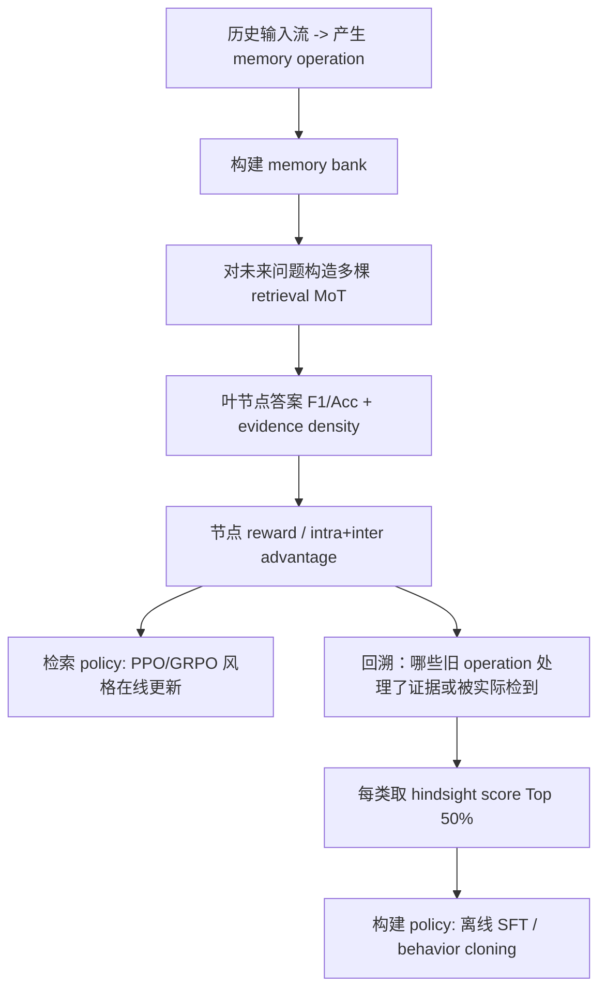

<!--more-->


## 零、写在前面

方法不算太复杂，能感受到作者功力非常深厚，工作质量非常高，不管是方法本身还是实验的设计都非常全面且严谨。

不过个人感觉本文的卖点是解决奖励稀疏的问题？对于记忆划分那一块的消融实验，感觉各部分的作用似乎都不是很明显。


## 一、标题


>   来源：ICML 2026
>
>   github：https://github.com/yanweiyue/Mem-T
>
>   huggingface：https://huggingface.co/EdwinYue/Mem-T-4B

Mem-T 中的 T 即 Tree，训练检索策略时，把一条检索轨迹扩展成 **Memory Operation Tree, MoT（记忆操作树）**

相比 Search-R1、Memory-R1 只看结果，Mem-T 的 reward 更 dense 一些。

**Mem-T 用检索树回传终局奖励，再把收益追溯给早期记忆操作，以训练长期记忆 Agent。**


## 二、背景

### 2.1 问题

作者认为，真正可学习的 memory agent 不应只使用人工规定的“抽取、存储、检索”流水线，而应由模型自己决定：

- 这段新信息要不要记？
- 应记成事实、经验，还是只保留原文？
- 应 `ADD` 新条目，还是 `UPDATE` 旧条目？
- 回答问题时先查哪类记忆？查到什么程度可以停止？

难点在于：这些动作往往跨越很长时间。一个写入动作可能在第 30 轮发生，第 400 轮才被未来问题验证。若只给最终答案一个 `0/1` 奖励，模型很难知道到底该奖励哪一步，这就是 **temporal credit assignment（跨时间贡献分配）**问题。

### 2.2 相关工作

#### 2.1 Memory Agent 架构

>   不知到这个作者是参与了《Memory in the Age of AI Agents: A Survey》那个工作还是说读过，分类范式是一样的。

论文把记忆功能分为三类：

| 功能                                | 通俗解释                       | 人类类比                                       | Mem-T 对应模块 |
| ----------------------------------- | ------------------------------ | ---------------------------------------------- | -------------- |
| **Factual Memory（事实记忆）**      | 保存可陈述的事实、关系和状态   | “Gina 住在罗马”“Jon 已离职”                    | `M_fact`       |
| **Experiential Memory（经验记忆）** | 保存任务策略、步骤和可复用做法 | “制定旅行计划时，先确认成员，再查目的地和时间” | `M_exp`        |
| **Working Memory（工作记忆）**      | 当前会话暂时需要的压缩状态     | 脑中临时记住正在算的中间结果                   | `M_work`       |

此外还有：

- **Raw Memory（原始记忆）**：保留跨 session 的**原始数据或原文片段**。

#### 2.2 RL for Memory Agent


过去一年有很多agentic RL 的方法，比如 MemRL、Memory-R1。但是长程episode以及奖励稀疏，始终是个痛点。


## 三、方法


### 5.1 Hierarchical Memory Definition

设连续输入为：

$$
X=\{x_1,x_2,\ldots,x_T\}.
$$
每读到一段新输入 $x_t$，Mem-T 维护：

$$
M_t=\{M_t^{work},M_t^{fact},M_t^{exp},M_t^{raw}\}.
$$

- $M_t^{work}$：当前 session 的小结；
- $M_t^{fact}$：事实卡片；
- $M_t^{exp}$：经验/策略卡片；
- $M_t^{raw}$：原文资料。

其中事实和经验条目带有效时间区间：

$$
m=(\text{content},t_{start},t_{end}).
$$
例如：

```text
事实：Gina 在 2025-06 到 2025-10 住在 Rome。
经验：安排双人旅行时，先核对双方可出行日期，再选共同去过或共同偏好的城市。
原始：2025-08-13 的对话片段全文。
```

时间区间的作用是让系统至少有能力表达“曾经如此”和“现在如此”。不过，论文没有将其发展成完整的 belief revision system：没有明确置信度、来源可靠性、冲突逻辑或真伪核验图。

### 5.2 阶段一：连续记忆构建

构建分为两步：**formation** 先产生候选，**evolution** 再决定如何并入正式 memory bank。

**A. Formation：从输入中提取候选记忆**

记忆形成策略 $\pi_{form}$ 观察当前输入和工作记忆：

$$
a_t^{form}\sim\pi_{form}(\cdot\mid x_t,M_t^{work}).
$$
它可选的动作集合是：

$$
\mathcal A_{form}=\{\texttt{CrtFact},\texttt{CrtExp},\texttt{CrtRaw},\texttt{UpdWork}\}.
$$


| 动作      | 作用             | 例子                                   |
| --------- | ---------------- | -------------------------------------- |
| `CrtFact` | 创建原子化事实   | “Jon 在 6 月失业”                      |
| `CrtExp`  | 创建程序性经验   | “若旅行计划冲突，先比较每人的时间约束” |
| `CrtRaw`  | 保存原始资料     | 保存原对话或关键片段                   |
| `UpdWork` | 更新当前会话摘要 | “本轮已确认 Gina 与 Jon 都去过 Rome”   |

所谓 **atomic memory unit（原子记忆）**，意图是让一条条目只承载尽量单一、可独立更新的内容，避免把一大段互不相关的话粘在一起。

**B. Evolution：决定怎样改正式库**

对每个候选条目 $m$，演化策略 $\pi_{evol}$ 查看它与旧库中相关条目，选择：

$$
\mathcal A_{evol}=\{\texttt{ADD},\texttt{UPDATE},\texttt{DELETE},\texttt{IGNORE}\}.
$$


- `ADD`：新事实，写入；
- `UPDATE`：旧信息被新信息替代，写新版本、删旧版本；
- `DELETE`：某条记录应被移除；
- `IGNORE`：无价值、重复或不适合保存，不写。

论文用集合写法表达这一过程：

$$
\Delta^+=\{\text{要加入的条目}\},\qquad
\Delta^-=\{\text{要移除的条目}\},
$$

$$
M_{t+1}=(M_t\setminus\Delta^-)\cup\Delta^+.
$$

这只是“先从旧档案抽掉该删的，再放入该加的”的形式化表达。

### 5.3 阶段二：按需、多步检索

当问题 $q$ 出现时，模型不只做一次向量检索，而是连续决策：

$$
\mathcal A_{retr}=\{\texttt{Search}(r,\text{key},\text{top-k})\mid r\in M_t\}\cup\{\texttt{Finish}\}.
$$
每一步都要决定：

1. 该查 `fact`、`exp`、`raw` 还是别的模块？
2. 搜索 query（`key`）如何改写？
3. 召回 top-k 后，是否还需要继续查？
4. 什么时候 `Finish`，用现有证据回答？

形式上：

$$
a_l\sim\pi_{retr}(\cdot\mid q,M_t,h_{l-1}),
$$
其中 $h_{l-1}$ 是此前已经检到的记忆及推理状态。最终积累相关集合 $M_{rel}$，再生成答案：

$$
y\sim p_\theta(\cdot\mid q,M_{rel}).
$$
例子：问题是“Gina 和 Jon 都去过哪里？那个城市在欧洲吗？”一个好的检索链不应搜索模糊的“Gina Jon common”，而可能是：

```text
1. Search(Fact, "Gina visited which cities")
2. Search(Fact, "Jon visited which cities")
3. 对齐城市：Rome
4. 检索或利用常识确认 Rome 在 Europe
5. Finish
```

这就是论文所说的 **multi-turn retrieval（多轮检索）**。

### 5.4 检索训练：Memory Operation Tree（MoT）

>   Q：**为什么需要“树”而不是多采几条轨迹？**
>
>   A：
>
>   普通 GRPO 可对同一个问题采样若干完整检索轨迹，再按最后答题成绩做相对比较。但一个完整轨迹如果有六步：
>
>   ```text
>   Search A -> Search B -> Search C -> Search D -> Finish -> Answer
>   ```
>
>   最后答错时，你仍不知道是 A 就查错库、C 的 query 不好，还是 D 不该继续查。

Mem-T 将检索过程做成树：

1. 对每个问题先采样 $G$ 条完整的 seed trajectory，得到 $G$ 棵初始树；
2. **多轮随机挑选树内尚未结束的 pivot node；**
3. **保留该节点之前的前缀，从这里重新 rollout 一个后续分支；**
4. 新分支接回树中。

这样，同一个“前缀检索决策”可以长出多种后续结果。若某个节点后面接的多个分支普遍表现好，说明这个节点较有价值。

>   论文实际设置为：每问题 $G=3$ 棵树、最大深度 4、每轮扩展 3 个节点。
>

**节点 reward：当前证据 + 后续成功潜力**

对树节点 $v$，论文定义：

$$
r(v)=\mathbb I_{fmt}(v)\cdot\left(\alpha\cdot\operatorname{Evid}(v)+\operatorname{Perform}(v)\right).
$$

| 符号                        | 含义                               | 直觉                                   |
| --------------------------- | ---------------------------------- | -------------------------------------- |
| $\mathbb I_{fmt}(v)$        | 工具调用格式是否合法的 0/1 mask    | 工具格式错了，直接不给分               |
| $\operatorname{Evid}(v)$    | 已检回集合中含有多少标准证据       | “有没有把关键文件找出来？”             |
| $\operatorname{Perform}(v)$ | 从该节点继续下去的预期最终答题质量 | “沿这条路走，最后能不能答好？”         |
| $\alpha$                    | 证据密度权重                       | 调节“马上找对证据”与“最终答对”谁更重要 |

其中，叶节点直接以最终答案的 F1 或 accuracy 衡量：

$$
\operatorname{Perform}(v)=\operatorname{F1}(v),\qquad v\in V_{leaf}.
$$
内部节点则取其所有孩子的平均表现：

$$
\operatorname{Perform}(v)=\frac{1}{|Ch(v)|}\sum_{u\in Ch(v)}\operatorname{Perform}(u).
$$
这正是“把叶子结果沿树往前传”的地方。它不是严格的 Bellman value learning，而是一个利用已有 rollout 子树的**经验平均回传**。

>   Q：**这一步依赖什么监督？**
>
>   A：
>
>   $\operatorname{Evid}(v)$ 使用 **ground-truth evidence（标准证据）**，即 benchmark 告诉你答案所需的原文证据是什么。
>
>   因此训练阶段不是完全“只凭最终 answer reward 自己悟出来”。它借用了数据集已有的证据标注，把“检到对的东西”变成一个更早、更稠密的信号。这会提高可训练性，但也意味着真实线上场景往往没有同等质量的 \(\operatorname{Evid}\) 标签。
>

### 5.5 Dual-Scale Advantage：树内比较 + 树间比较

得到节点 reward 后，论文计算两种 advantage（相对优势）：

$$
A_{intra}(v)=\frac{r(v)-\mu_{intra}}{\sigma_{intra}+\epsilon}.
$$
这是**树内标准化**：同一棵树里比较“同一背景下哪条岔路更好”。

$$
A_{inter}(v)=\frac{r(v)-\mu_{global}}{\sigma_{global}+\epsilon}.
$$
这是**树间标准化**：把所有树放在一起，比较“这条路在所有候选方案中是否仍然优秀”。

最终：

$$
A_{total}(v)=A_{intra}(v)+A_{inter}(v).
$$
随后使用带 KL 约束的 PPO/GRPO 风格 clipped objective 更新检索 policy：


### 5.6 构建训练：Hindsight Credit Assignment（事后贡献追溯）

**问题：三百轮前写的记忆，怎样拿到今天答案的 credit？**

设某个构建操作 $a^{mem}$ 处理了源输入 $X_{src}$，写出记忆条目 $m$。现在有问题 $q$，已知它的标准证据是 $X^q_{evi}$。论文给这个旧操作一个 hindsight score：

$$
S(a^{mem})=
\frac{1}{|V_{leaves}|}
\sum_{v_l\in V_{leaves}}
A_{total}(v_l)\cdot \omega(a^{mem},v_l).
$$
即：遍历检索树的叶子。一个叶子最终表现好，且这个早期操作确实与该问题有关，就给这个操作较高分。

关键在权重：

$$
\omega(a^{mem},v_l)=
\mathbb I(X_{src}\cap X^q_{evi}\neq\varnothing)
+eta\cdot\mathbb I(m\in M^{rel}_{v_l}),
$$
论文中 $\beta=0.1$。它由两个 gate 组成：

1. **Evidence Alignment Gate（证据对齐门）**：如果这个操作所处理的源 turn 本身包含该问题的标准证据，说明它“本来就该被好好记住”。
2. **Retrieval Trace Gate（检索轨迹门）**：如果这个操作生成的条目真的出现在某个叶子路径检到的记忆中，说明它至少实际参与了该次决策。该项权重较小，为 0.1。

例子：

```text
第 30 轮源对话：Gina 和 Jon 去过 Rome。
第 200 轮问题：他们共同去过哪里？

若构建操作把该事实正确写成 M_fact，
且后续检索树中它被搜到，最终回答 Rome 又得高分，
那么该操作会拿到较高 hindsight score。
```

>   值得注意的是：
>
>   如果数据集没有 $X^q_{evi}$ 这样的标准证据，第一项失效，系统只能依赖第二项“条目是否被检到”。
>
>   但“被检到”不等于“正确且必要”。一条噪声记忆也可能被检到。所以论文所谓“在缺少 ground-truth evidence 时仍可泛化”，应理解为**算法仍能运行**，而不是已经证明 credit 质量同样可靠。

### 5.7 Policy Refinement

论文先：

1. 生成一批 memory operations；
2. 丢掉非法 tool invocation；
3. 在每种 operation category 内，按照 hindsight score 排序；
4. 保留每类前 **50%**；
5. 将保留下来的 $(x,a^{mem})$ 当作高质量示范；
6. 最大化这些动作的 log-likelihood：

$$
\mathcal L_{off}(\theta)=
-\mathbb E_{(x,a^{mem})\sim D_{mem}^{+}}
\left[\log\pi_\theta(a^{mem}\mid x,M_t)\right].
$$

这就是普通 next-token prediction / SFT 形态的监督目标，只不过“正确示范”不是人工写的，而是由未来检索树和最终表现**事后筛选**出来的。

**也就是说，进一步离线蒸馏了GRPO的memory policy。**

因此整体训练可以这样理解：



总结就是：**检索端用树把“未来答得好不好”回传给中间搜索动作；构建端再把这些高价值检索结果回溯成早期记忆操作的训练示范。**


## 四、实验

### 4.1 设置

**数据集**

- **LoCoMo**：长期多轮对话记忆 QA；论文采用与 Memory-R1 相同的 `1:1:8` train/validation/test 划分（这倒是跟Memory-R1类似）。
- **LongMemEval**：长期交互记忆，含信息抽取、多 session 推理、时间推理、知识更新、拒答等能力。
- **HotpotQA**：多跳问答。论文构造约 56K token 的长上下文版本，将 gold documents 放进 400 篇干扰 Wikipedia 文档中。
- **NarrativeQA**：长篇叙事理解，论文随机采样 10 个长文档、298 个 QA 作评测。

LoCoMo 是训练内任务，其余三个主要作为 OOD（分布外）泛化测试。

**模型与操作设置**

- 主 backbone：**Qwen3-4B**；附录也报告 **Qwen3-8B**；
- embedding model：**BGE-M3**；
- MoT：每个问题 3 棵树，最大深度 4，每次扩展 3 个节点；
- 推理最多 6 步检索；每次默认取 top-5；
- retrieval training：200 steps；
- construction training：使用含 **10k memory operations** 的数据；
- retrieval 端最大 prompt length 40,960，最大 observation history 20,480；
- construction 端最大序列长度 6,144；训练使用 8 张 GPU、DeepSpeed ZeRO-3、FlashAttention 2。

反正想一想这个实验就很贵了，树还要进行多次扩展，成本还是太可怕了。

### 4.2 LoCoMo 主结果


### 4.3 OOD 泛化


这些结果说明：从 LoCoMo 学到的“如何分库、如何生成搜索 query、何时继续检索”至少可以迁移到多跳和长文档 QA。

但它们仍是以“有标准答案的 QA benchmark”为中心的泛化，不等同于真实用户长期交互中的人格稳定、偏好修订、隐私处理或自发知识成长。

### 4.4 消融实验


**移除记忆模块**

| 消融        | Overall F1 | 相比 58.65 的变化 |
| ----------- | ---------: | ----------------: |
| 完整 Mem-T  |      58.65 |                 - |
| 去 `M_work` |      57.59 |             -1.06 |
| 去 `M_fact` |      55.25 |             -3.40 |
| 去 `M_exp`  |      56.60 |             -2.05 |
| 去 `M_raw`  |      56.61 |             -2.04 |

在 LoCoMo 这种以人物、事件、时间更新为主的任务中，事实记忆最重要。这并不能证明经验记忆在真实复杂 Agent 任务中不重要，只能说明此 benchmark 对事实型信息依赖更强。

**移除训练部件**

| 消融                       | Overall F1 |  变化 |
| -------------------------- | ---------: | ----: |
| 完整 Mem-T                 |      58.65 |     - |
| 不优化 retrieval policy    |      53.37 | -5.28 |
| 不优化 construction policy |      55.36 | -3.29 |
| 去 $A_{intra}$             |      56.95 | -1.70 |
| 去 $A_{inter}$             |      54.09 | -4.56 |

最强信号是：**retrieval optimization 的贡献大于 construction optimization**。这与作者“联合优化全部生命周期”的叙事并不冲突，但也提醒我们：当前提升可能主要来自学会更好地查，而不是学会更好地长期写。

`A_inter` 的消融损失明显大于 `A_intra`，说明跨树比较对训练稳定性更关键。直觉上，只有树内相对比较时，“一棵整体很差的树里的冠军”也可能被误判为好策略；全局横向标准化能修正这个问题。

**敏感性分析**


- 最大检索步数从 2 增至 6，LoCoMo F1 从 **53.45** 升至 **58.65**；再从 6 到 10，收益小于 0.5%，但 token 显著增加。
- 操作树数 $G$ 从 1 增至 3，LoCoMo F1 从 **54.20** 升至 **58.65**；HotpotQA 从 **62.49** 升至 **66.54**。
- $G=5$ 时平均仅再提高约 0.35，却增加约 67% 计算成本。

**这解释了作者为什么选 3 棵树：不是树越大越好，而是在探索覆盖与训练成本间取折中。**


## 五、总结

### 5.1 论文贡献

**Memory Operation Tree 把检索端的 terminal reward 变成节点级监督；Hindsight Credit Assignment 再用证据对齐和实际检索痕迹，把一部分价值回传给早期构建操作。**

### 5.2 局限

- **并非真正没有人工监督**：node reward 和 construction credit 都显式利用 ground-truth evidence；真实生产环境通常没有这种标注。
- **Retrieval Trace 有循环性**：一条记忆被 policy 检到，因此得到 credit；但它被检到可能只是因为当前 policy 已有偏好，并不证明它本来正确或必需。
- **没有 belief layer**：虽有时间区间、`UPDATE/DELETE`，但没有来源、置信度、矛盾检测、证据链、主动求证或正式 belief revision。
- **经验记忆较弱地被验证**：LoCoMo 是对话事实 QA，`M_exp` 的收益小于事实记忆；论文没有用真正的长时程工具使用/技能迁移任务充分检验 experiential memory。
- **“更省 token”只指推理**：最终推理可少查资料，不代表训练或 memory construction 总成本更低。

### 5.3 启发。？

1. **没有 gold evidence 时如何可靠归因**  
    把 Evidence Alignment Gate 替换成可验证的 provenance、反事实删除、信息增益、或多模型一致性评估，而不是仅凭“被检到过”。

2. **从文本记忆升级为 belief memory**  
    让每条 memory 不只是 `(content, time)`，而是：

    ```text
    belief = (命题, 置信度, 来源, 时间, 支持证据, 冲突集合, 可修订状态)
    ```

    然后 reward 不只看“是否答对”，还看冲突是否减少、过期信念是否撤销、解释是否能追溯到可靠来源。

3. **更低成本的 process credit** 
    MoT 的树搜索很重。可以研究：少量分支的 value model、离线 replay、层级 action credit、基于 retrieval trace 的 causal estimator，或在不显式大规模 branching 的情况下做稠密 reward。

