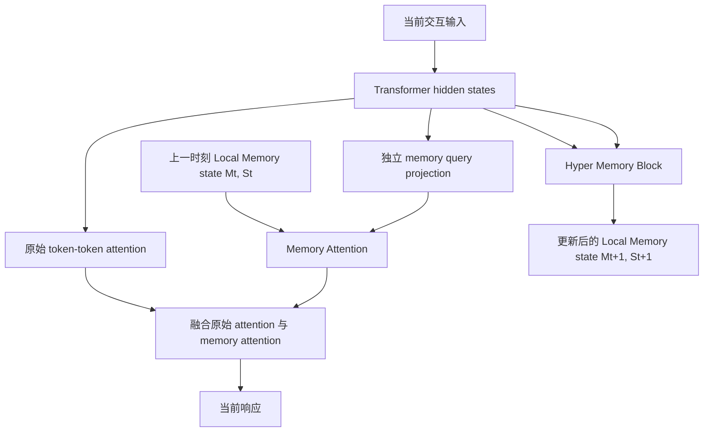

<!--more-->


## 零、写在前面

七月底就看到 Metis 的论文了，当时感觉在memory的 benchmark 上表现很差，而且觉得还是 TTT 那套，就没怎么看。现在回过头来看，发现很多 insight 还是很有启发的，而且论文里面 MemTensor 团队也将 Metis 和 TTT 做了区分。

整体下来，Metis 这个模型架构还是比较清晰的，论文实验的 taste 也很好，但是效果对比那些外部记忆方案真的有点差……


## 一、标题


>   Code：https://github.com/MemTensor/Metis
>
>   huggingface：https://huggingface.co/collections/IAAR-Shanghai/metis

**Memory Foundation Model（记忆原生基座模型）** ：让基础模型本身具有跨多步交互的原生记忆能力。

它包含两个核心要求：

1. 模型内部存在一个**持久且动态变化的 memory state（记忆状态）**；
2. 模型能够在前向计算中自主执行记忆的存储、利用、更新和遗忘等操作。

这两个要求分别对应：

- **Native memory state（原生记忆状态）**：记忆以动态参数或快速变化的参数形式存在，并参与模型计算；
- **Native memory procedure（原生记忆过程）**：模型根据输入的语义，自主决定如何把当前信息写入或修改 state，以及如何从 state 中读取信息。

按照《Memory in the Age of AI Agents: A Survey》的 **Forms / Functions / Dynamics** 框架，Metis 可以这样归类：

| 维度                | Metis 的位置                                                 |
| ------------------- | ------------------------------------------------------------ |
| **Form**            | 主要是 **parametric memory（参数化记忆）**：信息写入动态的矩阵状态，并通过模型参数化的计算使用 |
| **Form 的补充描述** | 这些矩阵本身位于 latent computation 中，所以也带有 latent 表征特征，但严格分类时不应把它等同于“只输出 latent memory token”的 latent memory |
| **Function**        | 同时覆盖 factual memory、experiential/operation memory 和 working memory；训练任务包括 remember、update、forget、reflect |
| **Dynamics**        | 有原生的 formation、retrieval/utilization、updating 和 forgetting；但当前实现仍是固定容量、规则形式相对有限的动态状态 |
| **系统位置**        | 不是普通外挂式 RAG；更接近与 Transformer 前向计算耦合的 fast-weight memory |

---


## 二、摘要

### 2.1 挑战


现在大多数 Agent Memory 系统都在模型外面：

```text
历史对话
   -> 外部 memory manager 整理
   -> 数据库 / 向量库 / 图结构
   -> 检索和拼接
   -> 把文本放回 prompt
   -> LLM 回答
```

论文认为这种做法有三个问题：

1. **架构解耦**：外部 memory module 负责生成上下文，backbone 只负责在这个上下文上做语言建模。外部模块挑出的信息未必最适合 backbone 的内部计算，backbone 也未必能最优地利用它；
2. **端到端优化困难**：检索、离散选择、文本拼接等操作会阻断梯度，难以直接用最终任务损失训练整个记忆系统；
3. **额外推理开销**：外部系统需要单独做索引、召回、重排、摘要或拼接，增加线上延迟。

>   个人观点：
>
>   外部记忆方案和原生记忆两种路线，现在来看都不是全能方案，但却可以是互补的，外部可以做一些 harness 上的规则设计，以及探索一下更加适配 agent memory 这种动态场景的检索范式。但是现有的很多工作，感觉都是在 agent memory 爆火之际，摘 low hanging fruit 的占坑工作，或者就直接知识图谱或者类似的领域的拼接、抄作业的工作。
>
>   但是做原生记忆，又不能简单的做成 linear attn 或者 TTT 那种，否则就本质一个固定容量的状态、快权重更新了。如何在 灾难性遗忘、固定记忆容量在长程任务上的退化、记忆在多轮交互中的作用 上做一些改进，这些问题其实很容易找出来，但和现有的 rag + 记忆库 的问题一样，我知道有问题，但是还没找到合适的解决策略。
>
>   前段时间和别人讨论 agent memory，他们都认为已经饱和了，但个人觉得其实还是一片蓝海，只是很多东西不是短时间能够解决罢了，

### 2.2 Metis 的主要思路

Metis 将记忆拆为两个结构：

- **Local Memory Block（局部记忆块）**：维护一个固定大小的动态矩阵，保存此前交互压缩后的信息；
- **Hyper Memory Block（超记忆块）**：使用训练阶段得到的静态参数，把当前输入的 hidden states 压缩成 key/value，并更新 local memory；同时学习如何从 local memory 读取信息。

在每一轮交互中，流程大致是：

1. 用当前的 $M_t$ 参与回答当前输入；
2. 根据当前交互的中间 hidden states 选择重要 token；
3. 将选中的 hidden states 投影成 memory key/value；
4. 用训练得到的更新规则把它们写入 $M_{t+1}$；
5. 下一轮直接使用更新后的 state，而不用重新把全部历史文本放进上下文。

### 2.3 Metis 的特点

论文强调：

- 记忆 state 是固定大小的动态参数；
- memory 读写过程与 backbone 前向计算结合；
- mid-training 阶段训练 memory-specific objectives；
- 在线维护不需要梯度，只需要 forward pass；
- 推理时学习到的模型权重冻结，只有每个会话的 memory state 持续变化。

### 2.4 批判性理解

Metis消除的是：

- 外部文本记忆的检索和拼接路径；
- **每次查询重新 prefill 全部历史的需要；**
- 离散 memory operation 与主模型之间的强解耦。

它没有消除的是：

- 每个会话的动态状态存储；
- 有限容量导致的信息压缩和干扰；
- 模型需要学习如何正确管理 state 的难题。

---


## 三、引言

### 3.1 从“无状态预测器”到“有状态系统”

普通语言模型可以看成一个函数：给定当前输入，输出下一个 token。用符号表示，传统模型在第 `t` 步生成 token 时，依赖当前输入 $X_t$、当前已生成的响应以及固定参数 `θ`：

$$
y_{t,k}\sim P(y\mid X_t,Y_{t,<k};\theta).
$$
如果前一轮说过“我喜欢牛肉汉堡”，而这一轮只问“我喜欢吃什么”，普通模型不会凭空知道这件事，除非应用程序把历史对话重新放入当前上下文。

### 3.2 外部记忆如何工作

外部记忆系统一般维护一个文本或结构化存储 $C_t$：

$$
C_t=C_{t-1}\oplus\{(X_t,Y_t)\},
$$
其中 `⊕` 表示写入或更新。

查询时再根据当前输入检索：

$$
C_t=C_{t-1}\otimes X_t,
$$
其中 `⊗` 表示读取、检索或筛选。

回答模型实际看到的是：

$$
y_{t,k}\sim P(y\mid C_t,X_t,Y_{t,<k};\theta).
$$
类比一个办公助理：

- LLM 是负责写答案的员工；
- 外部 memory manager 是档案管理员；
- 数据库是档案室；
- prompt 中拼接的检索结果是管理员递给员工的资料。

这种模式实用、可解释，今天的工业系统大量采用。但论文希望问：能不能让员工本身拥有一个小型、持续变化的内部工作记忆？

>   感觉在端侧场景还是很有前景的？/托腮

### 3.3 论文为什么强调“内生”

论文的核心观点不是“外部记忆完全错误”，而是认为外部记忆存在一个接口问题：

```text
外部系统先决定“给模型什么”
模型再决定“如何使用这些内容”
```

但真正有用的记忆依赖于当前任务的细粒度需求。例如：

- 用户问“Bob 现在住在哪里”，需要最新状态，而不是所有历史地点；
- 用户问“上次为什么失败”，需要经验或事件因果，而不是单纯关键词相似的对话；
- 用户说“忘掉 Alice 喜欢汉堡”，系统需要修改已有状态，而不是简单追加一条“不要记住”。

**如果记忆读取和写入与模型的语义计算在同一个连续函数空间里，理论上可以直接用最终输出损失训练它们。**

### 3.4 记忆本质上是一个预测问题

论文提出一个有启发性的看法：**在线记忆的困难来自时间流**。

- 在写入时，模型知道当前信息，但不知道未来会怎样使用它；
- 在未来查询时，原始信息可能已经不在上下文中，只剩下当时保存的压缩状态。

所以记忆不是简单的“把文本复制到某个地方”，而是：

> 根据当前信息，预测它未来会如何被使用，并把最有用的部分保存下来。

这解释了为什么论文认为 memory operation 不应只由人工规则决定。一个简单的“包含 remember 就插入、包含 forget 就删除”规则，很难覆盖隐含指令、状态变化、多事实干扰和未来任务需求。

### 3.5 论文自定义的两个核心概念

#### Native memory state

**Native memory state（原生记忆状态）** 指在多步交互中持久存在、动态变化，并且参与 backbone 前向计算的参数化状态。

论文严格区分：

- 交互开始之前模型已经拥有的信息，属于知识或静态参数；
- 交互过程中实时获得的信息，才属于本文定义的 memory。

#### Native memory procedure

**Native memory procedure（原生记忆过程）** 指记忆的存储和使用不再作为模型外部离散步骤运行，而是在模型计算中自动完成。

它包括：

- remember：保存新事实；
- update：用新事实覆盖或修正旧事实；
- forget：削弱或移除某项记忆；
- reflect：组合多个事实形成更高层结论；
- utilize：在当前回答中读取需要的信息。

### 3.6 这篇论文的主要贡献

根据论文原文，可以概括为：

1. 给出 memory foundation model 和 native memory 的形式化定义；
2. 提出 Metis，使用 local memory block 与 hyper memory block 构成原生记忆架构；
3. 从多个公共 benchmark 合成 memory-specific training data；
4. 设计 memory reconstruction、memory operation 和 regularization 三类优化目标；
5. 在记忆操作、记忆问答、OOD、容量、效率和通用能力上做系统分析，并发布代码和 checkpoint。

## 四、相关工作

### 4.1 按记忆表示形式分类

论文将已有 Agent/LLM Memory 粗略分成三种：

#### Textual memory

**Textual memory（文本记忆）** 把历史保存为文本，再用 RAG 检索。

例如：MemoryBank、MemTree 和大量生产系统。

优点：可解释、可编辑、跨模型兼容；缺点：信息密度低，查询时常常需要重新做 embedding、检索、拼接和 prefill。

#### Latent memory

**Latent memory（潜在记忆）** 把历史压缩成中间激活或 latent tokens。

例如：NextMem 将事实压缩成 latent representation，MemGen 生成与推理过程交织的 latent memory tokens。

它通常不直接保存可读文本，而是利用模型内部的隐状态表示。

#### Parametric memory

**Parametric memory（参数化记忆）** 把信息写进模型内部参数或可训练参数结构。

例如：

- Locas 把 FFN 看成 soft lookup table；
- ROME 把投影矩阵当作关联记忆，通过 rank-one update 写入事实；
- δ-Mem 使用低秩在线 state 影响 attention。

Metis 属于第三类，但它更进一步：它不是每次为一条事实临时训练 LoRA，也不是只额外插入一个 latent token，而是把一个持续演化的动态 memory state 设计进 Transformer block，并用专门数据训练读写程序。

### 4.2 Fast Weight Programming

**Fast Weight Programming, FWP（快速权重编程）** 指模型同时拥有：

- **slow weights**：训练阶段学到、推理时固定的慢参数；
- **fast weights**：推理过程中根据输入快速更新的参数或状态。

线性 attention、RetNet、RWKV、状态空间模型、Mamba、TTT 和 Titans 都与“用固定大小状态吸收序列信息”的思想有关。

**Metis 借鉴的是这条路线，但目标和普通长上下文建模并不完全相同：**

>   这里和TTT单纯根据每次input做序列建模做了区分

- 线性 attention 常常主要为降低序列计算复杂度；
- Metis 试图让 state 具有显式的记忆语义，能够根据 remember / forget / update 等操作变化；
- Metis 不打算替换当前交互内部的标准 full attention，而是把过去交互压缩后的 state 作为额外记忆分支。

### 4.3 Memory-Augmented Neural Networks

**Memory-Augmented Neural Network, MANN（记忆增强神经网络）** 会加入 memory slots，并让 controller 学习可微的读写操作。

Metis 与它们的区别在于：

- MANN 的 memory 通常是由 controller 控制的独立存储组件；
- Metis 将 memory state 设计为与 backbone 层计算耦合的参数化状态；
- Metis 的 hyper memory block 与普通 backbone 一样，在 mid-training 阶段被优化；
- 在线时，state 的变化不需要额外的梯度下降。

### 4.4 与相近 Agent Memory 方法的定位

| 方法               | 记忆主要在哪里                      | 在线更新方式                     | 是否保留文本检索路径           |
| ------------------ | ----------------------------------- | -------------------------------- | ------------------------------ |
| RAG / Mem0 / A-MEM | 外部文本、向量或图结构              | 外部 manager 写入、合并、检索    | 是                             |
| MemGPT             | 外部分层存储 + 上下文管理           | 由 Agent/manager 控制迁移        | 是                             |
| MemGen / NextMem   | latent activations 或 latent tokens | 生成或压缩 latent representation | 通常仍与上下文/推理配合        |
| Temp-LoRA          | 临时 adapter 参数                   | 测试时梯度更新                   | 不一定，但适配成本高           |
| δ-Mem              | 低秩在线矩阵和 attention correction | forward 中更新 state             | 不依赖文本检索，但结构较小     |
| **Metis**          | 每层 local memory state             | forward 中执行原生存储程序       | 目标是移除文本 memory 的必需性 |

这里的关键不是“Metis 一定比外部 memory 更强”，而是它把研究问题从“如何管理外部记忆”改成了：

> **如何训练一个基础模型，使它自己学会记忆生命周期。**

---


## 五、Memory Foundation Model

### 5.1 传统模型、外部记忆模型与 Metis 的形式化差别

设连续交互有 `T` 个时间步，每一步接收输入 $X_t$，生成响应 $Y_t$。

#### 无记忆模型

模型参数 `θ` 固定：

$$
y_{t,k}\sim P(y\mid X_t,Y_{t,<k};\theta).
$$
每轮之间不存在模型内部的持久状态。

#### 外部记忆模型

模型参数仍然固定，但回答额外依赖外部上下文 $C_t$：

$$
y_{t,k}\sim P(y\mid C_t,X_t,Y_{t,<k};\theta).
$$
$C_t$ 通过外部的写入 `⊕` 和读取 `⊗` 得到。

#### Memory Foundation Model

论文定义 memory foundation model 为：

$$
y_{t,k}\sim P(y\mid X_t,Y_{t,<k};\theta_t),
$$
其中 $θ_t$ 已经整合了此前交互的信息。

这里的 $θ_t$ 更适合被理解为一个**有效参数状态**：

$$
\theta_t=\Phi\cup M_t,
$$
其中：

- `Φ`：冻结的 backbone 与 hyper memory 参数；
- $M_t$：随会话变化的 native memory state。

论文强调，$θ_{t+1}$ 会在当前前向计算中根据 $X_t$ 和 $Y_t$ 被自动变换。实际实现中并不是把整个 4B/9B/27B backbone 权重重新训练，而是更新小得多的 local memory state。

### 5.2 Native memory state 的严格定义

#### 5.2.1 为什么必须是动态的

如果不同时间步保存的信息不同，模型在第 `t` 步和第 `t+1` 步使用的有效状态就不能完全相同。因此至少有一部分参数必须根据交互动态变化，这一部分就记为 $M_t$。

#### 5.2.2 为什么论文把它称作 parametric state

文本记忆容易解释，但有两个成本：


- 每个 token 都需要占用离散上下文空间；
- 每次查询可能需要重复 prefill 历史文本。

参数化状态则把多个历史 token 压缩到固定大小的矩阵中，理论上有更高的信息密度。

但这里有一个基本代价：

```text
文本记忆：容量随文本增长，保真度高但访问昂贵
参数记忆：容量固定，访问便宜但可能丢信息和互相干扰
```

**Metis 的全部实验，实际上都在探索这个 trade-off。**

#### 5.2.3 静态参数和动态参数必须对齐

论文认为，dynamic memory state $M_t$ 与 static parameters `Φ` 的语义空间必须在 pre-training 或 mid-training 阶段对齐。否则动态矩阵即使保存了某些数值，也无法被 backbone 正确解释。

这也是为什么只给普通 LLM 外面随便加一个矩阵不够：

- 写入空间要和模型的 key/value 表示匹配；
- 读取查询要和模型的 hidden state 匹配；
- 训练信号要让“保存什么”和“以后如何读取”共同适配。

### 5.3 Native memory procedure

论文把 memory procedure 分为两大类：

#### Storage procedure

负责把当前交互中的信息保存到未来可访问的 state 中，包含：

- remember；
- forget；
- update；
- consolidation 或压缩式存储。

#### Utilization procedure

负责在回答当前问题时，从 state 中取出需要的信息，并让它参与当前 forward。

论文认为这两个过程都难以用固定离散规则完整表达。例如“Bob 搬到了 Boston”不只是插入一条新字符串，它还暗示 Bob 的旧地点应该被替换；“请忘掉 Alice 喜欢牛肉汉堡”不是简单追加一条否定文本，而是要改变已有 latent representation 的可访问性。

因此，Metis 试图在连续的 hidden-state / parameter space 中学习这些操作。

### 5.4 与 TTT 的区别

**Test-Time Training, TTT（测试时训练）** 通常在当前序列内部用自监督损失更新模型，使模型更适应当前输入。

论文区分两者：

| 维度       | TTT                           | Memory Foundation Model                          |
| ---------- | ----------------------------- | ------------------------------------------------ |
| 时间范围   | 常在一个序列内适配            | 跨多个交互步骤持久保存                           |
| 更新目的   | 更好适应当前输入分布          | 语义地 remember / update / forget / reflect      |
| 训练信号   | 通常是语言模型自监督损失      | 记忆重建、记忆操作和正则化目标                   |
| 目标结构   | 主要是适应                    | 明确包含 memory state 与 memory procedure        |
| 当前注意力 | 有些 TTT 替换或简化 attention | Metis 将 memory branch 作为当前 attention 的补充 |

Metis 与 TTT 使用了相似的“动态参数”思想，但论文希望把它提升为具有记忆语义的跨轮次系统。

### 5.5 五级发展路线


论文附录提出了 Memory Foundation Model 的路线图：

1. **Stateful capability**：从无状态函数变成具有持久 state 的系统；
2. **Self-managing capability**：学会自主 remember、update、consolidate、forget；
3. **Experience-learning capability**：从交互经验中形成可复用能力；
4. **Persistent cognitive capability**：维护世界、用户、任务、自身的持续内部模型，处理变化、不确定性和冲突；
5. **Self-evolving capability**：把长期经验抽象成新的知识结构、学习策略和能力。

Metis 主要处在第一级，并部分尝试第二级。它还不是“会自我进化的 Agent”：

- 它的 backbone 权重不会在交互中持续重写；
- 它的 memory state 有固定容量；
- 它没有完整的 belief revision、长期 consolidation 或 open-ended capability learning；
- 它没有展示真正多年级别的连续使用。

---


## 六、Metis 架构


### 6.1 先理解一层普通 Transformer

在第 `l` 层，输入 hidden states 记为：

$$
H^{(l-1)}\in\mathbb{R}^{L\times d},
$$
其中 `L` 是当前序列长度，`d` 是 hidden dimension。

经过 pre-normalization 后，得到：

$$
\widetilde H^{(l)}=\operatorname{PreNorm}(H^{(l-1)}).
$$
普通 attention 生成：

$$
Q^{(l)}=\widetilde H^{(l)}W_Q^{(l)},
\quad
K^{(l)}=\widetilde H^{(l)}W_K^{(l)},
\quad
V^{(l)}=\widetilde H^{(l)}W_V^{(l)}.
$$
然后：

$$
A^{(l)}=
\operatorname{Softmax}
\left(
\frac{Q^{(l)}(K^{(l)})^\top}{\sqrt{d_k}}+\operatorname{Mask}(L)
\right)V^{(l)}.
$$
这条路径只看当前交互中的 token。

### 6.2 Metis block 的总体结构

Metis 在每个 Transformer block 中加入一个 Metis block：



每个 Metis block 由两部分组成：

#### Local Memory Block

保存当前会话的动态 state：

- $M_t^{(l)}$：dense memory network，形状为 $d_k × d_v$；
- $S_t^{(l)}$：query-key normalization vector，形状为 $d_k$。

>   这个本质还是 Linear Attn，M_t 就是 Linear Attn 里面把 softmax 拿掉后，压缩后的 KV
>
>   S_t 是 Σ k，这个是为了做归一化，因为拿掉 softmax后，注意力计算的分母是 q * Σk 

默认初始化：

$$
M_1^{(l)}=0,\qquad S_1^{(l)}=0.
$$


#### Hyper Memory Block

包含训练后固定的参数，负责学习如何写入和读取 local state：

- $\widetilde w_{agg}^{(l)}∈R^d$：token importance scorer；
- $\widetilde W_K^{(l)}∈R^{d×d_k}$：memory key projection；
- $\widetilde W_V^{(l)}∈R^{d×d_v}$：memory value projection；
- $\widetilde W_Q^{(l)}∈R^{d×d_k}$：memory query projection。

可以用人脑作类比：

- Local Memory 像当前脑内保存的痕迹；
- Hyper Memory 像决定“什么信息值得写入、如何编码、如何用问题去读取”的固定神经回路；
- 当前 hidden states 像正在被大脑处理的感知和语言活动。

### 6.3 Native memory storage：怎么写入记忆

#### 第一步：给当前 token 打重要性分数

先对当前 hidden states 做归一化：

$$
\widetilde H_t^{(l)}=\operatorname{PreNorm}(H_t^{(l-1)}).
$$
再用训练得到的 importance vector 计算每个 token 的重要性分布：

$$
p_t^{(l)}=
\operatorname{Softmax}
\left(
\frac{\widetilde H_t^{(l)}\widetilde w_{agg}^{(l)}}{\tau}
\right)\in\mathbb{R}^{L}.
$$
其中：

- $\widetilde H_t^{(l)}$：当前交互中每个 token 的 hidden state；
- $\widetilde w_{agg}^{(l)}$：模型学到的“哪些 token 更适合写入 memory”的方向；
- $τ$：temperature，控制分布尖锐程度；
- $p_t^{(l)}$：所有 token 的重要性概率。

这一步意味着 Metis 不是机械地把最后一个 token 或全部 token 平均写入，而是尝试学习一条交互中哪些位置更值得保存。

#### 第二步：top-ρ 自适应选择 token

把概率从大到小排序：

$$
p_{(1)}\ge p_{(2)}\ge\cdots\ge p_{(L)}.
$$
选择最短的前缀，使累计概率达到阈值 `ρ`：

$$
L'_t=
\operatorname{clip}
\left(
\min\left\{k:\sum_{r=1}^{k}p_{(r)}\ge\rho\right\},
K_{min},L
\right).
$$
通俗地说：

- 如果重要性集中在少数 token，就少选一些；
- 如果信息分散，就选择更多 token；
- 但至少保留 $K_{min}$ 个，最多不能超过整段输入。

选中的 hidden states 记为：

$$
\overline H_t^{(l)}=\Pi_t^{(l)}\widetilde H_t^{(l)},
\qquad
\overline H_t^{(l)}\in\mathbb{R}^{L'_t\times d}.
$$
$Π_t$ 是一个由 one-hot 行组成的选择矩阵。

由于 top-ρ 选择本身不可微，论文使用 **straight-through estimator（直通估计器）**：前向传播真的采用离散选择，反向传播则让梯度近似通过稠密的 $p_t$ 分布传回 $w_{agg}$。

#### 第三步：把 selected hidden states 转成 memory key/value

$$
\widetilde K_t^{(l)}=\overline H_t^{(l)}\widetilde W_K^{(l)},
\qquad
\widetilde V_t^{(l)}=\overline H_t^{(l)}\widetilde W_V^{(l)}.
$$

其中：

- key 决定未来什么样的 query 能找到这段信息；
- value 是真正要被读出的信息内容。

这就是一个 key-value associative memory（键值关联记忆）：

```text
当前 hidden state
   -> memory key：未来用什么线索找它
   -> memory value：找到后返回什么内容
```

#### 第四步：更新 dense memory network

论文先给出线性更新形式：

$$
M_{t+1}^{(l)} =
\lambda M_t^{(l)} +
\frac{1-\lambda}{L'_t}
\frac{(\widetilde K_t^{(l)})^\top}{\sqrt{d_k}}
\widetilde V_t^{(l)}.
\tag{2}
$$
其中：

- `λ` 是 discount factor；
- `λ M_t` 保留旧记忆；
- 后面的外积式项写入当前内容；
- `1/L'_t` 对选中 token 数量做平均；
- key/value 的乘积把一批 key-value 对压缩进固定大小矩阵。

`S_t` 的更新为：

$$
S_{t+1}^{(l)} =
\lambda S_t^{(l)} +
\frac{1-\lambda}{L'_t}
\frac{(\widetilde K_t^{(l)})^\top}{\sqrt{d_k}}\mathbf{1}.
\tag{3}
$$
`S_t` 可以理解为 memory attention 的归一化分母统计量，用来防止不同时间步写入量级不一致。

#### 第五步：最终采用 GDU 更新

论文说明，实际 Metis 使用 **Gated Delta Network based Update, GDU（基于门控 Delta Network 的更新）**，而公式（2）--（3）主要用于说明基本的线性写入逻辑。

它与简单线性更新的直觉区别是：

- 线性更新像固定比例的“旧记忆保留 + 新记忆累加”；
- GDU 通过门控和 delta-style correction，让模型可以根据当前信息决定保留、覆盖或修正多少旧状态；
- 因而更适合 update / forget 和更长的交互轨迹。

论文没有在主方法段把完整 GDU 展开成一套新的 memory-specific 数学公式，而是将其作为 Gated Delta Network 的工程实现，并用 `w/o GDU` 消融比较它与 linear update 的差异。

这点需要特别记住：**Metis 的“会忘记”不是显式地找到某个矩阵槽位并执行 delete，而是通过训练后更新规则让旧信息在共享 state 中被抑制、覆盖或变得不可读。**

### 6.4 Native memory utilization：怎么读取记忆

#### 第一步：产生独立的 memory query

对于当前 hidden states，Metis 不直接复用普通 attention 的 query，而是使用一套单独投影：

$$
\widetilde Q_t^{(l)}=\widetilde H_t^{(l)}\widetilde W_Q^{(l)}.
$$

>   Q：为什么要单独的 query？
>
>   A：普通 attention query 的目标是处理当前 token-token 关系；memory query 的目标是从跨时间压缩 state 中找历史信息。两者任务不同，单独的 `W_Q` 可以把当前问题重新映射到更适合查询历史 memory 的空间。
>

#### 第二步：计算 memory attention

论文定义：

$$
\widetilde A_t^{(l)} =
\operatorname{diag}
\left(\widetilde Q_t^{(l)}S_t^{(l)}\right)^{-1}
\widetilde Q_t^{(l)}M_t^{(l)}.
\tag{4}
$$
可以把它拆成三步理解：

1. $\widetilde Q_t$ 表示当前问题想找什么；
2. `M_t` 保存历史 key-value 的压缩关联；
3. `Q M` 得到历史 value 的加权读出，`Q S` 起归一化作用。

论文实践中在分母中加入 identity vector，以避免数值溢出并提高稳定性。

#### 第三步：与普通 attention 融合

Metis 不是完全替换当前输入的标准 attention，而是把原始 attention 和 memory attention 混合：

$$
A_t^{(l)} =
\gamma\cdot
\operatorname{Softmax}
\left(
\frac{Q_t^{(l)}(K_t^{(l)})^\top}{\sqrt{d_k}}
+\operatorname{Mask}(L)
\right)V_t^{(l)} +
(1-\gamma)\cdot
\operatorname{Norm}(\widetilde A_t^{(l)}).
\tag{5}
$$
其中：

- 第一项处理当前交互内部的信息；
- 第二项读取跨交互的 native memory；
- `Norm` 把 memory branch 的数值尺度调整到能与原 attention 合并的范围；
- `γ∈[0,1]` 控制两条分支的相对影响。

这可以类比为：

```text
当前工作台上正在看的资料（original attention）
        +
脑中检索出来的旧经验（memory attention）
        -> 当前思考结果
```

### 6.5 为什么 memory state 可以理解为“压缩的虚拟前缀”

论文在理论分析中引入一个虚拟 memory prefix $P_t^{(l)}$，把历史信息看成附加在当前输入之前的 prefix tokens：

$$
\widehat H_t^{(l)}=
\begin{bmatrix}
P_t^{(l)}\\
\widetilde H_t^{(l)}
\end{bmatrix}.
$$
在修改过的 causal mask 下，当前输入 token 可以看到 prefix，而 prefix 不必看到当前 token 的未来位置。

由此，论文把 attention 分解成：

- **Original Attention**：当前 token 对当前 token 的注意力；
- **Memory Attention**：当前 token 对历史 prefix 的注意力。

这说明 Metis 的 memory branch 在功能上类似于：

> 先把历史压缩成一组固定大小的“虚拟前缀”，再让当前 token attend 到它们。

但实现上它不是显式保存一长串 prefix token，而是把许多历史 key/value 汇总成固定大小的 `M_t`。

### 6.6 理论误差分析的直觉

假设当前问题真正需要第 `c` 个历史步骤的信息。由于 `M_t` 把多个步骤混合到同一个矩阵里，读取结果不会只包含第 `c` 步，还会混入其他步骤。

论文把误差分成三类：

- `ε1`：无关历史步骤带来的 attention error；
- `ε2`、`ε3`：全局归一化造成的 structural error。

这些误差项中都含有类似：

$$
\widetilde Q_t^{(l)}(\widetilde K_j^{(l)})^\top,
\qquad j\ne c.
$$
如果当前 query 与无关历史 key 的相似度很低，那么混入噪声的误差就可能较小；如果多个事实在 latent space 中相似，误差就会变大。

这也解释了论文实验中出现的两个现象：

1. **语义相似的事实容易相互干扰；**
2. **交互轨迹越长，固定状态累积的压缩误差越严重。**

### 6.7 效率：为什么可以比外部文本记忆更快

Metis 主要有三条计算分支：

- 当前输入的 original attention；
- 从 $M_t$ 读取历史的 memory utilization；
- 根据当前 hidden states 更新 $M_{t+1}$ 的 storage procedure。

论文认为它们在得到共享 hidden states 后可以并行执行，因此一层的理想延迟可以写成：

$$
T_{parallel}^{(l)} =
\max\left(
T_{orig}^{(l)},T_{util}^{(l)},T_{store}^{(l)}
\right)
+T_{fuse}^{(l)}.
\tag{11}
$$
与外部 RAG 相比，Metis 不需要：

- 对历史重新做 embedding 检索；
- 召回文本；
- 拼接成长 prompt；
- 在 query 时重新 prefill 全部历史。

其 memory read cost 主要由固定大小 state 决定，而不是由历史交互条数线性增长。

但要注意：历史仍需要经过 backbone forward 才能被压缩写入 state。Metis 省掉的是后续查询重复读取历史的成本，不是让历史信息处理完全免费。

## 七、数据构造

Metis 不直接拿现成的长上下文 QA 数据做普通 SFT，而是将公共 benchmark 改造成带明确记忆操作的多步交互数据。

### 7.1 训练数据的两个原则

#### 时间顺序

样本必须是按时间排列的多步交互：

```text
先提供信息
    -> 中间可能发生其他交互
    -> 后续提出问题
```

这样模型才必须把早期信息写入 state，再在未来步骤使用。

#### 状态一致性

后续问题的答案必须与前面已经发生的 memory operation 一致：

- update 后回答新值；
- forget 后不能再泄露旧值；
- reflect 要能组合前面多个事实；
- irrelevant dialogue 不应被记忆状态污染。

### 7.2 Primary Data：核心记忆操作数据

论文用 27 个公共 benchmark 合成四类操作。


其中：

- `A1` 表示初始事实；
- `A2` 表示更新后的事实；
- `Ā1` 表示撤销或遗忘指令；
- `A∩B` 表示需要组合 A、B 的问题。

#### 两种 instruction salience

每个操作会被写成两种风格：

- **Explicit style（显式风格）**：直接说“请记住……”“请忘掉……”；
- **Implicit style（隐式风格）**：把同样的信息放进自然叙述，不出现明显 memory command。

这个设计非常重要。否则模型可能只是学会看到 `remember` 就写入、看到 `forget` 就删除，而不是理解语义意图。

#### Noise / distractor

论文还在 reference 和 query 之间插入与核心事实无关的对话 turn，构造 distractor variant。

例如：

```text
Alice 喜欢牛肉汉堡。
昨天北京下了雨。
助手帮用户写了一封邮件。
Alice 喜欢吃什么？
```

这迫使模型在时间上隔着噪声保存信息。

### 7.3 数据合成 pipeline

#### Step 1：Seed Extraction

从原始 benchmark 提取：

- source reference；
- query；
- answer；
- subject；
- relation；
- target；
- update target 或 multi-hop chain 等操作字段。

同时收集与问题逻辑正交的 distractor dialogue。

#### Step 2：Static Synthesis

使用一个强的 instruction-following language model，把 base dialogue 改写为：

- explicit / implicit 两种风格；
- clean / distractor 两种噪声条件；
- 不同自然语言表达。

这里的 LLM 主要负责**离线数据改写和扩充**，不是在推理时充当 memory manager。

#### Step 3：Quality Verification

再用语言模型做自动质量检查：

- **Consistency check**：最终答案是否符合预期 memory state；
- **Orthogonality check**：distractor 是否真的不泄漏核心事实；
- **Shortcut check**：问题是否可以不看 reference 就回答；
- **Diversity check**：避免所有样本退化成相同模板。

任何检查失败的样本都会被丢弃。

### 7.4 Primary Data 统计

过滤后，primary corpus 有 **357,137 条样本、约 406.1M tokens**：

| 操作      |    Explicit |   Implicit |    Distract |      总样本 |     Tokens |
| --------- | ----------: | ---------: | ----------: | ----------: | ---------: |
| Remember  |      14,682 |     13,671 |      28,502 |      56,855 |     362.0M |
| Forget    |      59,900 |      8,251 |      68,120 |     136,271 |      21.7M |
| Update    |      33,452 |      7,300 |      40,749 |      81,501 |      11.0M |
| Reflect   |      20,646 |     20,615 |      41,249 |      82,510 |      11.4M |
| **Total** | **128,680** | **49,837** | **178,620** | **357,137** | **406.1M** |

Remember 的 token 量特别大，主要因为它插入了很多长 distractor context，用来训练长距离保留。

### 7.5 Auxiliary Data：处理复杂场景

Primary Data 主要是单个或简单的记忆操作。真实交互还会遇到：


- 多个相似事实同时存在；
- 只撤销其中一个事实；
- 记忆查询后又继续普通聊天；
- state 中有记忆，但当前问题根本不需要它。

因此，论文额外构建四种 auxiliary data：

| 子类型                     | 交互骨架                                                 | 训练目标                         |
| -------------------------- | -------------------------------------------------------- | -------------------------------- |
| Multi-Entity Binding       | `Info(A1) → Info(B1) → Query(A) → Query(B)`              | 将相似事实绑定到正确实体         |
| Selective Forgetting       | `Info(A1) → Info(B1) → Info( B̄1 ) → Query(B) → Query(A)` | 只忘掉 B，不误伤 A               |
| Post-Memory Dialogue       | `Info(A1) → Query(A) → Chat`                             | 记忆问答后回到普通聊天           |
| Memory-Irrelevant Dialogue | 有 state，但当前普通问题不需要它                         | 防止 memory value 泄漏到无关回答 |

#### Auxiliary Data 统计

| 目标                | 子类型                     |      样本数 |
| ------------------- | -------------------------- | ----------: |
| Multi-fact Scenario | Multi-Entity Binding       |      76,153 |
| Multi-fact Scenario | Selective Forgetting       |      76,153 |
| Memory Pollution    | Post-Memory Dialogue       |     357,137 |
| Memory Pollution    | Memory-Irrelevant Dialogue |     100,000 |
| **Total**           |                            | **609,443** |

#### 如何生成相似但不重复的事实

对每个 source fact，论文让语言模型生成一个 confusable counterpart，采用四类变换：

1. 保持 subject，改变 relation；
2. 保持 relation，改变 subject；
3. 模仿 value 的格式；
4. 与原事实语义相邻但不相同。

之后由 verifier 丢弃以下情况：

- 与原事实矛盾；
- 只是重复原事实；
- 依赖原事实、无法独立理解。

这一步的价值在于，训练模型不要把 latent state 当成“所有相近事实混成一团的袋子”。

---


## 八、模型优化

### 8.1 训练到底更新什么

Metis 使用 Qwen3.5 作为 backbone，在 mid-training 阶段：

- **冻结 backbone 参数**；
- **只优化 native memory parameters**，也就是 Metis 的 hyper memory 参数和相关结构参数；
- 每个训练样本中的交互步骤按顺序 forward；
- 当前步骤结束后更新 memory state，下一步骤读取更新后的 state。

这些 trainable memory parameters 使用对应 backbone layer 的 key/value projection 进行初始化。

因此它不是“把 4B/9B/27B 模型全部重新训练成 memory model”，也不是为每个用户训练一个 LoRA。它训练的是一套让动态 state 能够被正确读写的固定机制。

### 8.2 多步训练轨迹

每条样本写成：

$$
s=\{(X_t,Y_t)\}_{t=1}^{T_s}.
$$
模型按顺序处理每一个 $X_t$，生成或提供 $Y_t$，并在步骤之间更新 state。

只有 query steps 的 response 被标注并参与监督；reference / operation steps 虽然可能没有独立标签，但它们仍然需要被 forward，因为它们负责塑造未来查询时使用的 memory state。

这个设计是训练 Metis 的关键：

```text
早期信息步骤没有直接 query loss
        ↓
它仍然必须通过可微 state update 影响未来
        ↓
后续 query 的 loss 沿时间反向传回 memory procedure
        ↓
模型学习怎样写入和读取 memory
```

### 8.3 基础损失：token-level NLL / SFT loss

对于被监督的 query step `t`，论文使用 token-averaged negative log-likelihood：

$$
\ell(s,t)=-
\frac{1}{|Y_t|}
\sum_{k=1}^{|Y_t|}
\log P(y_{t,k}\mid X_t,Y_{t,<k};\theta_t).
\tag{12}
$$
这就是标准的 next-token prediction / teacher-forcing 形式，也可以称为 SFT-style loss。

但要注意它和普通单轮 SFT 的不同：

- 普通 SFT 的 `θ` 通常在一条样本内部不变；
- Metis 的有效参数状态 $θ_t$ 已经包含前面步骤产生的 $M_t$；
- 因此后续 query 的 token loss 不仅训练回答能力，也间接训练“此前的信息应该怎样进入 memory state”。

对一个样本，多个 query steps 的损失相加：

$$
\mathcal{L}(s)=\sum_{t\in Q_s}\ell(s,t).
$$


### 8.4 三类训练目标

论文说三类 objective 具有共同的 likelihood 形式，但使用不同数据子集，分别塑造 memory state 和 memory procedure。

#### 8.4.1 Memory Reconstruction Objective

**Memory Reconstruction（记忆重建）** 让模型先保存一段 reference，之后尽可能把它重新生成出来。

流程：

```text
早期步骤：输入 reference passage
        -> 写入 native memory state
后续步骤：提出需要该 passage 的 query
        -> 要求模型重建原文内容
```

损失为：

$$
\mathcal{L}_{rec} =
\pi_{rec}(e)
\mathbb{E}_{s\sim D_{rec}}
\left[
\sum_{t\in Q_s}\ell(s,t)
\right].
\tag{15}
$$
它提供一个很强的 storage warm-up 信号：如果模型无法在 state 中保存基本内容，后续的 remember / update / reflect 很难学好。

但它也有缺点：

- **重建目标鼓励尽量无损地复制；**
- **真正的 memory procedure 往往需要有选择地压缩、更新和遗忘。**

所以 reconstruction 和 semantic memory operation 存在张力。

#### 8.4.2 Memory Operation Objective

**Memory Operation Objective（记忆操作目标）** 训练 remember、forget、update、reflect。

它使用两类 primary data：

- $D_{op}^{e/i}$：explicit + implicit，迫使模型从语义意图而不是关键词学习操作；
- $D_{op}^{d}$：distractor，训练跨噪声的长程记忆。

损失为：

$$
\mathcal{L}_{op} =
\pi_{e/i}(e)\mathbb{E}_{s\sim D_{op}^{e/i}}
\left[\sum_{t\in Q_s}\ell(s,t)\right] +
\pi_d(e)\mathbb{E}_{s\sim D_{op}^{d}}
\left[\sum_{t\in Q_s}\ell(s,t)\right].
\tag{16}
$$
这里没有单独给“应该修改矩阵第几行”的人工标签。监督信号来自未来 query 的正确答案：

- update 样本要求输出新值；
- forget 样本要求不再暴露旧值；
- reflect 样本要求组合多个事实。

因此模型通过最终行为反向学习怎样变换 latent state。

#### 8.4.3 Regularization Objective

**Regularization Objective（正则化目标）** 处理两个退化问题：

1. **Interference（干扰）**：相似事实混淆，或者忘掉一个事实时误伤另一个；
2. **Memory pollution（记忆污染）**：当前问题不需要 memory，但模型把 state 中的内容强行泄露出来。

它使用两类 auxiliary data：

- $D_{mf}$：multi-fact，训练多实体绑定和 selective forgetting；
- $D_{mp}$：memory pollution，训练普通聊天和 memory-irrelevant response。

$$
\mathcal{L}_{reg} =
\pi_{mf}(e)\mathbb{E}_{s\sim D_{mf}}
\left[\sum_{t\in Q_s}\ell(s,t)\right] +
\pi_{mp}(e)\mathbb{E}_{s\sim D_{mp}}
\left[\sum_{t\in Q_s}\ell(s,t)\right].
\tag{17}
$$

它不是普通意义上只防止过拟合的正则项，而是用更难的交互结构，约束模型不要学出“永远读取、永远写入、永远把 memory 放进答案”的退化策略。

### 8.5 Task-weighted sampler：不是直接加 loss 权重

论文没有主要通过手工 loss coefficient 混合三类任务，而是通过 task-weighted sampler 调整不同数据子集被采样的频率。

第 `e` 个 epoch 中，子集 `τ` 的权重线性变化：

$$
w_\tau(e) =
w_\tau^s+
\left(w_\tau^e-w_\tau^s\right)
\min\left(\frac{e}{E-1},1\right).
$$
再归一化成采样概率：

$$
\pi_\tau(e) =
\frac{w_\tau(e)}{\sum_{\tau'}w_{\tau'}(e)}.
\tag{13}
$$
这个 curriculum 的直觉是：

```text
早期：多训练基础存储，先让模型学会“记住”
后期：逐渐增加长程、复杂事实和抗污染数据
```

总体期望目标是：

$$
\mathcal{L} =
\sum_{\tau\in\mathcal{T}}
\pi_\tau(e)
\mathbb{E}_{s\sim D_\tau}
\left[\sum_{t\in Q_s}\ell(s,t)\right].
\tag{14}
$$


### 8.6 在线推理为什么不需要梯度

训练阶段使用梯度，是为了学习 hyper memory 的固定参数；部署阶段则：


- backbone 和 hyper memory 参数冻结；
- `M_t`、`S_t` 根据当前 forward 的 hidden states 更新；
- 不计算 backward；
- 不做 optimizer step；
- 下一轮直接使用新的 state。

所以 Metis 与 Temp-LoRA 的一个重要区别是：

- Temp-LoRA 在每个实例中通过梯度下降适配临时参数；
- Metis 只通过已经训练好的更新函数做 forward-time state transition。

这带来更低的在线更新成本，但也把难题前移到了 mid-training：模型必须事先学会一套能够泛化到未来交互的写入和读取函数。

### 8.7 训练配置

论文报告的主要训练配置：

- backbone：Qwen3.5-4B / 9B / 27B；
- GPU：`8×H100`；
- backbone：冻结；
- 优化器：AdamW；
- learning rate：`2×10^{-4}`；
- 前 `200` steps warmup，之后 constant schedule；
- weight decay：`0.01`；
- `β=(0.9,0.999)`；
- `ε=10^{-8}`；
- gradient clipping：`1.0`；
- precision：BF16；
- seed：42；
- checkpoint：每 `2,000` steps 保存。

训练步数：

- Metis-4B：14,000 steps，约 1 epoch；
- Metis-9B：8,000 steps，约 0.5728 epoch，依据 validation early stopping；
- Metis-27B：14,000 steps，约 0.4 epoch。

---


## 九、实验

### 9.1 实验问题

论文主要回答四个问题：

1. **Metis 能否在没有原始上下文的情况下完成 remember / update / forget / reflect？**
2. **它能否支持后续的 memory-based QA？**
3. **各个架构组件和辅助数据是否真的有贡献？**
4. **固定大小 native state 的容量、效率和副作用是什么？**

### 9.2 数据集与设置

#### Memory operation tasks

- **MemOps**：专门评估 remember、update、forget、reflect；
- **Metis Test Set**：论文自己构建数据的测试集。

MemOps 有两种上下文条件：

- **Full**：给出完整的三个 evidence segments，共 24 个 utterances；
- **Gold**：只给出回答所需的 oracle turns。

Metis 的核心比较是 **No Context**：信息阶段可以被模型处理并写入 state，但到 query 阶段不再提供原始上下文。

#### Memory-based QA

- **LoCoMo (Gold)**：包括 single-hop、multi-hop、temporal 和 open 四类；
- **NextMem / Contextual Generation**：包括 SQuAD、HotpotQA、LongMemEval、LoCoMo。

注意 `LoCoMo (Gold)` 里的 Gold 表示提供 gold evidence session 给评测设置；对于 Metis 的 no-context 运行，这些 evidence 会先用于信息阶段，真正提问时只给问题。

#### 评测方式

论文主要使用 `gpt-4.1-mini` 作为 judge，对每个预测做三次判断并取 median；不同任务类型的平均使用 micro-average。

### 9.3 Baselines

#### Full Context

直接把全部历史证据放回 Qwen3.5-4B/9B/27B 上下文。这是一个很强的上限，但计算和上下文成本也最高。

#### Partial Context / Dense RAG

对 observations 和 query 做 dense embedding，按 cosine similarity 选 top-5 observations，再拼回 prompt。

#### Temp-LoRA

在测试时针对前面的文本 chunks 训练一个临时 LoRA，把历史信息编码进临时参数中。每个测试实例都重置 LoRA 和 optimizer。

#### δ-Mem

使用官方发布的低秩在线 state 和 attention correction，将历史压缩进小型参数状态。

Metis 与这些 baseline 的比较具有层次性：

- 和 Full Context 比，衡量固定 native state 的信息损失；
- 和 RAG 比，衡量不使用外部文本检索的能力；
- 和 Temp-LoRA / δ-Mem 比，衡量不同 parametric memory 机制的差别。

### 9.4 Memory operation 主结果


下面重点看 **No Context**，即 query 时不再提供原始证据。

#### MemOps (Gold)

| 方法          |  Remember |    Update |    Forget |   Reflect |      Avg. |
| ------------- | --------: | --------: | --------: | --------: | --------: |
| Temp-LoRA-4B  |     15.33 |     10.19 |      2.95 |      4.83 |      8.85 |
| Temp-LoRA-9B  |     23.81 |     13.43 |      5.00 |      8.10 |     13.51 |
| Temp-LoRA-27B |     20.68 |      6.48 |      2.50 |      4.83 |      9.70 |
| δ-Mem         |      7.44 |      6.02 |      1.82 |      1.55 |      4.38 |
| **Metis-4B**  | **19.35** | **27.55** |  **7.27** | **16.90** | **17.84** |
| **Metis-9B**  | **25.89** | **23.61** | **11.59** | **15.52** | **19.63** |
| **Metis-27B** | **28.27** | **31.02** | **10.91** | **26.55** | **24.76** |

在这个设置中，Metis-27B 的平均分最高。尤其 update 和 reflect 比较突出，说明它不只是“把一条文本压进去”，也能在一定程度上学习状态修改和多事实组合。

但是，与 Full Context 的 Qwen3.5-27B 平均 **87.90** 相比，Metis-27B 的 **24.76** 仍有巨大差距。这个差距正是固定容量 latent memory 的代价。

#### Metis Test Set

| 方法          |  Remember |    Update |    Forget |   Reflect |      Avg. |
| ------------- | --------: | --------: | --------: | --------: | --------: |
| Temp-LoRA-4B  |     15.80 |     27.71 |     15.21 |     17.66 |     19.34 |
| Temp-LoRA-9B  |     20.05 |     17.71 |     20.21 |     20.47 |     19.51 |
| δ-Mem         |     13.92 |     21.77 |     12.40 |     10.31 |     15.03 |
| **Metis-4B**  | **52.24** | **63.85** | **31.25** | **90.16** | **56.72** |
| **Metis-9B**  | **58.14** | **63.33** | **30.42** | **90.78** | **57.92** |
| **Metis-27B** | **61.08** | **68.13** | **77.50** | **93.44** | **73.77** |

Metis 在自己的测试分布上显著更强，尤其 reflect 很高。这说明训练数据和测试任务之间存在较强的结构匹配：模型已经学会了这套记忆操作范式。

但不能直接用这个结果证明它已经具备现实世界中的长期记忆能力，因为真实交互通常有：

- 更开放的语言表达；
- 更长的轨迹；
- 多个实体和冲突事实；
- 未知的任务目标；
- 多模态输入和工具反馈。

### 9.5 Memory-based QA 主结果


#### LoCoMo (Gold)

| 方法          |    Single |     Multi |  Temporal |      Open |      Avg. |
| ------------- | --------: | --------: | --------: | --------: | --------: |
| Temp-LoRA-4B  |     10.92 |     11.24 |      1.80 |     26.69 |      9.99 |
| Temp-LoRA-9B  |     13.33 |     13.31 |      2.42 |     25.00 |     11.72 |
| δ-Mem         |     12.86 |     10.16 |      3.28 |     20.22 |     10.79 |
| **Metis-4B**  | **18.90** | **15.29** |  **7.03** | **28.37** | **16.31** |
| **Metis-9B**  | **18.87** | **18.53** |  **7.03** | **27.25** | **16.81** |
| **Metis-27B** | **31.01** | **27.97** | **13.83** | **28.93** | **26.74** |

Full-context Qwen3.5-27B 的平均分为 **65.03**，因此 Metis-27B 仍明显落后。它比无上下文的原始 Qwen3.5 几乎为零的结果好很多，但距离“完整恢复历史信息”还远。

#### NextMem / Contextual Generation

| 方法          |     SQuAD |  HotpotQA | LongMemEval |    LoCoMo |      Avg. |
| ------------- | --------: | --------: | ----------: | --------: | --------: |
| Temp-LoRA-4B  |     26.19 |     38.62 |        9.71 |     11.12 |     24.20 |
| Temp-LoRA-9B  |     29.52 |     45.07 |       12.93 |     12.80 |     28.12 |
| δ-Mem         |     20.74 |     33.02 |        9.79 |     10.29 |     20.42 |
| **Metis-4B**  | **29.62** | **58.13** |   **39.36** | **50.48** | **41.69** |
| **Metis-9B**  | **33.06** | **63.45** |   **33.36** | **51.56** | **43.39** |
| **Metis-27B** | **43.42** | **66.54** |   **39.71** | **60.41** | **50.82** |

Metis 在 HotpotQA、LongMemEval 和 LoCoMo 上的提升更明显，说明 native state 在多跳、时间和跨上下文使用上有一定能力。但 Full Context Qwen3.5-27B 的平均分是 **78.80**，所以这依然是“部分恢复”，不是无损记忆。

### 9.6 消融实验


论文在 Metis-4B 上评估数据和结构的消融，整体完整模型平均分为 **33.14**。

| 变体       | Overall Avg. | 相对完整模型 |
| ---------- | -----------: | -----------: |
| Full Model |        33.14 |            - |
| w/o MS     |        29.68 |      -10.43% |
| w/o MS+MP  |        26.74 |      -19.31% |
| w/o GDU    |        32.95 |       -0.58% |
| w/o SA     |        12.93 |      -60.98% |
| w/o OQ     |        29.09 |      -12.23% |
| w/o QKN    |        23.72 |      -28.44% |

缩写含义：

- `MS`：Multi-fact Scenario；
- `MP`：Memory Pollution；
- `GDU`：Gated Delta-based Update；
- `SA`：adaptive aggregation / selective aggregation；
- `OQ`：optimizable memory query projection；
- `QKN`：query-key normalization。

#### 结果解读

##### Adaptive aggregation 最关键

去掉 adaptive aggregation、直接使用 last-token hidden state 后，整体从 `33.14` 降到 `12.93`。

这说明一段输入的信息可能分布在多个 token 中，最后一个 token 并不能稳定代表整段交互。Metis 的“选择哪些 token 写入”是一个非常重要的结构设计。

##### Query-key normalization 很重要

去掉 QKN 后整体降到 `23.72`，在 LoCoMo 和 NextMem 上尤其明显。原因是不同时间步写入的量级和 key 相似度可能不一致，没有归一化时，无关记忆更容易在读取时造成干扰。

##### 独立的 memory query 有用

去掉 OQ 后重新使用普通 attention query，整体降到 `29.09`。这支持了“当前 token attention 和历史 memory retrieval 是两个不同任务”的判断。

##### GDU 的平均收益不大，但长程收益更好

去掉 GDU、改用 linear update 后，Overall 只从 `33.14` 降到 `32.95`。在短期记忆操作任务上，linear update 甚至略好；但在 LoCoMo 上明显更弱。

因此不能简单说“GDU 是所有任务都更强”。更准确的结论是：

> 线性更新足以处理部分简单、短期操作；GDU 更有希望处理较长轨迹和更复杂的状态演化。

### 9.7 OOD memory tasks


论文还测试了训练数据构建时没有使用的两个 benchmark：**ATM-Bench** 和 **MemDaily**，均为 no-context setting。

#### ATM-Bench

Metis-27B 的平均分为 **18.56**，高于 Temp-LoRA-27B 的 **2.57** 和 δ-Mem 的 **2.27**。它在 list、number、open 等类型上显示出一定迁移能力。

#### MemDaily

Metis-27B 平均 **59.04**，Temp-LoRA-27B 为 **59.45**，两者非常接近；Metis-9B 甚至只有 **47.29**。

这说明 native memory procedure 有一定跨数据集泛化，但并不稳定，也不具备在所有 OOD 任务上统治外部方法的能力。

### 9.8 Memory capacity：固定 state 能记多久


论文把容量分成两个维度。

#### Step-level capacity

衡量一次 update 里能压缩多少信息：

1. 重置 memory state；
2. 把前 `t` 条 statements 一次性拼起来；
3. 通过一次 update 写入；
4. 分别问第一条、中间一条和最后一条事实。

结果：

- 输入较短时，Metis 能记住部分信息；
- 输入变长后准确率快速下降；
- 第一条事实下降最明显；
- 超过几百词后，三个位置的表现都变低。

这说明固定矩阵不是任意长文本的无损编码器。

#### Trajectory-level capacity

衡量多次 update 后能保持多少信息：

1. 只在开头重置一次 state；
2. 40 条 persona statements 按每组 5 条分组；
3. 每组顺序写入；
4. 每次写入后查询早期、中间和当前事实。

结果：

- 第一条事实几乎持续下降；
- 中间和最近事实也不稳定；
- 干扰不只是“旧信息被新信息覆盖”，而是整个共享 state 的表示都可能互相影响。

这是 Metis 最重要的限制之一：

> **它有持久状态，但持久状态不等于无限容量。**

### 9.9 General capability：记忆会不会伤害原本的模型

论文比较 Metis-4B 和原始 Qwen3.5-4B。

#### Initial Stage：空 memory

| Benchmark | Gap = Metis - Qwen3.5 |
| --------- | --------------------: |
| MMLU-Pro  |                 -0.80 |
| IFEval    |                 +0.55 |
| GSM8K     |                 -1.06 |
| MMMLU     |                 -0.80 |

**空状态时，Metis 基本保持原模型能力，说明 memory architecture 和 mid-training 没有完全破坏 backbone。**

#### Active Stage：先写入无关信息

| Benchmark | Gap = Metis - Qwen3.5 |
| --------- | --------------------: |
| MMLU-Pro  |                 -5.10 |
| IFEval    |                -22.18 |
| GSM8K     |                 -5.61 |
| MMMLU     |                 -3.30 |

当 state 中已经有无关信息后，性能普遍下降，尤其 IFEval 从 `76.71` 对比 `54.53`，下降 **22.18 个百分点**。

这暴露了一个非常现实的问题：

> 如果 native memory 的读取门控不够精确，它不仅不能帮助当前任务，还会主动污染当前任务的 hidden states。

### 9.10 Low-rank decomposition：state 是否可以进一步压缩

论文对每层 memory matrix 做 SVD：

$$
M_t^{(l)}=U_t^{(l)}\Sigma_t^{(l)}(V_t^{(l)})^\top.
$$
只保留前 `k` 个奇异方向，构造低秩近似：

$$
\widehat M_t^{(l)} =
\widehat U_t^{(l)}
\widehat\Sigma_t^{(l)}
(\widehat V_t^{(l)})^\top.
$$
结果：

|        Rank | Overall | 相对 Full |
| ----------: | ------: | --------: |
|           1 |   14.43 |     43.5% |
|           4 |   22.84 |     68.9% |
|          16 |   31.22 |     94.2% |
|          64 |   33.10 |     99.9% |
|         128 |   33.26 |    100.4% |
|         256 |   33.17 |    100.1% |
| Full (1024) |   33.14 |    100.0% |

这说明：

- state 中存在大量冗余；
- 64 个主要方向已经接近 full state；
- 但 rank 太小时会损失记忆操作信息；
- 不同任务对容量的敏感性不同。

这个结果一方面支持 Metis 的存储效率，另一方面也说明论文当前使用的 full state 可能不是最优的存储方式，后续可以研究自适应 rank、按层分配容量或按任务分配容量。

### 9.11 Case study：forget 的细节

论文展示了几个定性案例：

- remember：成功保存 Alice 喜欢牛肉汉堡，并在后续问题中回答；
- multi-fact：同时保存 Alice 的年龄、食物和居住地，并回答正确属性；
- distractor：无关对话没有覆盖掉已经保存的偏好；
- forget：接收到遗忘指令后，后续查询不再返回旧偏好。

但 forget 案例也暴露出重要不一致：

```text
收到 forget 指令的当前步骤：仍然重复旧事实
下一个查询步骤：已经不再返回旧事实
```

也就是说，最终 memory state 发生了正确改变，但执行 forget 指令的即时 response 并没有完全符合操作意图。

这说明 Metis 当前更像“state transition 学对了，但 action response 和 state transition 还没有完全同步”。在真正的 Agent 中，这会造成用户体验问题：系统嘴上说已经忘了，但当前回复仍然泄露旧信息。

### 9.12 效率与存储实验

#### LoCoMo (Gold) 端到端延迟

在 4B 规模下，论文报告：

- Partial Context 平均端到端延迟：`0.268s`；
- Metis：`0.562s`；
- Full Context：`0.607s`；
- Metis 将 Full Context 的 P95 从 `3.012s` 降到 `0.926s`；
- 相比 δ-Mem，Metis 平均/P95 端到端延迟降低约 `36.4% / 42.2%`；
- 相比 Temp-LoRA，降低约 `64.1% / 71.9%`。

Metis 并不是在所有短输入场景下都最快，Partial Context 仍然更快；它的优势主要在历史变长时逐渐体现。

#### 受控长上下文延迟

在 128K tokens 的受控实验中：

- 对 32-token 输出，Full Context 为 `14.254s`，Metis 为 `9.521s`，约 `1.497×` 加速；
- 对 128-token 输出，Full Context 为 `21.404s`，Metis 为 `13.423s`，约 `1.595×` 加速。

但是，Metis 仍然要先把历史分块经过 backbone forward 写入 state。它的 advantage 来自“查询阶段不再重复读取历史”，而不是历史编码没有成本。

#### 每会话存储

在 32K tokens 时：

- Full Context KV cache：约 `1,118.86 MB`；
- Metis Full：`16.79 MB`；
- Metis `k=64`：`2.11 MB`；
- δ-Mem：约 `4.6 KB`；
- Temp-LoRA：约 `190.3 MB`；
- RAG store：约 `6.051 MB`，还需要保存 embedding 和文本。

这里应当这样评价：

- Metis 比 Full Context 和 Temp-LoRA 更节省固定会话状态；
- δ-Mem 更小，但容量和效果也明显受限；
- Metis 的 `k=64` 在论文测试中几乎保留 full-state 性能，同时只使用约八分之一的 Metis Full state。

### 9.13 实验结论的分层解读

#### 论文支持较好的结论

1. **Native state 可行**：Metis 确实能在没有 query-time 原始上下文的情况下保存并利用部分信息；
2. **Forward-only update 可行**：在线 state 更新不需要像 Temp-LoRA 那样做梯度下降；
3. **操作语义可以通过输出监督学到**：没有人工标注每个矩阵槽位，但后续 query loss 能训练 remember / update / forget / reflect；
4. **固定 state 有效率优势**：历史变长后，查询延迟和 per-session storage 更稳定；
5. **架构细节重要**：adaptive aggregation、独立 memory query 和 normalization 都有明显作用。

#### 不能过度解读的结论

1. Metis 不是完整替代 RAG 的方案：Full Context 仍然明显更强；
2. Metis Test Set 的高分不能代表现实世界长期记忆的普遍性能；
3. OOD 结果并不稳定，MemDaily 上没有超过 Temp-LoRA-27B；
4. Forget 仍然困难，即使 27B 也不是所有设置都强；
5. active-stage 通用能力下降，说明 state noise 是真实风险；
6. “native”并不意味着不用保存 session state，也不意味着模型参数在开放世界中无限学习；
7. 当前实验主要是文本交互，离多模态、工具调用、多 Agent 共享和真实长期用户轨迹还有距离。

---


## 十、结论

### 10.1 核心结论

Metis 试图把 Agent Memory 从外部信息管理模块变成基础模型内部的动态计算机制：

1. 每层维护一个固定大小的 local memory state；
2. hyper memory block 学习如何从当前 hidden states 中选择、投影和写入信息；
3. 独立的 memory query 从 state 中读出历史内容；
4. memory branch 与当前 token attention 融合；
5. 通过 reconstruction、operation 和 regularization 数据，用 SFT-style likelihood 训练读写程序；
6. 在线推理时只做 forward-time state update，不做梯度优化。

### 10.2 创新点

这篇论文的创新点更偏向“研究范式”而非某个单点算法：

- 它明确提出了 **Memory Foundation Model** 这个概念；
- 把“动态状态”和“记忆操作程序”同时纳入定义；
- 把 memory 视为与 backbone 共同学习的连续计算过程；
- 试图用统一模型同时处理 remember、update、forget、reflect；
- 把存储效率、操作能力、泛化和通用能力副作用放在一起评测。

### 10.3 局限

#### 固定容量问题

无论是矩阵 state 还是低秩 state，都存在容量上限。长轨迹下旧信息逐渐衰减，新旧事实可能相互干扰。

冲突和 belief revision

Metis 可以在合成数据中学习 update / forget，但还没有建立显式、可解释的 belief system：

- 用户过去说过 A，后来改成 B，应该如何保留时间线；
- 两个来源冲突时，哪个更可信；
- 旧事实是否彻底删除，还是保留为历史版本；
- 不同任务需要不同粒度的记忆时如何处理。

#### 长期能力演化

它更新的是 session-level native state，不是开放式改变模型能力的长期 learning。论文附录提出了 experience-learning、persistent cognition 和 self-evolving，但 Metis 当前主要验证的是 stateful capability，并部分涉及 self-managing capability。

#### 记忆污染

active-stage IFEval 下降 22.18 个百分点，说明无关 memory 对当前任务的干扰还没有被可靠解决。

#### 即时响应与状态更新不同步

forget 案例中，最终 state 已经修改，但当前 action response 仍旧泄露旧事实。未来的 Agent Memory 不仅要保证“下一次能不能查到”，还要保证“本次操作的确认、工具调用和状态变更是否一致”。

### 10.4 后续研究方向

如果沿着 Metis 继续研究，比较有价值的方向包括：

1. **自适应 memory capacity**：根据信息量、任务难度和不确定性动态扩展 state，而不是固定矩阵；
2. **层级或多槽位 native state**：让不同层、不同 head 或不同 memory slot 承担不同时间尺度和功能；
3. **与外部 memory 混合**：native state 保存高频、低延迟工作记忆，外部文本/图数据库保存可审计的长期事实；
4. **显式 belief memory**：在 latent state 之外维护时间、来源、置信度和冲突关系；
5. **可学习的 memory read gate**：让模型知道什么时候不应该读取 memory，缓解 active-stage 污染；
6. **面向真实交互的在线训练**：从用户反馈、任务成功率和错误恢复中学习，而不是只依靠合成的 remember/update/forget skeleton；
7. **更严格的长轨迹评测**：测试数百到数万步交互、多实体、事实冲突、撤销、隐私删除和多 Agent 共享；
8. **状态可解释性**：研究某个事实到底存在哪些层、哪些方向，以及 forget 后它是被删除、覆盖还是变得不可检索；
9. **memory operation 与 action 对齐**：让模型在执行 forget、update 等操作时，同时正确更新 state、生成确认回复并遵循权限约束；
10. **更有效的训练目标**：在 reconstruction、semantic operation、long-horizon retention 和 non-interference 之间建立更明确的多目标优化关系。

