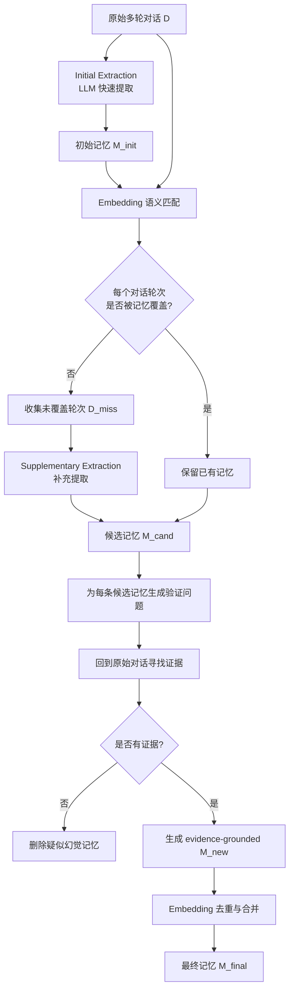

<!--more-->


## 零、写在前面

这个论文问题角度是很好的，现在做记忆构建往往都是让 llm 对原始对话做一下摘要（当然也有像 SimpleMem 那样去做原子事实提取，从而近似达到语义无损压缩），但是不可避免地会面对：丢失关键信息，llm hallucination 等问题。

之前看的那个 BudgetMem 的做法是保留原始对话，query 来了再做 summary，感觉这个 summary 提前还是延后都有各自问题。

这篇工作的解法并不漂亮，仍然是 prompt engineering，token 开销、推理延迟都会变大，只能说角度还可以，所以感觉这篇草草看一下就行了。


## 一、标题


>   作者团队来做 NJU

**Static summarization（静态总结）** 指的是：对话发生后，系统用一次 LLM 调用把历史压缩成一段 summary，然后把这段 summary 存起来。

例如：

```text
原始对话：用户提到朋友、工作变动、喜欢的食物、旅行计划和一个暂时的烦恼
        ↓ 一次总结
用户最近在考虑职业发展，并且喜欢旅行和美食。
```

问题是，这段总结是在系统知道未来问题之前生成的。它不知道以后用户会问：

> “朋友 Matthew 和 Linda 在我升职过程中具体起了什么作用？”

于是很可能只留下“朋友支持了用户”，却丢掉“提供了不同视角和情绪支持”这类细节。

所以标题就表明，这个工作关注于记忆的 extraction。


## 二、摘要

### 2.1 核心问题

论文认为，已有 Agent Memory 研究更多关注：

- memory 如何组织；
- memory 如何演化；
- memory 如何检索；
- memory 如何放入上下文。

但很多系统忽略了最早的一步：

> **从原始对话中，究竟提取了哪些记忆？**

作者认为，后面的检索再先进，如果最开始写入的记忆已经漏掉了关键细节，后续系统也无法凭空恢复它。

可以把整个流程看成：

```text
原始对话 -> 记忆提取 -> 记忆组织/更新 -> 记忆检索 -> 最终回答
```

过去的研究通常把注意力放在后半段，而 ProMem 把第一箭头单独拿出来研究。


### 2.2 两个主要缺陷

#### 缺陷一：Ahead-of-time summarization

摘要是在“不知道未来任务”的情况下提前生成的，因此可能产生错误的保留优先级。

生活类比：

> 你要把一整个月的旅行日记压缩成 100 字，但别人不告诉你下个月会问哪一天、哪个人、哪件事。你只能凭直觉删减，难免删掉后来真正有用的细节。


#### 缺陷二：One-off extraction

很多系统只提取一次：

```text
对话 -> summary -> 保存
```

如果这一次出现：

- 信息遗漏；
- 过度概括；
- 不受支持的推断；
- LLM hallucination；

错误就会进入长期 memory，并在未来不断被检索和复用。


### 2.3 核心观点

ProMem 借鉴 **Recurrent Processing Theory（RPT，递归加工理论）**，把一次性提取改造成带反馈的过程：

```text
初次提取 -> 语义对齐找遗漏 -> 自我提问 -> 回原文找证据
                     ↑                 ↓
                     └── 补充 / 修正 / 去重 ──┘
```

论文声称，这个 feedback loop 能够：

- 提高 memory completeness；
- 降低 hallucinated memory；
- 提高下游 QA accuracy；
- 在输入被压缩或使用较小模型时仍保持一定鲁棒性。


## 三、引言

### 3.1 “更多记忆”为什么不一定更好？

把所有历史原文都保存下来，会导致：

- 存储膨胀；
- 检索噪声增加；
- 当前上下文被无关信息占满；
- 旧信息和新信息冲突；
- 后续模型难以判断哪些信息值得信任。

所以 memory extraction 的目标不是单纯提高 recall，而是同时平衡：

```text
完整性（不要漏） + 准确性（不要编） + 可用性（未来能回答） + 成本（不要无限贵）
```


### 3.3 论文对已有工作的批评

论文把已有工作大致分为两类：

1. **Memory organization and utilization**：怎样存、怎样更新、怎样检索；
2. **Initial extraction**：怎样从 raw dialogue 生成初始 memory。

作者认为第二类经常被简单处理，常见做法是：

- 一次性让 LLM 总结；
- 预设固定 schema；
- 使用摘要模型压缩；
- 直接把对话切块后存储。

ProMem 的切入点是：

> **不是所有错误都能在 retrieval 阶段修复。很多错误在写入那一刻就已经发生了。**


### 3.4 RPT  包装

>   经典认知科学理论包装

RPT 是认知神经科学中的理论，用来解释大脑如何从快速的前馈感知走向更完整、更有意识的知觉。论文借用两个概念：

- **Feed-forward sweep**：快速、单向、初步处理；
- **Recurrent feedback loop**：高层向低层返回反馈，重新检查并补全信息。

ProMem 的类比是：

| RPT          | ProMem                                    |
| ------------ | ----------------------------------------- |
| 快速前馈加工 | 初次 memory extraction                    |
| 高层反馈     | self-questioning 和 evidence verification |
| 完整知觉     | 更完整、更有证据支撑的 memory             |


## 四、方法

### 4.1 overview


ProMem 的输入是一段对话历史：

$$
D = \{t_1, t_2, \ldots, t_n\}
$$
其中 $t_i$ 表示第 $i$ 个对话轮次。输出是一组最终记忆：

$$
M_{final}
$$
整体流程为：



ProMem 共有三个主要阶段：

1. **Initial Memory Extraction**：快速得到候选事实；
2. **Memory Completion via Semantic Matching**：找出没有被覆盖的对话；
3. **Memory Verification via Self-Questioning**：主动提问并回原文验证。

最后再做 deduplication 和 merging。


### 5.2 阶段一：Initial Memory Extraction

系统让 LLM 扮演 **personal information extractor（个人信息提取器）**，阅读整个对话并尽可能抽取与用户有关的事实，例如：

- 用户喜欢什么；
- 用户不喜欢什么；
- 用户有什么习惯；
- 用户经历过什么事件；
- 用户与哪些人有关系；
- 用户表达过哪些目标。

形式化表示为：

$$
M_{init} = LLM(D, P_{extract})
$$
其中：

- $D$：原始对话；
- $P_{extract}$：提取提示词；
- $M_{init}$：第一次生成的记忆列表。

这里的 LLM 不是训练出来的 memory specialist，而是通过 prompt 被要求进行信息抽取。

**这一阶段的角色**

它类似于“快速初筛”：先不要逐条证明，只尽量建立一个候选集合。

**这一阶段的问题**

- 一次全局扫描可能遗漏局部细节；
- LLM 可能把推测写成事实；
- 可能把多个事件混成一个事实；
- 可能只保留主题而丢掉细节；
- 可能没有时间信息和证据来源。

因此论文明确把 $M_{init}$ 当作 preliminary baseline，而不是可信的最终 memory。


### 4.3 阶段二：Memory Completion via Semantic Matching

这一阶段不是直接让 LLM 再总结一遍，而是先用 embedding 做覆盖检查。

#### 4.3.1 把记忆和对话都编码成向量

对于每条初始记忆 $m \in M_{init}$，得到向量：

$$
v_m \in \mathbb{R}^d
$$
对于每个对话轮次 $t_i$，得到向量：

$$
v_{t_i} \in \mathbb{R}^d
$$


#### 4.3.2 计算余弦相似度

论文使用 cosine similarity：

$$
S(t_i,m)=
\frac{v_{t_i}\cdot v_m}
{\|v_{t_i}\|\|v_m\|}
$$


#### 4.3.3 判断该轮是否被覆盖

对每个 $t_i$，找与它最相近的 memory：

$$
Match(t_i)=
\max_{m\in M_{init}}S(t_i,m)>\tau_{match}
$$
其中 $\tau_{match}$ 是覆盖阈值。

- 若最大相似度超过阈值：认为该轮次已经被某条记忆覆盖；
- 若低于阈值：认为该轮是 **uncovered turn（未覆盖轮次）**。

实验中设定：

$$
\tau_{match}=0.6
$$


#### 4.3.4 对未覆盖轮次做定向补充提取

把所有未覆盖轮次收集为：

$$
D_{miss}
$$
然后再次调用 LLM：

$$
M_{supp}=LLM(D_{miss},P_{supp})
$$
最后合并：

$$
M_{cand}=M_{init}\cup M_{supp}
$$

>   第一次是对整个对话的全局扫描，第二次只针对 embedding 认为“可能漏掉”的局部区域进行补充，避免每次都让 LLM 对全量对话重新总结。
>


#### 4.3.5 这一阶段的关键假设

它假设：

> 如果某一轮对话的信息已经被记忆覆盖，那么该轮和某条记忆应该有足够高的语义相似度。

这个假设并不总成立。例如：

- 一条抽象 memory 和原文表面措辞差异很大；
- 对话轮次只包含时间或否定信息；
- 一条记忆覆盖了多个分散轮次；
- embedding 不理解反事实或隐含关系。

因此，semantic matching 仍然只是启发式做法。


### 4.4 阶段三：Memory Verification via Self-Questioning

这是 ProMem 的核心模块。

对每条候选记忆 $m \in M_{cand}$，系统先生成一个验证问题：

$$
q_m=LLM(m,P_{question})
$$
例如：

```text
候选记忆：用户喜欢苹果
验证问题：用户为什么喜欢苹果？原始对话中有什么证据？
```

这个问题的目的不是让 Agent 直接回答用户，而是把一条模糊记忆转换为一个“证据请求”。


#### 4.4.1 Evidence seeking

接着，系统把 $q_m$ 和原始对话 $D$ 一起交给 LLM，让它判断原文能否回答这个问题。

有两种情况。

**情况 A：找不到证据**

如果原始对话没有足够证据，系统认为候选 memory 可能是：

- hallucination；
- 不受支持的推断；
- 把两个事实错误拼接后的结果。

此时直接丢弃该记忆。

**情况 B：找到证据**

如果原始对话包含证据，系统提取一个更具体、更加 grounded 的新记忆：

$$
m_{new}
$$
这个 $m_{new}$ 应该尽量包含：

- 原文真正支持的内容；
- 必要的上下文；
- 具体细节；
- 不超出证据的表述。


#### 4.4.2 Deduplication 与 correction

得到 $m_{new}$ 后，再与原候选 $m$ 计算相似度：

$$
S(m_{new},m)>\tau_{sim}
$$
实验设置：

$$
\tau_{sim}=0.8
$$
处理逻辑为：

- 如果相似度高：说明二者表达的内容基本一致，保留更有证据支撑的 (m_{new})，删除重复项；
- 如果相似度低但原文确实有证据：说明原来的 (m) 可能不准确或过于粗糙，用 (m_{new}) 替换它；
- 如果没有证据：删除候选 memory。

最终得到：

$$
M_{final}
$$


### 4.5 ProMem 的“循环”到底循环在哪里？

论文把它称为 recurrent feedback loop，但从算法描述看，循环主要表现为：

```text
对每条候选 memory：生成问题 -> 回原文找证据 -> 保留、修正或删除
```

它并不是一个明确写出“反复运行 N 轮直到收敛”的递归优化算法。更准确地说：

- 有多个候选 memory；
- 每个候选都经过一次 question-verify-update 流程；
- 过程中形成了从高层候选回到低层原文的反馈。

这是一种**反馈式流程设计**，而不是严格意义上的 recurrent neural network 或训练时递归状态更新。


### 4.6 ProMem 调用了几个 LLM 阶段？

按论文方法描述，至少包括：

1. 初始全局 memory extraction；
2. 未覆盖对话轮次的 supplementary extraction；
3. 为每条候选 memory 生成 self-question；
4. 针对问题回原文寻找证据并生成 verified memory；
5. 最终 QA answer generation。

embedding matching 和去重本身不一定需要 LLM，但验证环节会产生较多 LLM 调用。尤其当 $M_{cand}$ 较大时，self-questioning 的调用数量会随着候选 memory 数量增长。


### 4.7 计算成本：论文的解释与实际含义

论文承认 ProMem 比 one-pass summarization 使用更多 token，并提出三个理由：

1. memory error 会在未来长期传播，错误成本可能高于一次写入成本；
2. memory extraction 是 **write-once, read-many**，高成本只在写入时支付一次；
3. extraction 可以异步在后台运行，不一定阻塞实时回复；
4. self-questioning 和 matching 可以交给较小的 LLM。

这个论证在“单次写入、长期多次读取”的场景成立，但需要两个条件：

- 记忆确实会被重复使用很多次；
- 提取错误率的下降足以抵消额外调用成本。

如果每条对话只使用一次，或者 memory 经常被更新和重写，那么 write-once/read-many 的摊销优势会明显减弱。


## 五、实验

### 5.1 实验问题

论文主要想回答四个问题：

1. ProMem 能否提取更完整的 user memory？
2. 它能否同时保持较高的 memory accuracy，减少 hallucination？
3. 更完整的 memory 能否提升下游 QA？
4. 这种方法在输入压缩和较小模型下是否仍然有效？


### 5.2 数据集

#### HaluMem

HaluMem 是主数据集，重点评估：

- memory 是否覆盖了应该保存的事实；
- memory 是否忠实于原始对话；
- memory 是否出现 hallucination；
- memory 能否支持后续问答。

它适合 ProMem 的研究问题，因为 ProMem 关注的就是“漏记”和“错误记忆”。


#### LongMemEval

LongMemEval 用来测试长期记忆在下游检索问答中的效果。它更接近“存下来的 memory 最后有没有帮到 Agent”。

需要注意：这两个 benchmark 主要仍是长期对话/记忆问答，并不是完整的持续 Agent 环境。它们没有充分测试：

- 多月持续交互；
- 用户偏好不断变化；
- 多次 update/delete；
- 工具调用导致的环境状态变化；
- memory action 对后续策略的长期影响。


### 5.3 指标

论文报告三个核心指标。

#### Memory Integrity

衡量记忆提取的**完整性**，可以理解为 ground-truth memory facts 的 recall：

> 应该记住的事实，有多少被成功抽取出来？

它更关心漏记。


#### Memory Accuracy

衡量提取条目的**正确性**，会惩罚 hallucination 和事实错误：

> 已经写入的 memory，有多少是真实且准确的？

它更关心错记。


#### QA Accuracy

衡量使用提取 memory 回答问题的准确率：

> 记忆内容是否真正帮助 Agent 回答未来问题？

这三个指标一起看很重要。一个系统可以非常保守，只记一两条最确定的事实，于是 Accuracy 高，但 Integrity 很低；也可以记很多东西，Integrity 高，但编造很多内容，Accuracy 下降。


### 5.4 实验配置和 baseline

论文使用：

- GPT-4o-mini：执行初始提取、补充提取、自问、验证和答案生成；
- GPT-4o：判断答案正确性；
- Qwen3-Embedding-8B：语义相似度与检索；
- $τ_{match}=0.6$：判断对话轮次是否已被 memory 覆盖；
- $τ_{sim}=0.8$：去重/合并阈值；
- retrieval top-20：回答问题时取最相关的 20 条 memory，并附加 timestamp。

Baseline 包括：

- Memobase；
- Supermemory；
- Mem0；
- LightMem。

论文没有纳入 A-MEM 和 Zep，因为作者认为它们不是 summary-based memory。


### 5.5 HaluMem 主结果


ProMem 的最大提升在 Integrity：

- 相比 Mem0：73.80 - 42.91 = **+30.89 个百分点**；
- 相比 Supermemory：73.80 - 41.53 = **+32.27 个百分点**。

但它的 Memory Accuracy 不是最高的，Memobase 反而达到 92.24%。这说明 Memobase 很可能采用了极保守的策略：少写，所以少错；但同时漏掉了大量应记事实。

ProMem 的优势是取得了更好的平衡：

```text
不只保存少量最安全的事实，也尽量恢复更多细节，同时把 hallucination 控制在较低水平。
```

QA Accuracy 也从 Mem0 的 53.02 提升到 ProMem 的 62.26，说明更完整的 memory 确实能帮助下游回答。


### 5.6 消融实验

论文消融两个模块：

- **MC**：Memory Completion，语义匹配和未覆盖轮次补充；
- **MV**：Memory Verification，自问自答式验证。


**消融结论**

1. 去掉 MC 后 Integrity 从 73.80 降到 60.33，说明 coverage-based 补充确实负责找回遗漏；
2. 去掉 MV 后，QA 降低，说明 verification 对最终可用性有帮助；
3. 两个模块都去掉后，Integrity 和 QA 最差，接近 one-pass extraction；
4. 没有 feedback 时 Accuracy 反而更高，说明系统更保守，写得少但更不容易错；
5. Full 模型的价值在于“多记且尽量不编”，而不是单独追求 precision。


### 5.7 Token Compression 实验


论文使用 LLMLingua-2 对原始对话进行 token compression，并比较 Mem0 与 ProMem。

这里的 compression ratio 从 0.8 降到 0.2。论文对 0.2 的解释是：大约丢弃了 80% 的对话 token，只保留 20%。

在 compression ratio = 0.2 时，论文报告：

| 方法   | Memory Integrity | QA Accuracy |
| ------ | ---------------: | ----------: |
| Mem0   |            23.28 |       21.34 |
| ProMem |            57.20 |       37.20 |

论文的结论是：ProMem 的 feedback 和 supplementary extraction 对输入信息损失更鲁棒。

**但这个实验需要谨慎解释**

它证明的是：

> 在使用 LLMLingua-2 随机/重要性压缩后的输入上，ProMem 相比 Mem0 对信息缺失更不敏感。

它不完全等于：

> ProMem 能够从真正被删除的证据中恢复事实。

因为如果关键证据已经被压缩掉，任何后续 self-questioning 都无法凭空恢复；ProMem 可能只是更擅长利用压缩后仍然保留的线索。


### 5.8 Small Language Model 实验

论文进一步使用 Llama3-8B 作为 memory extraction 和 QA 的语言模型。


ProMem 的结果：

- Integrity 提升 12.50 个百分点；
- Accuracy 基本持平；
- QA 提升 10.74 个百分点。

论文据此认为，迭代式 self-correction 让较小的模型也能提高记忆质量。

更准确的理解是：

> ProMem 通过增加流程和调用次数，部分弥补了单个 Llama3-8B 在一次性总结中的能力不足。

这是一种“用系统推理换模型规模”的思路，但不代表它在总计算量上更便宜。


### 5.9 LongMemEval 结果


ProMem 比 LightMem 高 0.93 个百分点，比 NativeRAG 高 4.48 个百分点。

论文据此提出一个很强的表述：

> Better data is more important than better algorithms。

如果写入的 memory 本身丢了关键细节，再高级的 retrieval 也很难补救；高质量数据/记忆条目可能比复杂检索算法更重要。


### 5.10 Case Study：为什么 ProMem 能回答得更具体？


案例问题是：

> Sarah Garcia 的社交网络在她转任 Oracle Senior Manager 的过程中发挥了什么作用？

Gold evidence 包含两类细节：

- 社交网络提供了 insights 和 support；
- Matthew、Linda 提供了 emotional support。

Mem0 只保存了较粗的：

```text
社交网络对她的职业发展有积极影响。
```

所以最终答案较模糊。

ProMem 保存了更细的：

- diverse perspectives；
- emotional support；
- 这些支持与转型经历之间的联系。

这个例子很好地说明 ProMem 的目标：不是找到更多文档，而是让写入的记忆保留未来问题可能需要的细粒度证据。


### 5.11 小结

论文实验支持以下结论：

- ProMem 比 比较的 summary-based baseline 更完整；
- self-questioning 能提高 memory 的下游可用性；
- ProMem 在压缩输入和 Llama3-8B 场景下有一定鲁棒性；
- 高质量 extraction 确实可能是 Agent Memory 的关键瓶颈。

但实验没有充分证明：

- ProMem 能否在长时间运行中持续更新 memory；
- ProMem 能否处理新旧偏好冲突；
- ProMem 能否主动遗忘或删除错误记忆；
- ProMem 是否能学习跨任务的 memory policy；
- 它的额外 token 成本在真实 write-many 场景下是否值得。

总的来说感觉就这一个创新点，而且方法也一般般，工作量也不大，这个工作只能作为参考了。


## 六、总结

ProMem 的主要贡献可以概括为三点：

1. 把被忽视的 **memory extraction** 单独作为研究问题；
2. 用 semantic matching 发现初次摘要没有覆盖的对话轮次；
3. 用 self-questioning 和 evidence verification 形成从候选 memory 回到原始对话的反馈链。

它的核心理念是：

> 记忆一旦写错，后续系统会反复使用错误；因此高质量写入本身就是 memory system 的一等公民。


论文结尾也承认两项主要限制：

**计算开销和延迟**

self-questioning 与 supplementary extraction 增加 token 和 LLM 调用。虽然可以异步化或使用 SLM，但严格实时场景仍可能受影响。

**依赖 backbone LLM 能力**

如果 backbone 不会提出好的验证问题，或者不会从原文中准确找证据，那么反馈环也可能只是重复错误。

从 Agent Memory 的完整视角看，ProMem 还缺少：

- 长期 update；
- forgetting / retention；
- belief revision；
- memory versioning；
- provenance 字段的显式存储；
- 记忆之间的关系图；
- 面向未来任务的 credit assignment；
- RL 或 continual learning 意义上的 self-evolution。


**可能的启发。？**

**1、ProMem + Belief Memory**

把每条 memory 扩展为：

```text
claim + evidence + source + timestamp + confidence + validity scope
```

这样系统不仅验证“有没有证据”，还可以处理：

- 新旧信息冲突；
- 证据可靠性不同；
- 偏好随时间变化；
- 暂时性状态与稳定事实的区别。


**2、ProMem + RL Memory Manager**

**让 RL policy 决定：**

- 哪些候选值得进入 verification；
- 哪些候选只需轻量检查；
- 哪些候选应直接丢弃；
- verification 的 token budget 应该分配多少。

奖励可以同时考虑：

```text
memory integrity + downstream QA - false memory penalty - LLM/API cost
```

这样 ProMem 的“固定多阶段流程”可以变成自适应的 memory write policy。


**3、ProMem + Long-term Update / Forgetting**

当前 ProMem 重点是第一次写入。后续可以增加：

- ADD：新事实；
- UPDATE：新证据修正旧事实；
- DELETE：用户撤回或事实失效；
- MERGE：重复事实合并；
- ARCHIVE：不删除但降低默认可见性；
- ABSTAIN：证据不足，不写入。

