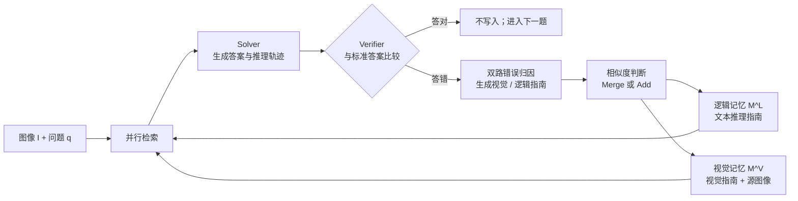

<!--more-->


## 零、写在前面

多模态memory相关的一直没看，搜到这个工作个人感觉并不solid，方法比较naive，而且面向的是离线带标签环境，但是这个思路可以先积累一下。


## 一、标题


>   
>
>   **来源：CVPR 2026**

**ViLoMem** = **Vi**sual + **Lo**gic + **Mem**ory：对应方法中的**视觉记忆**和**逻辑记忆**两条流。

本文的出发点：

为什么多模态大模型（MLLM）总是反复犯错？ 而现有的 Memory 机制全是存文本逻辑（Logic/Text）。

但 AI 很多时候公式都背对了，但图看错了。比如： 

-   把背景的阴影当成了物体； 
-   几何题里把“高”看成了“边”； 
-   统计图表里没看清坐标轴单位。

所以作者认为 agent memory 不能只记“如何推理”，还要引入视觉记忆来引导模型看图。

如何怎么“反思看图”？ViLoMem 的选择是：**不存完整轨迹，存由“错误 + 正解”提炼出的纠错指南**。更具体地说：

```text
视觉记忆：这类画面应该重点看哪里、别被什么视觉陷阱误导
逻辑记忆：这类题应该用什么推理规则、别犯什么推理错误
```


## 二、摘要


>    yysy，这个图有问题，5-12-13 是勾股数，标准的直角三角形怎么画成图里面那个样子了。
>
>   看来作者画图的AI也需要装一个 ViLoMem 了（bushi）

论文的观察是：多模态推理失败并不只有“数学公式没想对”。很多逻辑错误的上游原因，是模型一开始就**看错了图**，例如漏掉符号、混淆材质、误读空间位置，随后再用很流畅的语言把错误推理到底。

因此，作者在摘要这里介绍了本文的方法：

1. 对新图文题，从视觉库和逻辑库并行检索经验；

2. Solver（解题模型）在这些经验帮助下作答；

3. Verifier（验证器）拿**答案与标准答案**比较；

    >   他这个工作面向的是离线带标签环境，其实就是在一个离线题库里面锻炼多模态解题经验

4. 若答错，由模型分别判断是否存在视觉错误、逻辑错误；

5. 把新规则与相似旧规则合并，或新增一条，供以后使用。

摘要最后也是卖了一下结果：双流记忆在六个多模态基准上都提高了 `pass@1` （一次答对）准确率，并借助“图像候选筛选 + 文本规则重排”控制检索成本。


## 三、引言

### 3.1 动机

引言的逻辑其实就4点：

1. MLLM 能看图并推理，但仍经常反复犯相同错误。
2. 现有长期记忆多存成 文字摘要或 reasoning trace 的形式，偏向“逻辑”，忽略视觉证据和注意位置。
3. 多模态任务里，**视觉失误会向下游传导成逻辑幻觉**。例如把图中 `6` 看成 `12`，之后即使公式正确，答案仍错。
4. 所以记忆系统应同时积累视觉纠错模式与逻辑纠错模式，并在回答前共同注入模型。

作者的核心主张就是：**看错图，逻辑再强也没用；只修“怎么想”而不修“怎么看”，会留下错误的源头。**


### 3.2 认知科学包装

然后经典 memory 论文拿认知科学做包装：

论文把人脑语义记忆描述成“hub-and-spoke（中心枢纽—辐条）”结构：**不同模态各自保存特征，中心再整合**。设计成：

- **Visual stream（视觉支路）**：保存视觉陷阱和观察提示；
- **Logic stream（逻辑支路）**：保存公式、条件检查、推理纠错提示；
- **Solver（统一枢纽）**：读取两类提示后生成答案；
- **Verifier（执行控制）**：根据对错决定是否需要更新。


### 3.3 相关工作

论文把前人分为两类：

- **Context engineering（上下文工程）**：ReAct、Reflexion、TextGrad、GEPA 等会用轨迹或反馈修改当前 prompt。问题是上下文常是一次性的，连续改写还可能产生 **brevity bias（为了简短而丢掉关键细节）**。
- **Long-term memory（长期外部记忆）**：Dynamic Cheatsheet、ACE 等会积累策略。问题是多偏向逻辑文本，图像中的“看漏了什么”没有被很好地表征。

ViLoMem 的回答是“错误驱动的双流 schema memory”。

值得注意的是，ViLoMem 并非首个层级或外部记忆，也不是首个用反思更新记忆。它真正新增的是：**维护视觉错误的经验，并给视觉流设计了不同的检索路线。**


## 四、方法


### 4.1 overview



形式化地，一道样本是 $x_i=(I_i,q_i)$：图像 $I_i$ 和问题 $q_i$。系统维护两个记忆库：

$$
\mathcal M^L=\{m_1^L,m_2^L,\ldots\}
$$

$$
\mathcal M^V=\{(m_1^V,I_1^V),(m_2^V,I_2^V),\ldots\}
$$


- $m^L$：一条**逻辑指南**，如“使用垂直平分线性质前，先确认点确实在垂直平分线上”。
- $(m^V,I^V)$：一条**视觉指南**和它对应的**源图像**，如“背景渐变会制造颜色差异错觉，判断物体本色前隔离背景”。


### 4.2 问答流程

对于当前问题，ViLoMem 从两条流取得 $R_i^L$ 和 $R_i^V$，再让 Solver 生成候选答案 $\tilde y_i$：

$$
\tilde y_i = \text{Solver}(I_i,q_i,R_i^L,R_i^V)
$$
然后 Verifier 将 $\tilde y_i$ 与标准答案 $y_i$ 比较。只有 $\tilde y_i \ne y_i$ 才启动记忆生成。

这种 **error-triggered writing（错误触发写入）** 有明显优点：不会为每题都付出 LLM 反思和写库成本，内存也长得更慢。但它也有盲点：

- **一个答对的轨迹仍可能“蒙对”，里面含有错误观察；系统不会从中学习。**
- **没有标准答案或可靠环境反馈时，系统不知道什么时候应写入。**
- **真正有价值的成功策略也不会被保存。**


### 4.3 答错后，视觉流如何写入

视觉模块的输入是：当前图像 $I_i$、问题 $q_i$、错误推理 $\tilde y_i$、标准答案 $y_i$。一个 MLLM 一次输出：

$$
(e_i^V,g_i^V)=\text{AnalyzeGenerate}^V(I_i,q_i,\tilde y_i,y_i)
$$


- $e_i^V$：是否存在**视觉错误**，例如漏看符号、物体属性混淆、空间关系误读。
- $g_i^V$：可执行的视觉纠错指南。

例如，错误并不是简单记成“第 37 题把物体材质看错”；而是提炼为：

> “物体表面看似哑光时，也要与画面中已知金属物体比较反射与高光；不要只凭整体颜色判断材质。”

接着用 **text embedding（文本嵌入）** 比较新指南和既有视觉指南的余弦相似度：

$$
s_j^V=\text{Sim}(E_T(g_i^V),E_T(m_j^V))
$$

>   这里比较的对象，根据论文的说法的话，是系统按照 [q, a] 重排得到的topk

若最高相似度超过阈值 $\tau^V$，则把新旧两条合并；否则新增 $(g_i^V,I_i)$。

这里的 `Merge` 是由模型把两条相近规则综合成更通用的规则，源图像沿用旧条目的图像。直觉上，它把“同一种错”从十条实例压成一条模式。

**很值得批判地注意**：视觉记忆虽保存了图像，但它的“是否同类、是否合并”主要看的是**生成出来的文字指南是否相似**，不是图像视觉等价性。这可能带来两种风险：

- 两个文字说法相近、但适用视觉条件不同的规则被错误合并；
- 两个图像明显相似、但模型用不同措辞生成指南，因而没有合并。


### 4.4 逻辑流如何写入

逻辑模块不需要图像，输入为问题 $q_i$、错误推理轨迹 $\tilde y_i$、标准答案 $y_i$：

$$
(e_i^L,g_i^L)=\text{AnalyzeGenerate}^L(q_i,\tilde y_i,y_i)
$$


- $e_i^L$：错误是否属于逻辑推理错误；
- $g_i^L$：可泛化的推理规则。

例如：“看到平行线被截线切开时，先定位角所在的区域，再判定它是同位角、内错角还是同旁内角；不能只因图形相似就直接套公式。”

更新机制与视觉流相同：相似度高于 $\tau^L$ 则合并，否则新增；如果判定为 `Non-Logical` 或没生成有效指南，就不写逻辑库。


### 4.5 Grow-and-Refine 到底做了什么

可以概括为一个简单的三分支策略：

```text
答对                         -> Skip：不做记忆生成
答错 + 新规则近似已有规则      -> Merge：合并、精炼已有记忆
答错 + 新规则明显不同          -> Add：新增一条记忆
```

它避免的对象是“每次把总摘要改写一遍”。后者很容易出现：旧信息被新信息覆盖、越写越短、无法回到哪次具体错误。ViLoMem 至少保留了多个离散 schema，较容易扩展和局部更新。

但它仍不是完整的记忆治理机制：没有显式的**置信度**、**来源链路**、**版本历史**、**时间有效期**或**冲突消解**。


### 4.6 检索：为什么视觉流要走两阶段

**逻辑检索：先理解题型，再找规则**

作者不直接拿原问题去搜逻辑库，而是先让 LLM 分析题目所涉及的领域和关键概念：

$$
a_i=\text{Analyze}^L(q_i,\tilde y_i), \quad \tilde q_i=[q_i;a_i]
$$
直觉是：问题文本“这道图中求面积的题”可能写得很短；先补出“几何、三角形、底高关系、条件核验”后，才更容易搜到正确的逻辑模式。\(\tilde y_i\) 在首轮尚不存在时，可理解为当前解题上下文或系统分析轨迹；论文符号在这点上略显不够严谨。


#### 视觉检索：先按图粗筛，再按问题细筛

1. 对当前图像和记忆条目中的源图像做**多模态 / 图像 embedding 相似度**，取前 $k^M$ 个候选；
2. 再用扩展问题 $\tilde q_i$ 与这些候选的文字视觉指南做文本相似度筛选，取前 $k^V$ 条。

```text
当前图像
  -> 图像向量近邻：先找“画面看起来像”的少量旧案例
  -> 文本规则匹配：再找“对当前问题真正有用”的视觉提醒
  -> 注入 Solver
```

**为什么不只做图像相似？因为两张图看上去相近，不代表问题相同。例如同一张实验图可问材质、颜色、数量或空间关系。第二阶段让当前题目的语义参与决定“要提醒什么”。**

论文还尝试将检索到的视觉错误模式转成 **question-aware attention map（问题感知注意图）**，高亮模型过去容易看错的区域，再作为额外视觉输入交给 Solver。它在部分任务有效，但在需要精细顶点和几何关系的 MathVista/MathVision 上可能帮助有限甚至轻微退化，说明“涂一层热力图”并不等于可靠的空间理解。


### 4.7 一个完整例子

假设模型看到一张几何图，把角内的 `6` 读成 `12`，因此面积算错：

1. **检索**：视觉流找到了“先核对图内标注数字位置”的提醒；逻辑流找到了“三角形面积需要底和对应高”的提醒。
2. **作答**：Solver 仍把 `6` 误读为 `12`，答案错误。
3. **验证**：Verifier 通过标准答案发现错误。
4. **归因**：视觉模块生成“对小型数字标注，先放大确认其所在区域和数值，避免将邻近数字混读”；逻辑模块若发现公式也套错，则再生成对应规则。
5. **更新**：若库中已有“几何图中的数字易误读”规则，就合并；没有才新建。视觉条目还会保存当前图作为代表案例。
6. **下一题**：遇到相似几何图时，图像近邻先把这类案例召回，问题语义再确认“这次确实是在问数值/面积”，最后把提醒给 Solver。


## 五、实验

### 5.1 实验设置

论文在六个多模态 benchmark 上评估，指标是 **pass@1 accuracy（一次作答即正确的比例）**：

| 基准                                   | 主要考察                  |
| -------------------------------------- | ------------------------- |
| **HallusionBench**（1,129 条对照问题） | 视觉幻觉与细粒度观察      |
| **RealWorldQA**（765 个自然场景）      | 现实图像理解              |
| **MathVista-mini**                     | 图表 / 几何等视觉数学推理 |
| **MathVision-mini**                    | 视觉数学与复杂图形理解    |
| **MMMU validation**（1,050 题）        | 多学科多模态知识与推理    |
| **MMStar**（1,500 样本）               | 视觉依赖推理              |

测试模型是 GPT-4.1、Qwen3-VL-235B-A22B-Instruct 和 Qwen3-VL-8B-Instruct。生成逻辑记忆使用 Qwen3-235B-A22B-Instruct；生成视觉记忆使用 Qwen3-VL-235B-A22B-Instruct；文本与图像检索分别使用 Qwen3-Embedding、Qwen2.5-VL-Embedding。

这也意味着结果并非“免费提升”：系统额外依赖较强的生成模型、embedding 模型和标准答案验证。论文表格主要报告 Solver 的正确率，未完整拆开记忆生成、验证与注意图构建的端到端成本。


### 5.2 主结果：有提升，但应看清提升来自哪里


以 GPT-4.1 为例：

其中最醒目的是：相对 `Step`，GPT-4.1 在 MathVision 上 `+6.48`，在 MathVista 上 `+2.61`。这符合论文自己的叙事：图形理解和数学推理耦合较强的任务，更能从“视觉纠错 + 逻辑纠错”受益。

小模型 Qwen3-VL-8B 的部分结果也有提升：MMMU `65.52 -> 69.90`，RealWorldQA `70.85 -> 73.59`。作者据此认为外部经验可补充小模型有限的参数能力。

**不要把这些数字误读成通用 Agent 长期记忆 SOTA。** 它们是题库序列上的受控实验结果，主要说明该框架能复用同类多模态解题错误；并不说明它已能长期理解一个真实用户、处理动态事实，或在开放环境自主判错。


### 5.3 双流消融：两种记忆是否都值得保留？


Table 2 在 GPT-4.1 上逐一移除组件：

| 设置                    |      MMMU | MathVista | 解释                   |
| ----------------------- | --------: | --------: | ---------------------- |
| Baseline                |     74.00 |     70.40 | 无记忆                 |
| Step                    |     74.16 |     74.27 | 只有逐步推理           |
| 去掉逻辑记忆            |     76.64 |     75.59 | 只剩视觉流             |
| 去掉视觉记忆            |     76.88 |     75.66 | 只剩逻辑流             |
| 完整 ViLoMem            | **77.26** | **76.88** | 双流最好               |
| ViLoMem + attention map | **78.21** |     76.87 | 注意图并非各任务都增益 |

可以读出三点：

- 任一单流都有价值，但完整模型最高，说明二者存在互补。
- 去掉逻辑流时 MathVista 掉得相对明显，符合公式、条件检查等逻辑规则的重要性。
- 去掉视觉流后两项也下降，说明视觉误读并非少数特殊案例。

这组消融支持“分流有用”，但**没有完全证明错误归因绝对准确**。视觉描述质量较差时，Verifier 容易把视觉问题错误归到逻辑流，作者在分析中也承认这一点。


### 5.4 记忆使用、迁移与可扩展性


**视觉错误很多，但不等于视觉记忆永远更重要**

Figure 4 显示，各任务中视觉错误占新生成记忆模式的 `59%–93%`，而检索次数远高于生成次数。合理的解释是：一次生成的规则可被多次复用，且感知错误是多模态推理的常见源头。

但这并不能推出“视觉流总比逻辑流更重要”：在医学等知识和推理负担更强的领域，论文的领域分析反而显示逻辑记忆贡献更明显；商业图表类问题收益有限，可能因为基础模型本来就较擅长常见图表。

**跨模型迁移**

作者把一个模型生成的记忆给另一个模型使用。Qwen3-VL-8B 在更强模型生成的记忆帮助下，MMMU 从自身 ViLoMem 的 `69.90` 到 `71.26`，MathVista 从 `77.87` 到 `79.20`。这支持“规则比原始轨迹更可迁移”的直觉。

不过迁移能成功也依赖于：不同模型能以相近方式理解同样的自然语言指南。若换成专业工具 Agent、机器人或完全不同的视觉模型，结论还不能直接外推。

**记忆越多是否越好？**

在 WeMath 上，逐步累积数学领域记忆时：


这说明在该实验域内，更多跨任务的错误模式有持续收益，且积累来的记忆甚至超过“只在目标集上生成”的记忆。但目前最高也只有 150k tokens、集中在数学/视觉推理领域；还不能说明更长时间、更杂乱的真实 Agent 日志也会单调变好。


### 5.5 检索效率：论文的成本亮点应如何解读

Table 8 在 WeMath 报告每题额外检索时间：


在 150k tokens 时，两阶段方法的 `61.6 ms` 低于全库文本匹配的 `115 ms`，约快 `1.87x`。论文还强调其**随库规模增长的额外开销**大幅下降；这与“端到端延迟快 22.3 倍”不是一回事，阅读时不要混淆。

另一项与 Dynamic Cheatsheet 的对比（MathVista / GPT-4.1）是：


这个结果的原因主要是 ViLoMem **只在答错时写入**，并合并相似规则。它证明了存储与检索侧有一定压缩优势；但若部署在真实系统，还应把“拿标准答案验证、调用 MLLM 反思、生成注意图”的成本一并计入。


### 5.6 失败案例与实验没有彻底解决的事

论文在 MMMU 的人工分析中，净增益为 `+8.86%`，但仍有 66 个从正确变错误的 regression：

- 22 个（`33.3%`）因为视觉记忆过于泛化、与当前问题弱相关，反而干扰推理；
- 44 个（`66.7%`）是没有检索到有用记忆。

这恰好揭示一个很现实的问题：**“记住一条正确规则”不等于“在正确时刻把它取出来，并且不误导模型”。**


## 六、结论

### 6.1 贡献

ViLoMem 提出并验证了一个清晰的工程主张：在多模态推理中，外部记忆不能只存“逻辑经验”，还应系统性地存“视觉上容易看错什么”。它通过：

- 双 memory bank：视觉指南 + 图像、逻辑指南；
- 错误驱动的 Add / Merge / Skip；
- 图像粗筛、问题语义细筛的两阶段视觉检索；
- 将两类记忆一起注入 Solver；

让模型在受控 benchmark 序列上减少重复的视觉和逻辑错误。它的实用贡献不是发明一种新的大模型内部记忆，而是把多模态“错题本”做成了可增长、可检索、相对省存储的外置模块。


### 6.2 它没有解决什么

从 Agent Memory 研究角度，我建议把下面几点写进你的调研笔记：

1. **反馈依赖很强**：写记忆需要正确答案。真实开放世界中，谁来判定 Agent 的回答错了？
2. **归因并不可靠**：视觉错误和逻辑错误经常耦合。模型视觉描述本身很弱时，错误会被混进逻辑流。
3. **“视觉记忆”仍偏文本**：视觉库保存源图像，但去重与合并依据主要是文本指南 embedding；视觉结构没有被充分建模。
4. **缺少 belief 机制**：没有证据来源、置信度、反例、时间戳、版本和冲突关系。两条互相矛盾的指南可能静静共存或被错误合并。
5. **只从失败学习**：控制了增长，但漏掉高价值成功策略，也无法处理无标签在线环境。
6. **评测范围较窄**：主要是题库式视觉推理，而非多天、多工具、多用户的真实 Agent 任务。


### 6.3 启发

- **从 error memory 到 belief memory**：每条视觉/逻辑规则携带 `provenance（来自哪些案例）`、`confidence（支持强度）`、`validity（适用条件）` 和 `counter-evidence（反例）`。当新经验冲突时，不是直接 Merge，而是判断“场景变了、规则有例外，还是旧 belief 应被撤销”。
- **自适应写入与遗忘**：不只依据答错与否，还考虑新颖度、未来可复用性、风险、证据独立性和存储预算。可让 RL 或 contextual bandit 学“这条经验值不值得写”。
- **真正视觉感知级的合并**：结合图像区域、对象关系、OCR 符号和视觉条件，而非只比较两段 LLM 生成的文本。这样更可能分清“反光材质判断”和“几何数字误读”何时相似、何时不可混合。
- **无标准答案环境中的可信反馈**：研究 verifier 的不确定性、工具反馈、人类纠正和多 Agent 交叉验证，避免错误反思被写成长期规则。


