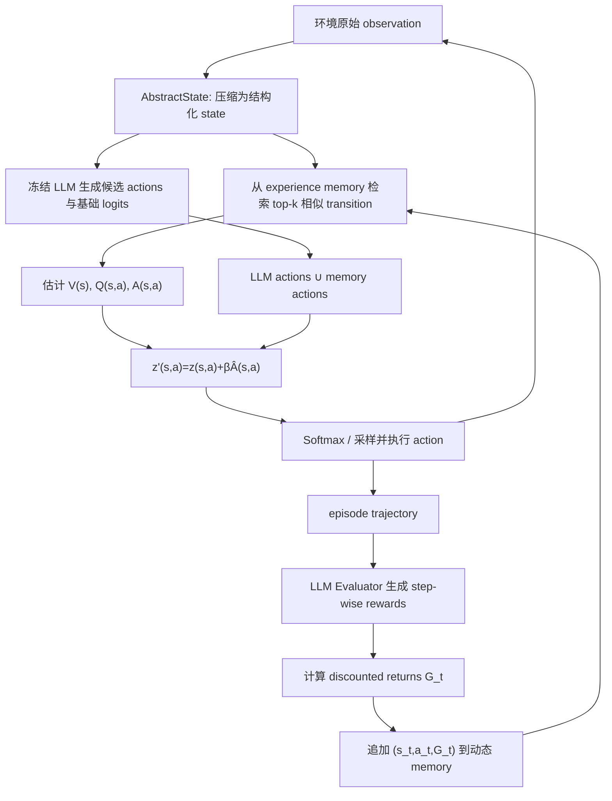

<!--more-->


## 零、写在前面

昨晚看完 re0，re0 切片没刷到，莫名其妙刷到这个工作的报告了（神秘推送），标题太吸引人了，而且也是我最近比较烦的事情，就是 RL 之类的方法成本太高了，而且 catastrophic forgetting、泛用性的问题也比较麻烦的点。

然后这个东西发出来之后好像就挺火的了，各种声音也比较多，趁着修电脑的工夫在 ipad 上读了一下，读完发现这个竟然是基于 memory 来做的，思路很有趣，后续想想能不能 follow 一下。

>   今天电脑似了，然后去维修点以180r的价格换了一块18r的网卡望周知（恼


## 一、标题


>   **来源：ICML 2026（spotlight）**
>
>   **代码：https://github.com/liushiliushi/JitRL**
>
>   作者团队来自 NUS


### 1.1 Just-In-Time

名字还挺有意思，**JIT（即时编译）**本就是 runtime 去实时编译 CLR 得到机器码然后装入内存，那么这里的 JIT RL 就是**即时强化学习**。

它学习的结果主要存在于两处：

1. 不断增长的 experience memory；
2. 当前推理步骤临时改变的 action distribution。

模型权重 $\theta$ 始终冻结。


### 1.2 `Without Gradient Updates`

JitRL 不需要：

- `backward()`；
- optimizer；
- gradient、optimizer state；
- PPO/GRPO 的多轮参数更新；
- 为每次环境变化重新训练 checkpoint。

但它仍然需要：

- 与环境反复交互并收集 trajectory；
- 使用 LLM Evaluator 给每一步产生 reward；
- 保存和检索经验；
- 为候选 action 取得或构造 logits；
- 每一步计算 $V$、$Q$、$A$ 并重排候选动作。

所以更准确的说法是：

> **JitRL 是 gradient-free continual adaptation，不是 computation-free learning。**


### 1.3 省流

**JitRL 用历史经验即时估计动作价值并修改 logits，让冻结 LLM 在测试时持续改进。**


## 二、摘要

### 2.1 核心问题

部署后的 LLM 通常是 frozen model。即使 Agent 在新环境中连续失败，它也不会自动把失败经验写进参数。传统 RL 可以更新 policy，但存在三个现实问题：

- 需要大量 rollout 和 GPU；
- 在每次环境变化后重新训练很慢；
- 持续更新可能造成 **catastrophic forgetting（灾难性遗忘）**，即学会新环境的同时损伤旧能力。

纯粹的 **In-Context Learning, ICL（上下文学习）**虽然无须训练，但通常只是把历史经验写成文本并塞进 prompt。随着交互增长，prompt 会变长，噪声也会增加；模型也未必严格按照文本建议行动。


### 2.2 JitRL 的核心方案


JitRL 维护动态 memory：

$$
\mathcal M=\{(s_i,a_i,G_i)\}_{i=1}^{N},
$$
其中：

- $s_i$：压缩后的历史状态；
- $a_i$：当时采取的动作；
- $G_i$：从该动作开始获得的 discounted return。

当前状态 $s$ 到来后：

1. 从 memory 中找 top-k 相似状态；
2. 用邻居回报估计 $\hat V(s)$ 和 $\hat Q(s,a)$；
3. 计算 $\hat A(s,a)=\hat Q(s,a)-\hat V(s)$；
4. 把 advantage 直接加到候选动作 logit：

$$
z'(s,a)=z(s,a)+\beta\hat A(s,a);
$$

5. 从更新后的 softmax distribution 中选动作；
6. episode 结束后，将本轮新经验写回 memory。


### 2.3 理论依据

这个工作还给了证明，上面的 additive logit update 不是随手设计的 heuristic。对于 KL-regularized policy improvement objective，其最优解为：

$$
\pi^*(a\mid s)
\propto
\pi_\theta(a\mid s)\exp\bigl(\beta\hat A(s,a)\bigr).
$$
由于 $\pi_\theta(a\mid s)=\operatorname{Softmax}(z(s,a))$，取对数后自然得到：

$$
z'(s,a)=z(s,a)+\beta\hat A(s,a).
$$


## 三、引言

### 3.1  Agent can't learn "on the fly"


一个 Web Agent 第一次把“客户评论”误认为在 `Catalog` 页面，失败后如果权重不变，第二次仍可能做同样选择。人类会形成经验：

> 在这个后台系统中，reviews 实际位于 `Marketing`，不要被 `Catalog` 的字面含义误导。

普通 frozen LLM 不会自动完成这种行为更新。


### 3.2 为什么不直接持续做 PPO/GRPO？

在真正的 continual deployment 中，数据往往是逐条到来的：

```text
第 1 次尝试 -> 一条 trajectory
第 2 次尝试 -> 又一条 trajectory
第 3 次尝试 -> 环境可能已经略有变化
```

而 PPO/GRPO 通常更擅长：

- 一次采集大量 rollout；
- 形成相对稳定的 batch；
- 多轮反向传播；
- 定期发布新 checkpoint。

在一两个新 trajectory 后立即更新 32B/70B 模型，不仅昂贵，梯度估计也可能非常不稳定。JitRL 因而把问题从“怎样及时训练参数”改写为：

> **能否不改参数，只利用局部历史经验，在当前状态临时求出一个更好的 action distribution？**


### 3.3 普通 memory prompting 还不够？

传统 memory agent 常执行：

```text
检索过去经验 -> 拼到 prompt -> 希望 LLM 自己理解并遵循
```

这是一条间接控制路径。即使 prompt 中写着“不要点 Catalog”，基础模型强烈的语义先验仍可能让它点 `Catalog`。

JitRL 则直接做：

```text
click(Catalog):   logit 0.90 -> 0.40
click(Marketing): logit 0.70 -> 1.40
```

因此历史经验不再只是“给模型看的建议”，而是被转换为 policy distribution 上的数值偏置。


### 3.4 论文贡献

我认为可以分成三层：

1. **系统层**：动态存储 `(state, action, return)`，测试时 kNN 估值；
2. **决策层**：在有限候选动作集合上直接做 advantage-based logit update；
3. **理论层**：将 logit update 解释为 KL-regularized objective 的闭式最优解，并在一组假设下给出估值与 policy update 的一致性结论。


## 四、相关工作

### 4.1 Gradient-based Agent RL

PPO、GRPO、WebRL 等方法将环境 reward 变成梯度，更新 LLM policy。优点是：

- 能把经验压缩进参数；
- 部署时不必始终保留全部训练 memory；
- 可以学习难以用自然语言明确描述的行为模式。

代价是：

- rollout 多；
- 训练和显存成本高；
- 在线小样本更新容易不稳定；
- 参数更新可能影响模型已有能力。

JitRL 保留 RL 的 $Q/V/A$ 和 policy improvement 视角，但移除了参数梯度。


### 4.2 Training-free test-time learning

论文比较的代表性方法包括：

- **Memory**：直接把完整历史 transcript 加入 prompt，超长后 FIFO 截断；
- **Reflexion**：让模型反思失败，并将语言化经验加入下一次 prompt；
- **AWM**：从成功轨迹中抽取 reusable workflow；
- **EvoTest**：在测试时改 prompt、memory、hyperparameter 和工具逻辑。

JitRL 与这些方法共同点是冻结模型；区别是：

> 它不只检索“过去发生了什么”，而是把历史 transition 当作局部经验 policy/value database，并据此数值化更新 logits。


### 4.3 与 In-Context RL / case-based reasoning 的关系

从方法实质看，JitRL 与以下思路很接近：

- **case-based reasoning（基于案例推理）**：当前问题和过去相似，就参考过去动作结果；
- **kNN value estimation**：以邻居 return 近似当前状态的 value；
- **episodic control**：直接利用成功 episode，不等待慢速参数学习；
- **retrieval-augmented policy**：外部 memory 参与 action selection。

因此“RL”主要体现在：

- experience 由 state、action、reward、return 组织；
- 使用 value 与 advantage；
- 最终更新来自一个 policy optimization objective。

它不是传统意义上的 policy-gradient algorithm。


## 五、Preliminaries

### 5.1 RL 的基本目标

一条 Agent trajectory 写作：

$$
\tau=(s_0,a_0,r_0,s_1,a_1,r_1,\ldots,s_T,a_T,r_T).
$$


- $s_t$：第 $t$ 步状态；
- $a_t$：Agent 采取的动作；
- $r_t$：该步奖励；
- $\pi_\theta(a\mid s)$：模型在状态 $s$ 选择动作 $a$ 的概率。

RL 希望最大化累计 reward：

$$
J(\theta)=\mathbb E_{\tau\sim\pi_\theta}[R(\tau)].
$$
传统 policy gradient 为：

$$
\nabla_\theta J(\theta)=
\mathbb E_{s,a\sim\pi_\theta}
\left[
\nabla_\theta\log\pi_\theta(a\mid s)A(s,a)
\right].
$$
直觉是：

- $A(s,a)>0$：这个动作比当前平均水平好，提高其概率；
- $A(s,a)<0$：这个动作较差，降低其概率。


### 5.2 V、Q、A 分别是什么？

$$
A(s,a)=Q(s,a)-V(s).
$$


- **State value $V(s)$**：来到状态 $s$ 后，平均能获得多少未来回报；
- **Action value $Q(s,a)$**：在 $s$ 做特定动作 $a$ 后，平均能获得多少未来回报；
- **Advantage $A(s,a)$**：动作 $a$ 比该状态的平均动作好多少。

例如在网页后台：

```text
状态 s：需要寻找 customer reviews
平均尝试回报 V(s) = 1.0
点击 Catalog 的 Q = -0.5 -> A = -1.5
点击 Marketing 的 Q = 2.0 -> A = +1.0
```

JitRL 的基本思想就是：不训练 value network，而是从相似历史案例中直接估计这些数字。


### 5.3 Return 为什么不是 immediate reward？

Episode 完成后，Evaluator 为每一步给出 $r_t$。论文再计算：

$$
G_t=\sum_{u=t}^{T}\gamma^{u-t}r_u.
$$
其中 $\gamma$ 是 discount factor。

这是为了处理延迟影响。例如在游戏里：

```text
第 5 步：拿起绳子，暂时没有得分
第 20 步：把绳子系在栏杆上
第 21 步：安全下崖并得分
```

如果只看第 5 步即时 reward，“拿绳子”似乎没用；return 会把后续收益的一部分回传给它。


### 5.4 JitRL 与普通 policy gradient 的关键替换

传统 RL：

$$
A(s,a)\rightarrow \nabla_\theta\log\pi_\theta(a\mid s)
\rightarrow \text{更新参数 }\theta.
$$
JitRL：

$$
\hat A(s,a)\rightarrow z'(s,a)=z(s,a)+\beta\hat A(s,a)
\rightarrow \text{只更新当前动作分布}.
$$
它跳过了 gradient-to-parameter 这一步。


## 六、方法

### 6.1 overview




这套系统有两个循环：

- **step 内循环**：检索 -> 估值 -> 改 logits -> 行动；
- **episode 外循环**：评估完整轨迹 -> 写入新 experience -> 下一 episode 使用。


### 6.2 第一步：状态抽象

原始 observation 往往不适合检索：

- WebArena 页面可能包含完整 DOM、截图、临时 element ID；
- Jericho observation 包含大量叙事性文字和位置往返记录。

JitRL 先构造 compact state $s_t$，目标是：

> 功能相同的状态尽量映射为相似表示，实例 ID 和无关措辞尽量被删除。

#### WebArena

论文使用：

- **Regularized URL**：把产品 ID、用户 ID 等替换为 placeholder；
- 当前 filter、输入框等有效页面状态；
- 会改变页面状态的局部 action history。

例如：

```text
/customer/edit/123
/customer/edit/456
```

会被归一为同一种 customer editing page，从而复用经验。

#### Jericho

模型将文本压缩为：

```text
Step t: [State: key nouns...] [Action: key verbs...]
```

并维护：

- `[SUMMARY]`：目标与当前局面；
- `[PROGRESS]`：真正带来得分的 milestone；
- `[LOCATION]`：去掉无效往返后的路径。

论文附录的消融表明，结构化 text state 比直接用 embedding state 更好。作者认为纯 embedding 容易把文字相似、但游戏拓扑完全不同的状态混在一起。


### 6.3 第二步：episode 后构建 experience memory

动态 memory 定义为：

$$
\mathcal M=\{(s_i,a_i,G_i)\}_{i=1}^{N}.
$$
这里没有保存模型 hidden state，也没有训练 LoRA。每个条目是一条经验判断：

> 在类似状态 $s_i$ 做动作 $a_i$，从这一步往后最终获得了回报 $G_i$。


#### Step-wise reward 从哪里来？

Episode 结束后，一个 **LLM-based Evaluator** 阅读完整 trajectory，为每个 action 评分。

WebArena 的 prompt 要求在 $-3$ 到 $+3$ 之间判断：

- 有用还是有害；
- 判断有多确定；
- 未来应重复还是避免。

Jericho evaluator 同时参考：

- 游戏 score change；
- 动作是否带来进展；
- 是否造成循环、浪费步骤或死亡；
- 动作的长期 consequence chain。

因此，JitRL 不是“完全不需要 reward engineering”。它把训练 critic 改成了**调用 LLM 事后做 trajectory credit assignment**。

这也带来明显风险：Evaluator 若误判，错误回报会被持久化进 memory，并在以后重复影响 policy。


### 6.4 第三步：检索相似经验

当前状态 $s$ 到来后，从 memory 中取 top-k 邻居：

$$
\mathcal N(s)=\operatorname{TopK}_{(s_i,a_i,G_i)\in\mathcal M}
\operatorname{Sim}(s,s_i).
$$
论文的实现不是统一的黑盒向量检索：

- **WebArena**：先按 regularized URL 过滤，再对 effective state 做 Jaccard similarity；
- **Jericho**：state index 与 history index 做 hybrid retrieval，权重为 `0.75 state + 0.25 history`，再用 Jaccard overlap 过滤。

Jaccard similarity 为：

$$
J(s,s_i)=
\frac{|T(s)\cap T(s_i)|}{|T(s)\cup T(s_i)|},
$$
其中 $T(s)$ 是状态文本的 token set。

这说明方法效果不只来自 RL 公式，还依赖大量 domain-specific state abstraction、action normalization 和 retrieval engineering。


### 6.5 第四步：扩充候选动作集合

冻结 LLM 先生成少量候选动作集合 $C_{LLM}$。论文主实验通常令候选数为 3。

随后加入相似历史状态中出现过的动作：

$$
C=C_{LLM}\cup\{a_i:(s_i,a_i,G_i)\in\mathcal N(s)\}.
$$
这个步骤很重要。否则如果 LLM 根本没有提出历史上成功的动作，logit update 无论怎么算，都无法把它选出来。

对于 memory 提供、但 LLM 没生成的动作，论文将其基础 logit 设为中性值：

$$
z(s,a)=0.
$$
随后再根据 advantage 加减。


#### Action normalization

- WebArena 的临时 element ID 会映射为语义描述，例如把 `click(240)` 转成 `click(<combobox[Sort by:]>)`；
- Jericho 直接把候选限制在 game engine 给出的 valid action set 中。

这保证过去动作至少在当前状态下语法可执行。


### 6.6 第五步：用 memory 估计 $V(s)$

状态 value 用邻居 return 的均值：

$$
\hat V(s)=
\frac{1}{|\mathcal N(s)|}
\sum_{i\in\mathcal N(s)}G_i.
$$
直觉上：与当前状态相似的历史案例，平均后来做得怎么样？

例如邻居 return 为 $\{3,2,-1,2\}$，则 $\hat V(s)=1.5$。


### 6.7 第六步：估计候选动作的 $Q(s,a)$

先从邻居中取出执行过动作 $a$ 的子集：

$$
\mathcal N(s,a)=
\{(s_i,a_i,G_i)\in\mathcal N(s):a_i=a\}.
$$


#### 情况一：历史上见过该动作

$$
\hat Q(s,a)=
\frac{1}{|\mathcal N(s,a)|}
\sum_{j\in\mathcal N(s,a)}G_j.
$$

也就是：在相似状态中做这个动作，后续平均表现如何？


#### 情况二：历史上没见过该动作

如果所有 unseen action 都给低分，Agent 会只重复旧经验，无法探索。JitRL 使用 **optimism under uncertainty（不确定性下的乐观探索）**。

以概率 $\lambda$：

$$
\hat Q(s,a)=\hat V(s)+\frac{\alpha}{|\mathcal N(s)|}.
$$
以概率 $1-\lambda$：

$$
\hat Q(s,a)=0.
$$


- $\lambda$：触发乐观探索的概率；
- $\alpha$：UCB bonus 强度；
- $\alpha/|\mathcal N(s)|$：经验越少，探索 bonus 越大；经验越多，bonus 越小。

生活类比：刚入职时错题本很薄，不能因为里面没写过某个方法就认定它不好；随着同类案例越来越多，再没出现过的方法就不应一直被高估。


### 6.8 第七步：计算和归一化 advantage

$$
\hat A(s,a)=\hat Q(s,a)-\hat V(s).
$$

实现中还进行 scale normalization：

$$
\tilde A(s,a)=
\frac{\hat A(s,a)}{\max_{a'\in C}|\hat A(s,a')|+\epsilon}.
$$
归一化后，最大绝对 advantage 大致落在 1 附近，防止不同游戏 reward scale 差异过大，使 logit update 突然失控。


### 6.9 第八步：closed-form policy update

作者提出以下优化问题：

$$
\pi^* = \arg\max_{\pi'}
\left(
\mathbb E_{a\sim\pi'}[\hat A(s,a)]
-\frac{1}{\beta}D_{KL}(\pi'\|\pi_\theta)
\right).
$$
它同时要求：

1. 新 policy 偏向高 advantage 动作；
2. 新 policy 不要离 frozen LLM 的原始分布太远。

通过 Lagrange multiplier 可得到：

>   这个求解过程还是蛮简单的，就是把期望展开，然后因为概率和是1，那么这就是一个带等式约束的求最值问题，直接上拉格朗日乘数法，求个导写一下最优解，然后把 λ 项替代成常数 β 就行了

$$
\pi^*(a\mid s) = \frac{1}{Z(s)}
\pi_\theta(a\mid s)
\exp\bigl(\beta\tilde A(s,a)\bigr),
$$

其中 $Z(s)$ 是归一化常数。由于 $\pi_\theta(a\mid s)\propto\exp(z(s,a))$，所以：

$$
\pi^*(a\mid s)
\propto
\exp\left(z(s,a)+\beta\tilde A(s,a)\right).
$$
最终直接更新：

$$
\boxed{
z'(s,a)=z(s,a)+\beta\tilde A(s,a)
}
$$

>   $\pi^*$ 是最优策略，$z'(s,a)$ 是对应的 logit

这就是整篇论文最核心的公式。

#### $\beta$ 在干什么？

- $\beta$ 小：更相信 frozen LLM 的原始判断；
- $\beta$ 大：更相信 memory 估计出的经验 advantage。


### 6.10 它修改的究竟是哪种 logit？

这里必须讲清楚：论文没有对 LLM vocabulary 中每个 next token 都构造 $Q$ 值。

它先构造有限 action set $C$，再取得这些 action 的分数：

- **Token-level Logit**：让模型用索引 token 选择候选项，例如输出 `A/B/C`，读取这些 token 的 log-probability；
- **Verbalized Logit**：黑盒模型不提供 logprob 时，让 LLM 为每个候选动作输出 `0–100` confidence，再将 confidence 转成 logit。

所以它严格来说是：

> **在有限候选动作上的 test-time reranking / policy reweighting。**

它并没有无梯度地重写 LLM 的完整 token policy，也不能把 advantage 自动传播到一段任意长度 action 的所有 token。


### 6.11 三个理论结论怎样理解？


#### Theorem 4.1：logit update 的最优性

对“最大化 expected advantage，同时惩罚偏离 reference policy 的 KL”这个单状态优化问题，指数倾斜：

$$
\pi^*\propto\pi_\theta e^{\beta\hat A}
$$
是精确闭式解。

它证明的是**给定 advantage 估计后，怎样重分配候选动作概率最合理**，并没有证明 $\hat A$ 本身一定正确。


#### Theorem 4.2：kNN 价值估计的一致性

作者在若干假设下证明，随着 memory 增长：

$$
\hat V_t(s)\xrightarrow{p}V^{\pi_t}(s),\qquad
\hat Q_t(s,a)\xrightarrow{p}Q^{\pi_t}(s,a),
$$

$$
\hat A_t(s,a)\xrightarrow{p}A^{\pi_t}(s,a).
$$

关键假设包括：

- 相近状态具有相近 value；
- return noise 零均值、方差有界；
- memory 增大时 $k\to\infty $，同时 $ k/N\to0$；
- 当前区域能被历史样本覆盖；
- 每个相关动作的出现次数趋于无穷；
- policy drift 足够慢。

这些是标准非参数估计思路，但在真实 Agent 环境里很强。例如一次性的网页状态、罕见动作和快速变化的网站，未必满足 coverage 与 slow drift。


#### Theorem 4.3：policy update 的一致性

如果 Theorem 4.2 的 advantage estimate 收敛，那么把它代入指数倾斜公式后，估计 policy 也会趋向由真实 advantage 定义的 KL-regularized optimal policy。

逻辑链是：

```text
memory 覆盖越来越好
-> kNN 的 V/Q/A 越来越准
-> 用估计 A 算出的 action distribution
   越来越接近用真实 A 算出的 distribution
```

它不是对整个 continual RL 过程获得 global optimal policy 的无条件证明，而是一个在固定查询状态、有限候选动作及相应正则条件下的一致性结果。


## 七、实验

### 7.1 Benchmark 与 protocol

#### WebArena

真实网页操作环境，包含 Admin、GitLab、Map、Reddit 和 Shopping。每个任务连续尝试 5 次，论文报告：

- **Avg success rate**：五次尝试的平均表现，反映整体学习效率；
- **Final success rate**：第五次尝试的表现，反映积累经验后的结果。

#### Jericho

文本交互游戏，包括 Library、Zork1 和 Zork3。每个游戏连续运行 50 episodes，报告平均分与最后一轮分数。

#### 主设置

- training-free 主实验 backbone：Gemini-2.5-flash；
- Jericho：候选动作 3，$\gamma=0.5$，$k=10$，$\lambda=0.65$，$\alpha=5$；
- WebArena：候选动作 3，$\gamma=0.1$，$k=10$，$\lambda=0.05$，$\alpha=5$；
- WebArena 每 episode 最多 10 步；Jericho 最多 60 步。


### 7.2 WebArena 主结果


JitRL 在五个网站的 Final success rate 分别为：

- Admin：56.59；
- GitLab：45.00；
- Map：42.19；
- Reddit：61.98；
- Shopping：45.83。

这组结果最能证明：在相同 Gemini backbone 和同一连续尝试 protocol 下，JitRL 比“把历史塞进 prompt”或“反思文本”更有效。


### 7.3 Jericho 主结果


JitRL 的优势在 Zork1 最明显，说明可复用的 puzzle mechanic 很适合经验检索。例如在 Loud Room，基础模型倾向于直接拿 platinum bar，但历史经验告诉它先执行 `echo` 才能安静下来。


### 7.4 对比 weight-update RL


这张表的 headline 很强，但不能单独当作完全公平的算法比较，因为 JitRL 与 WebRL 的 backbone、训练/适应 protocol 并不完全相同。作者因此在附录补了受控实验。


#### 相同 Llama-3.1-8B、相同五次 on-the-fly 尝试


这是更有说服力的小样本在线适应对比：两者都只利用前几次尝试，JitRL 不做梯度，在低样本区间优于 WebRL。


#### 相同 Llama-3.1-70B，offline train / held-out evaluation


在这个对 weight-update 方法更友好的大规模离线协议中，WebRL 仍高于 JitRL。JitRL 的优势转为：性能接近但成本显著更低，而不是绝对分数第一。


#### 相同 Qwen3-32B、Jericho 测试时适应


附录进一步调参后，GRPO 在 Zork1 可达到 mean 40.7、max 55，接近 JitRL 的 mean 53.0，但最好设置需要：

$$
50\times8\times8=3200
$$
条训练 trajectories；JitRL 的 50 episodes 只使用 50 条 trajectory。这里 JitRL 的主要优势是 sample efficiency 与不需要反向传播。


### 7.5 跨 backbone 与跨任务泛化

作者在 Gemini-2.5-flash、GPT-5-mini、DeepSeek-V3.2 上都观察到提升。以 Admin / Reddit 为例，JitRL 的 Avg / Final 分别为：

- Gemini：`52.31 / 56.59`，`57.64 / 61.98`；
- GPT-5-mini：`48.04 / 51.63`，`54.26 / 57.36`；
- DeepSeek-V3.2：`50.65 / 54.35`，`54.42 / 61.24`。

冷启动 cross-task memory 实验禁止检索同一个任务的旧记录，只能检索不同任务经验。JitRL 仍在五类网站上普遍优于 Static，说明 state/action normalization 可以迁移一部分程序性经验。

不过，这里的“跨任务”主要仍发生在同一网站生态与同一 action language 内，不能直接等同于跨领域技能迁移。


### 7.6 消融实验

#### Logit update vs prompt update

两种方法使用完全相同的 retrieval memory：


这说明增益不只是“检索到了经验”，将经验显式转成 action score 确实比把它写入 prompt 更有效。

但消融只覆盖两个网站，差值约 2.85 和 4.62 个百分点，并不是所有任务都已充分验证。

#### Exploration rate $\lambda$

Jericho 最优附近为 $\lambda=0.65$：


WebArena 则只需较小探索率，平均最优附近为 \(\lambda=0.05\)，因为网页任务失败成本高、每个 task 只有五次机会。


#### UCB bonus $\alpha$


$\alpha$ 太小无法鼓励新动作，太大则可能让未验证动作盖过可靠经验。主设置取 5，但 Zork1 单项在 $\alpha=7$ 时略高，说明超参数仍依赖环境。


#### Retrieval neighbor count $k$


论文发现 $k=8$ 到 14 较稳：

- 太小：样本少，value estimate 方差大；
- 太大：引入不相关状态，污染 $Q$ 与 $A$。


#### Memory scalability

Library 中 memory 从 0–500 增至 2000–2500 条时：

- retrieval latency 从约 15–22 ms 增至 47 ms；
- average score 从 18.1 增至 30.0。

在这个规模上检索开销远小于 LLM inference，但论文没有验证十万、百万级 memory，也没有加入复杂 consolidation 与 deletion。


### 7.7 成本结果


WebRL 的估算来自 Llama-3.1-70B 在 16 张 H200 上约 154 小时，包括 SFT、任务生成、rollout、reward labeling 和 actor-critic optimization。

因此论文所谓“降低 30 倍成本”，主要成立于：

> **将基于 API 的 JitRL inference/continual adaptation 成本，与完整 70B WebRL 训练成本比较。**

这并不表示 JitRL 比普通 static inference 更便宜。它比 Static 多约 45% 的 API 成本，因为需要：

- 多候选 action generation；
- confidence/logit 获取；
- episode evaluator；
- state summarization；
- memory retrieval。


## 八、结论、局限和展望

### 8.1 贡献

JitRL 提出了一种很干净的替代路线：

> 不把新经验压进神经网络参数，而是保留为外部 transition memory；每次行动前，从局部案例估计 advantage，并求一次 KL-regularized policy improvement 的闭式解。

它把三类经典思想接在一起：

- episodic memory；
- non-parametric value estimation；
- exponential-tilting policy update。


### 8.2 它为什么可能特别适合 Agent？

Agent action space 往往可以被约束成一个小候选集合，例如：

- 点击哪个网页元素；
- 调用哪个工具；
- 执行哪个游戏 command；
- 在几个 memory operation 中选哪一个。

在这种场景里，为有限动作做 test-time reranking 比“在线更新整个 32B/70B 模型”现实得多。


### 8.3 它与真正的 weight learning 是互补而非完全替代

JitRL 擅长：

- 小样本、即时适应；
- 环境变化快；
- 动作可枚举或可生成少量候选；
- 不希望损坏基础模型能力。

参数 RL 更擅长：

- 大规模离线经验压缩；
- 学习跨状态、跨表述的深层泛化；
- 部署时不依赖不断增长的外部 memory；
- 优化开放式长文本生成 policy。

因此更现实的组合是：

```text
慢速 parametric learning：定期把稳定、反复验证的经验蒸馏进模型
+
快速 non-parametric adaptation：JitRL 处理刚出现的新环境经验
```


### 8.4 局限

论文的 `Limitations` 部分明确列出三点：

1. **依赖冻结基础模型提供候选动作**：JitRL 只能重新加权 base model 与 memory 已经提出的 action，不能发现候选集合之外的动作。形式上，如果

    $$
    a^*\notin C_{LLM}\cup C_{memory},
    $$
    那么后续 value estimation 和 logit update 都无法选择 $a^*$。

2. **依赖 LLM Evaluator 的 step-wise credit assignment**：如果 Evaluator 把有害动作评为正分，或者没有识别出早期动作的长期价值，错误 return 会进入 memory，进而损害后续 policy。

3. **不适合关键状态难以文本化的任务**：JitRL 的状态表示和检索主要建立在文本上。对 chess board、复杂空间布局或 time-series forecasting 等任务，文本摘要可能丢失决定性结构，导致“文字看起来相似，但真实状态并不相似”。

这三点分别限制了它的**动作发现能力、reward 可靠性和状态表示范围**。


### 8.5 其他局限

#### 1. `Verbalized Logit` 不是模型真实 logit

对不提供 logprob 的闭源 API，论文让 LLM verbalize confidence。语言化的 `70%`：

- 可能未校准；
- 受 prompt 影响；
- 不一定与实际 sampling probability 一致；
- 不同模型间不可直接比较。

因此理论中的 $z(s,a)$ 与工程中的 verbalized score 之间存在近似落差。


#### 2. kNN return 并不天然是 causal value

相似状态下动作 $a$ 的高 return，可能来自后续步骤碰巧更好、环境随机性、evaluator 偏差，或 state representation 遗漏关键 hidden variable。

$$
\text{historical correlation}\neq\text{causal action value}.
$$


#### 3. 理论假设与现实 Agent 有距离

收敛要求 memory 覆盖、动作反复出现、policy 缓慢漂移。真实网页可能改版，用户任务也可能只出现一次。此时旧邻居不仅不能帮助，反而可能形成 stale policy bias。


#### 4. 目前缺少 memory evolution

现有设计基本持续追加 `(s,a,G)`：

- 没有系统合并近重复经验；
- 没有检测过期规则；
- 没有 source reliability；
- 没有冲突 resolution；
- 没有根据环境 change point 主动遗忘。

因此它尚不是完整的 lifelong memory system。


#### 5. LLM Evaluator 可能造成自我强化错误

同一类 LLM 既做 actor，又参与 reward evaluation，可能产生：

```text
Actor 偏好某种看似合理的动作
-> Evaluator 也觉得它合理
-> memory 记录正 return
-> 后续 logits 进一步偏向该动作
```

这类似 belief echo chamber。需要 environment verifier、规则检查器或多 evaluator disagreement 来降低风险。


#### 6. benchmark 的重复尝试协议较有利于 episodic memory

WebArena 每个 task 连续尝试 5 次，Jericho 在同一游戏中运行 50 episodes。这正是 JitRL 擅长的“相似状态反复出现”。

如果真实任务大多是一次性的、状态结构变化大，收益可能明显下降。因此还需要测试高 novelty task stream、non-stationary environment、adversarially misleading memory，以及很少重复状态的开放世界任务。


### 8.6 一些启发。？

**方向一：Learned retrieval，但保持 gradient-free policy**

可以离线训练一个更好的 state/action retriever，部署时仍冻结 actor，仅让 JitRL 做快速 adaptation。这样把慢速表示学习与快速策略更新分开处理。


**方向二：带置信度、时效和来源的 experience memory**

将条目扩展为：

```text
(state, action, return, timestamp, source,
 evaluator_confidence, environment_version, visit_count)
```

检索和 \(Q\) 估计同时考虑相似度、新鲜度、evaluator 可靠性、return variance 与环境版本。


**方向三：从均值估计升级到 uncertainty-aware value**

当前 $Q$ 主要取邻居 return 均值。可以改为 Bayesian kNN、distributional return、bootstrap confidence interval、conservative lower confidence bound 或 risk-sensitive value。


**方向四：Memory consolidation 与遗忘**

随着 memory 增长，可以周期性：

- 合并相似 `(state, action)` 的 return statistics；
- 删除长期不再命中的条目；
- 对环境改变前后的经验分库；
- 将反复验证的经验压缩为 procedural rule；
- 将最稳定规则蒸馏进 LoRA 或小 policy head。

这可以形成“快记忆 + 慢参数”的双系统。


**方向五：把 JitRL 用于 Agent Memory Manager**

它可以直接迁移到 memory operation selection：

```text
state:
  当前 observation + 旧 memory + 冲突信息

candidate actions:
  ADD / UPDATE / DELETE / MERGE / IGNORE / VERIFY

experience memory:
  过去类似冲突下执行某操作，后来问答/任务表现如何
```

这样可以不训练 memory manager，就在测试时根据历史 outcome 调整各 memory operation 的 logit。

不过必须处理长延迟 credit：一条 `UPDATE` 的好坏可能几十轮后才知道。可以结合：

- AttriMem 的 answer attribution；
- Mem-T 的 hindsight credit；
- JitRL 的 non-parametric logit update。


**方向六：安全的“可撤销即时学习”**

JitRL 的优势是参数没变，因此错误经验理论上容易撤销。未来可设计：

- 每条 memory 记录 provenance；
- 发现 reward 错误时回滚；
- 对可疑经验隔离；
- 在 policy update 前展示“哪个历史案例使该 action 加分”；
- 对高风险动作设置最大 logit shift。

这是它相比在线微调很有潜力的一点：**学习发生在外部、可读、可删的记忆层，而不是不可解释地混进参数。**


### 8.7 总结

JitRL 最有价值的地方不是声称“无需梯度也能等价替代 RL”，因为它并没有解决开放动作空间中的完整 policy learning。它真正提供的是一个很实用的中间层：

> **当 Agent 的候选动作有限、相似状态会重复、历史回报可获得时，可以把 experience memory 当成局部 value function，在推理时闭式调整 policy，而无需更新大模型权重。**

可以考虑：

- memory 中错误经验怎样被发现和撤销；
- 环境变化后旧经验怎样过期；
- 没有可靠 LLM Evaluator 时怎样构造 reward；
- 如何从有限 action reranking 走向更开放的策略生成；
- 如何将快速非参数适应与慢速参数 consolidation 结合。


