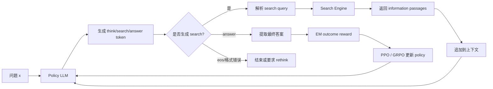

<!--more-->


## 零、写在前面

感觉今年各种 agent rl 工作井喷式爆发，打算速览一些工作，看看有没有什么启发，虽然 RL 的工作也没足够算力做：（。

>   这篇工作写作倒是还蛮好的，读起来很顺。


## 一、标题


>   来源：COLM 2025
>
>   arxiv：https://arxiv.org/abs/2503.09516
>
>   代码：https://github.com/PeterGriffinJin/Search-R1（貌似蛮多人复现来作为简历上的项目的）


## 二、背景

### 2.1 问题

普通 LLM 有两个相关问题：

1. 训练语料中没有某个领域的知识，或者知识已经过时；
2. 即使接上搜索引擎，也不一定知道什么时候搜、应该怎么搜、搜到后怎样继续推理。

把搜索接到模型前面只能解决“拿到一些材料”，不一定解决“如何主动查资料”。

### 2.2 相关工作

#### 2.2.1 LLM + Retrieval

论文将已有工作大体分成两类。

**RAG 路线**

```text
问题 -> 检索器找 top-k 文档 -> 把文档拼到 prompt -> LLM 回答
```

RAG 把检索结果作为额外上下文输入 LLM。优点是结构简单、容易部署；**缺点是一次检索和独立排序难以覆盖多跳问题**。

**Search-as-a-tool 路线**

模型把搜索引擎当作工具来调用。代表思路包括：

- **IRCoT**：每步推理后检索；
- **ReAct**：在 reasoning 和 action 之间交替；
- **Toolformer**：通过监督数据学习在合适位置插入工具调用。

```text
先想一步 -> 搜索 -> 读结果 -> 再想一步 -> 再搜索
```

它们说明了“交错推理和检索”是可行的，但主要依赖提示词。问题在于：

- 模型未必真正学会了什么时候搜索；
- 面对训练中没见过的任务，搜索 query 可能很差；
- 它可能重复搜索、过早停止，或者被错误结果带偏。

#### 2.2.2 LLM + Reinforcement Learning

论文涉及的 RL 方法包括：

- **PPO（Proximal Policy Optimization）**：带 critic 的 actor-critic 方法，通过 clipping 限制策略更新幅度；
- **GRPO（Group Relative Policy Optimization）**：对同一问题采样一组答案，用组内 reward 做相对 baseline，不需要额外 critic；
- **REINFORCE**：直接用 reward 加权 log probability 的经典策略梯度方法。

Search-R1 的工作分别做了 PPO 和 GRPO，把搜索环境、交错 rollout 和 retrieved-token masking 接到现有 RL 框架里。

### 2.3 为什么不直接做 SFT

**SFT（Supervised Fine-Tuning，监督微调）** 需要示范轨迹，例如：

```text
问题 -> 正确思考 -> 正确查询 -> 正确证据 -> 正确答案
```

**但是高质量的搜索轨迹很难大规模人工标注**，因为标注者不仅要写最终答案，还要决定：

- 第一条 query 应该怎么写；
- 哪条证据值得相信；
- 什么时候需要第二次搜索；
- 如何处理冲突或不完整信息。

Search-R1 的想法是：既然最终答案可以自动判断，就用 RL 让模型自己探索中间搜索策略。


### 2.4 论文提出的三个挑战

论文在引言中把问题归纳成三点。

#### 挑战一：如何把搜索放入 RL，且保持训练稳定

普通 LLM RL 假设整条 response 都由模型生成。但 Search-R1 的轨迹里混入了搜索结果：

```text
模型生成 token + 搜索引擎返回 token + 模型继续生成 token
```

**搜索结果不是模型动作，却出现在序列里，这会给 policy loss 和 KL loss 带来麻烦。**

#### 挑战二：如何支持多轮交错搜索

真正复杂的问题不一定一次搜索就够。模型需要学会：

- 先查实体 A；
- 从结果中抽取实体 B；
- 再查实体 B 的属性；
- 最后停止搜索并回答。

#### 挑战三：简单 outcome reward 是否足够

如果只在最后给正确/错误奖励，模型能否自己学出合理的 query 和搜索时机？这篇论文的实验结论是：在它的 QA 任务和训练设置下，简单奖励可以工作，但这并不意味着它已经解决了所有 reward design 问题。


## 三、方法


>   仍然是 PPO / GRPO 的经典流程，只需要明确一下环境、任务、奖励定义。

#### 3.1 总体流程



训练时的完整闭环是：

1. policy LLM 开始生成；
2. 模型遇到 `<search>...</search>` 时，系统提取 query；
3. search engine 返回 top-k passages；
4. 系统把 passages 包在 `<information>...</information>` 中，追加回上下文；
5. 模型继续生成；
6. 生成 `<answer>...</answer>` 后结束 rollout；
7. 根据答案是否正确计算 reward；
8. 用 PPO 或 GRPO 更新 policy LLM。

#### 3.2 搜索环境

论文实验使用：

- **知识库**：2018 Wikipedia dump；
- **retriever**：E5；
- **默认返回数量**：top-3 passages；
- **训练数据**：NQ 与 HotpotQA training set 的合并；
- **测试数据**：NQ、TriviaQA、PopQA、HotpotQA、2WikiMultiHopQA、Musique、Bamboogle。

因此，这里的“搜索引擎”并不是开放互联网浏览器，而是一个基于固定 Wikipedia 语料和 E5 检索器的可控搜索环境。

>   感觉这也是这么多人复现的原因吧：）

#### 3.3 training template


论文用结构化 token 规定模型和搜索环境如何交互：

| Token                            | 作用                           |
| -------------------------------- | ------------------------------ |
| `<think>...</think>`             | 模型的推理过程                 |
| `<search>...</search>`           | 模型请求调用搜索，内部是 query |
| `<information>...</information>` | 系统插入搜索结果               |
| `<answer>...</answer>`           | 模型给出最终答案               |

#### 3.4 多轮 rollout 是如何运行的


#### 3.5 reward：只看结果

>   感觉去年涌现出来的这些 agent-rl 工作的 reward 都是简单的基于结果，没有复杂的 reward 设计，原论文也说这个是一个 future work。

Search-R1 使用 rule-based outcome reward，主要是 Exact Match：

$$
r_{\phi}(x, y) = EM(a_{pred}, a_{gold})
$$
其中：

- `a_pred`：从 `<answer>` 中提取的预测答案；
- `a_gold`：数据集标准答案；
- `EM`：预测答案与标准答案匹配则为 1，否则为 0。

论文明确做了三个取舍：

- 不额外使用 format reward；
- 不为每次搜索设计 process reward；
- 不训练 neural reward model。

**优点**

- 实现简单；
- 不需要人工标注思考和查询轨迹；
- reward 不受一个额外 reward model 的偏差影响；
- 适合先验证“RL 能不能学会搜索行为”。

**缺点**

一个错误答案只告诉我们“最终错了”，却不告诉我们错在哪里：

- query 写错了？
- 检索器没找对？
- 搜索结果正确但模型没读懂？
- 多跳拆解失败？
- 最后答案格式不符合 EM？

因此 reward 很稀疏。不过像这种检索能力的训练，它的任务本身就是奖励稀疏的，所以效果还行。

#### 3.6 Retrieved Token Loss Masking

##### 3.6.1 问题

一条 Search-R1 rollout 可能是：

```text
模型 token:       我需要先确认 Britney Spears 的出生地
模型 token:       <search> Britney Spears birthplace </search>
检索 token:       Britney Spears was born in ...
模型 token:       <think>因此答案是...</think>
模型 token:       <answer>...</answer>
```

如果把整条序列的所有 token 都当成 policy 输出并计算 loss，就会产生概念错误：

- 搜索结果不是 policy 选择出来的；
- 模型不应该因为某段 Wikipedia 文字“长得像正确答案”而被当作在生成它；
- 训练目标应该优化“何时搜、搜什么、如何继续推理”，而不是拟合搜索引擎的返回文本。

##### 3.6.2 Mask 定义

定义 token mask：

```text
I(y_t) = 1，若 y_t 是 LLM 生成的 token
I(y_t) = 0，若 y_t 是 retrieved token
```

于是 policy loss 只在 `I(y_t)=1` 的位置计算。

##### 3.6.3 KL loss 也要 mask

论文还指出，retrieved token masking 同样应用于 KL divergence loss。否则即便 policy gradient 忽略了检索 token，KL 项仍可能把模型拉向搜索结果的 token 分布。

##### 3.6.4 mask 的消融

Qwen2.5-7B-base + PPO：

| 设置                      |   Avg |
| ------------------------- | ----: |
| 使用 retrieved-token mask | 0.431 |
| 不使用 mask               | 0.343 |

Qwen2.5-3B-base + PPO：

| 设置        |   Avg |
| ----------- | ----: |
| 使用 mask   | 0.303 |
| 不使用 mask | 0.262 |

这个消融很有说服力：它不是增加了一个复杂模块，而是修正了“哪些 token 属于模型行为”的基本建模错误。


#### 3.7 PPO


#### 3.8 GRPO


## 四、实验

### 4.1 数据集

论文使用七个开放域 QA 数据集：

#### General QA

- `NQ`：Natural Questions；
- `TriviaQA`：开放域 trivia 问答；
- `PopQA`：知识密集型实体问答。

#### Multi-Hop QA

- `HotpotQA`；
- `2WikiMultiHopQA`；
- `Musique`；
- `Bamboogle`。

训练时合并 `NQ` 和 `HotpotQA` 的 training set；测试时既有同分布数据，也有其他数据集，用来观察跨任务泛化。

论文使用 Exact Match 作为主要指标。需要注意：这些都是英文开放域 QA，不是长期用户交互、工具执行或个性化 Agent benchmark。

### 4.2 Baselines

论文比较了几种不同路线：

- **Direct Inference**：直接回答；
- **CoT**：只使用 Chain-of-Thought；
- **RAG**：一次检索后回答；
- **IRCoT**：prompt 驱动的多轮检索推理；
- **Search-o1**：搜索增强推理方法；
- **SFT**：监督微调；
- **R1**：不使用搜索，只做 RL 推理；
- **Rejection Sampling**：采样多条轨迹，保留答对的轨迹再做训练；
- **Search-R1**：把搜索调用直接纳入 RL rollout。

为了公平比较，论文尽量固定：

- 相同 retriever；
- 相同 Wikipedia 语料；
- 相同训练数据；
- 相同预训练模型；
- retrieval-based 方法默认返回 top-3 passages。

### 4.3 主结果


**qwen2.5-7b：**

最直观的对比是：

- Search-R1-base 比同模型设置下的 RAG `0.304` 提升到 `0.431`；
- 相比不带搜索的 R1-base `0.276` 也明显更高；
- 多跳数据 Musique 仍然较难，Search-R1-base 只有 `0.196`，说明“会搜索”不等于已经稳定解决复杂多跳推理。

**qwen2.5-3b：**

3B 的结果说明：搜索确实能帮助小模型，但能力上限明显受模型规模和多跳推理能力影响。尤其 `Musique` 与 `Bamboogle` 的表现并不稳定。

### 4.4 4B 附录结果

论文附录还测试了 Qwen2.5-14B。关键平均分如下：

| 方法               |                        Avg |
| ------------------ | -------------------------: |
| RAG                |                      0.281 |
| R1-base            |                      0.357 |
| Rejection Sampling | 未在附录主表列出对应完整行 |
| Search-R1-base     |                  **0.479** |
| Search-R1-instruct |                      0.433 |

Search-R1-base 的各项结果为：

```text
NQ 0.486, TriviaQA 0.676, PopQA 0.480,
HotpotQA 0.468, 2Wiki 0.470, Musique 0.241,
Bamboogle 0.528, Avg 0.479
```

这支持论文关于模型规模的观察：更大的 LLM 通常更容易学会较复杂的搜索和推理行为。但它也提示一个研究现实：要让 RL search policy 真正可靠，模型规模可能是重要前提，不能只靠环境设计弥补推理能力不足。

### 4.5 PPO 与 GRPO 对比


**论文的训练动态结论是**：

- GRPO 收敛更快，因为没有 critic warm-up；
- GRPO 训练较长时可能 reward collapse；
- PPO 收敛慢一些，但更稳定；
- 最终二者通常具有相近的可行性。

这里不能简单说“PPO 一定比 GRPO 好”。结果依赖模型大小和 base/instruct 初始化。更准确的总结是：**Search-R1 选择 PPO 作为默认方案，主要是出于训练稳定性，而不是因为 GRPO 完全无效。**

### 4.6 Base 与 Instruct

论文观察到：

- instruction-tuned model 初始表现更高；
- instruction-tuned model 前期收敛更快；
- 训练后 base 和 instruct 的 reward 可能接近；
- RL 能在一定程度上弥合 base model 的早期劣势。

这说明 RL 不只是在“微调一个已经会遵循格式的 instruct model”，base model 也可能通过 outcome reward 学会 `<think>/<search>/<answer>` 协议。

但这不代表 base model 在真实应用中不需要 instruction tuning。论文的格式很简单，且任务结构明确；现实 Agent 可能有更复杂的工具协议和安全约束。

### 4.7 top-k 检索数量消融

Qwen2.5-7B-base + PPO 的结果：

| top-k |       Avg |
| ----: | --------: |
|     1 |     0.375 |
| **3** | **0.431** |
|     5 |     0.400 |

直觉解释：

- top-1：上下文干净，但 recall 可能不够；
- top-3：recall 与噪声达到较好平衡；
- top-5：信息更多，但低质量或不相关 passage 增多，可能误导模型。

这其实也给 Agent Memory 一个常见提醒：**更多检索内容不等于更多有效记忆。** 检索器的 precision、证据质量和模型抵抗噪声的能力同样重要。

### 4.8 Group size 消融

在 GRPO 中，每个问题采样的 response 数量会影响组内 baseline。Qwen2.5-7B-base 结果如下：

| group size |       Avg |
| ---------: | --------: |
|      **1** | **0.410** |
|          3 |     0.363 |
|          5 |     0.350 |

论文指出：

- **group size=1 时，GRPO 退化为 REINFORCE；**
- 较大 group size 可能让训练动态更快，但不一定带来更好的最终泛化；
- 小 group size 在 unseen tasks 上表现更好，可能更稳定。

**这里有一个值得进一步研究的问题：组内相对 reward 不是越精确越好。大 group size 的采样成本更高，也可能放大策略坍缩或探索不足。**

### 4.9 Response length 与 valid search 数量

论文观察到训练过程呈现一个有意思的阶段性：

**前期：**

- response length 下降；
- reward 略有上升；
- 模型减少无意义 filler words，开始适应格式。

**后期：**

- response length 上升；
- reward 明显上升；
- valid search 次数增多；
- 搜索结果被加入上下文，导致 response 变长。

这说明模型可能先学会“说得更简洁、遵守格式”，之后才逐步学会“多搜索并利用外部知识”。

**但也要警惕一个问题：如果 reward 只奖励答对，不惩罚搜索成本，模型可能通过更多搜索来提高撞对概率。**

### 4.10 Case study：成功行为

**其实我读了方法后就在想model究竟学到了什么行为？**

论文案例体现了几类可学习的行为：

- **多跳搜索**：先找到一个实体，再查询该实体的属性；
- **补充信息查询**：第一轮没给出全部答案时，模型生成辅助 query；
- **搜索停止**：证据足够时，模型停止搜索并回答；
- **动态纠错**：第一条 query 不理想时，后续 query 逐步修正。

例如“Teide National Park 和 Garajonay National Park 位于哪里？”：

1. 先搜两座公园；
2. 得到其中一座的位置；
3. 再单独搜索另一座；
4. 合并为 Canary Islands, Spain。

这比一开始只做一次检索更接近真正的 agentic retrieval。

### 4.11 Case study：失败行为

论文附录也展示了重要失败：

- query 没有正确拆解复杂问题；
- 多次搜索同一条内容；
- 被 irrelevant passage 误导；
- 证据不足时过早回答；
- 从错误实体出发，后续推理建立在错误链条上；
- 最终答案不符合 ground truth，但模型在思考中表现出过度自信。

因此，RL 学会“调用搜索”不等于学会：

- 验证来源；
- 识别矛盾证据；
- 评估证据充分性；
- 计算搜索成本；
- 在不确定时拒答或请求澄清。

### 4.12 训练配置 

论文报告的主要配置如下：

| 项目                  | 配置                                         |
| --------------------- | -------------------------------------------- |
| 基础模型              | Qwen2.5-3B/7B，Base 与 Instruct              |
| PPO policy LR         | `1e-6`                                       |
| PPO value LR          | `1e-5`                                       |
| 训练步数              | 500 steps                                    |
| GPU                   | **单节点 8 x H100**                          |
| total batch size      | 512                                          |
| mini-batch            | 256                                          |
| micro-batch           | 64                                           |
| max sequence length   | 4096 tokens                                  |
| max response length   | 500 tokens                                   |
| max retrieved content | 500 tokens                                   |
| search action budget  | 4                                            |
| default retrieval     | top-3 passages                               |
| rollout engine        | vLLM                                         |
| parallelism           | tensor parallel size = 1                     |
| memory optimization   | gradient checkpointing、FSDP、CPU offloading |
| sampling              | temperature = 1.0，top-p = 1.0               |
| KL coefficient        | `0.001`                                      |
| PPO clip ratio        | `0.2`                                        |
| GRPO group size       | 5                                            |

RL 的实验就是这样，算力太夸张而且还不好做，sad……


## 五、总结

### 5.1 评价

这个工作的方法很简单，复现只要算力足够也比较容易做，定位基本就是baseline，后面可以进一步做改进。

**谈谈缺点**：

1.  它训练环境是一些开放式QA，并不是真实环境。

2.  然后一个很明显的问题就是：**reward 过于稀疏，且没有成本项**。

    >   **最终 EM 只关心是否答对，不惩罚：**
    >
    >   - **搜索次数；**
    >   - **query 长度；**
    >   - **passage token 数；**
    >   - **推理延迟；**
    >   - **API 费用；**
    >   - **重复搜索；**
    >   - **无用工具调用。**
    >
    >   **这会产生潜在的 reward hacking：只要多搜几次有助于答对，策略就可能倾向于增加搜索，即使在真实系统中成本不可接受。**

3.  **没有过程监督**

    >   reward 不区分错误来源，因此训练信号不能精细告诉模型：
    >
    >   - query 是否清晰；
    >   - 搜索是否应该停止；
    >   - 检索证据是否足够；
    >   - 是否真的根据证据回答；
    >   - 是否应该验证第二个来源。
    >
    >   后续工作可以加入 query quality、evidence sufficiency、citation correctness 和 search cost 等过程信号，但这也会增加 reward 设计难度。

4.  **证据可信度和冲突处理不足**

    >   模型可能看到错误或无关 passage。论文的失败案例已经表明：如果检索结果误导，模型可能沿着错误实体继续推理。
    >
    >   它没有系统解决：
    >
    >   - 多来源冲突；
    >   - 证据时效性；
    >   - 来源可信度排序；
    >   - “没有足够证据”时的拒答；
    >   - 事实随时间变化时的版本管理。

5.  **训练稳定性仍然依赖工程经验**

    >   论文观察到 GRPO 后期会 reward collapse，并采用最近稳定 checkpoint 进行评估。这个做法实用，但也意味着：
    >
    >   - 训练并非天然稳定；
    >   - 单个 checkpoint 的选择可能影响结果；
    >   - 如果缺少多 seed 方差报告，最终性能的可重复性仍需谨慎评估。

6.  **评测范围偏窄**

    >   主要任务是英文开放域 QA，缺少：
    >
    >   - 长期在线交互；
    >   - 多工具协同；
    >   - 真实网页操作；
    >   - 多模态搜索；
    >   - 用户个性化；
    >   - 多 Agent 共享记忆；
    >   - 隐私与权限控制；
    >   - 长时间尺度的自我修正。
    >
    >   所以不能直接把它的 EM 提升外推为真实 Agent 的成功率提升。

### 5.2 如果把搜索结果换成个人记忆库

Search-R1 的框架可以迁移到 Agent Memory：

```text
search engine -> personal memory retriever
Wikipedia passage -> user memory item
EM answer reward -> task success / memory utility reward
```

例如 Agent 可以学会：

- 什么时候查询用户偏好 memory；
- 什么时候查询历史任务经验；
- 什么时候需要再检索一次；
- 什么时候应该停止读取记忆；
- 什么时候应该写入新 memory。

但这需要重新设计 reward，因为“最终答案正确”不足以表达记忆系统的全部目标。还需要考虑：

- 记忆写入是否有价值；
- 是否产生冗余；
- 是否泄露隐私；
- 是否覆盖旧事实；
- 是否保留冲突版本；
- 检索和调用成本是否可接受。

